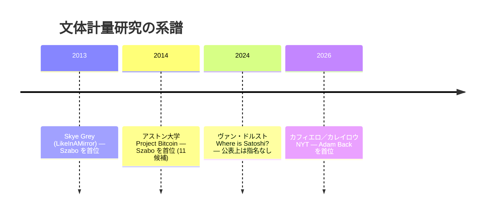

# Bitcoin Institute Style Guide

Internal editorial rules shared across Bitcoin Institute.

## Purpose

This file defines cross-language editorial conventions that should stay
consistent across the archive. Language-specific rules belong in companion
files such as `STYLE_GUIDE_JA.md`.

## Scope

These rules apply to:

- editorial intros and summaries
- aftermath entries
- biographies
- translated entries
- source-derived formatting decisions

## Core Distinction: Blockquotes vs Quotation Marks

- A blockquote marks block-level quoted or source-derived content.
- Quotation marks mark quoted words inside the language of the page.
- These are not interchangeable.

In other words:

- `>` / `<blockquote>` answers: "this block is quoted or excerpted material"
- quotation marks answer: "these words are being presented as a direct quote"

This section is the top-level partition between "quoted material" and
"the editor's own words." For the editor's-own-words side, the
[Editorial Markers](#editorial-markers) section below defines the
canonical sub-categories (page-level note, in-body interpretation,
in-body context, source attribution, quotation metadata, and the
untouchable original-poster edit notes).

## Primary-Source Entries

For emails, letters, forum posts, release notes, and similar primary-source
documents:

- preserve source structure where practical
- use blockquotes for quoted/source text
- do not add extra quotation marks by default just because the text is in a
  blockquote
- keep headers, logs, commands, URLs, UI labels, and code-like strings in the
  form that best matches the source

Use extra quotation marks only when the source itself uses them or when a short
excerpt is being called out as a quoted utterance rather than presented as the
body of the source.

**Original-poster edit notes are part of the source record.** Markers like
`edit:`, `[edit]`, `Edit:`, `編集:`, `[編集]` written by the original
author of a forum post, mailing-list message, or private email are part
of the historical record and must not be normalized as if they were
Archive editor notes. See category **F** in the
[Editorial Markers](#editorial-markers) section.

## Editorial / Narrative Entries

This section covers the **quotation form** used inside editor-written
narrative entries (aftermath, biographies, retrospectives). For the
**editor-note markers** that appear inside these same entries (the
markers that say "this paragraph is the editor's interpretation, not
quoted material"), see the [Editorial Markers](#editorial-markers)
section below.

For editor-written narrative entries such as aftermath pages, biographies, and
retrospectives:

- when excerpting a short direct quote inside the article narrative, use a
  blockquote plus the language-appropriate quotation marks
- when presenting a longer source passage or document-style excerpt, a
  blockquote alone is usually enough

Typical pattern:

- English: `> "..."` for short excerpted speech or statements
- Japanese: `> 「...」` for short excerpted speech or statements

## Source Citation: `sourceUrl` vs `secondarySources`

`<SourceCitation />` renders the two frontmatter fields as separate
sections at the foot of the entry:

- **`sourceUrl`** (required) — the single canonical primary
  reference. Rendered under 「関連ソース」 / "Related source". Pick
  the URL a reader should open first (archived original, Wikipedia
  biography, BitcoinTalk topic, GitHub PR, etc.).
- **`sourceNote`** (optional) — short caveat or context for the
  primary reference (provenance, publication route, dataset
  description, legal-document role, etc.). Rendered as a muted
  block immediately under the `sourceUrl` link, so the reader sees
  the explanatory text without having to click through.
- **`secondarySources[]`** (optional) — list of additional
  references with `name`, `url`, optional `note`. Rendered under
  「その他の関連ソース」 / "Other related sources".

**Rule.** The same URL must not appear in both fields. If it did,
the citation block would list the link twice. When tempted to
duplicate (e.g. because the existing `secondarySources[]` entry
carries a useful `note`), move the `note` text into the entry's
`sourceNote` field instead and remove the duplicate
`secondarySources[]` row.

**Enforcement.** `scripts/check-source-duplication.mjs` fails when
an entry's `sourceUrl` matches any of its own `secondarySources[].url`.
Wired into `npm run check` in `--strict` mode.

## When a Hypothesis-Related Article Deserves Its Own Aftermath Entry

Coverage of Satoshi-identity hypotheses (Skye Grey 2013 for Szabo, Hatch 2021
for Sassaman, Carreyrou 2026 for Adam Back, HBO 2024 for Todd, etc.) accumulates
quickly. Not every article warrants a standalone aftermath entry. Use this
distinction:

- **Claim events get a standalone entry.** The original articulation, a
  major-press tier amplification with substantive new framing (NYT, HBO,
  book), or a new methodological articulation (algorithmic stylometry vs.
  manual stylometry) — these are documentary milestones in the hypothesis's
  public history and route via `aftermath/`.
- **Response events stay in `secondarySources`.** A named candidate's denial
  to a journalist, a brief reactive comment, a "no I am not Satoshi" repeated
  to multiple outlets — these belong in the hypothesis entry's
  `secondarySources` with a `note:` capturing the verbatim line if needed.
  They do not get their own aftermath unless **(a)** the response is a
  formal sworn record (deposition, court filing, COPA witness testimony,
  Patterson-style on-record family denial) or **(b)** the response is itself
  a long-form public statement that introduces new framing (e.g., a candidate
  publishing their own essay in response).

Operational test: would a future reader want to navigate *to* this article
as a destination, or would they want it cited *from* the hypothesis entry?
Destinations get their own entry; citations live in `secondarySources`.

When in doubt, default to `secondarySources` — promotion to a standalone
aftermath is cheap if the article gains weight later, but pruning a
proliferation of thin reactive aftermath entries is editorial work.

## Translation Principle

When translating quoted material, preserve the function of the formatting, not
just the original glyphs.

- If the source block functions as document body text, keep document-style
  formatting.
- If the source block functions as a highlighted utterance in narrative prose,
  use the target language's quotation punctuation.

For **editor-note markers** ([Editorial Markers](#editorial-markers)),
the JA/EN canonical pairs use locale-specific punctuation:

- EN uses half-width colon (`:`); JA uses full-width colon (`：`).
- Mixing is not allowed: a JA file must not carry an EN marker form,
  and vice versa.
- The label and the note text are separated by exactly one half-width
  space, in both locales (e.g. `*[Editor: text]*`, `*[編者注：text]*`).

## Consistency Rule

- Do not rewrite untouched legacy material just for stylistic cleanup.
- When an entry is being edited, normalize the touched portion to this guide.
- If a category develops a strong established pattern, follow that pattern
  unless there is a clear reason to improve it.

For the [Editorial Markers](#editorial-markers) audit, the
`check:editorial-markers` script now runs in `--strict` (hard-fail)
mode under `npm run check`, since the existing legacy was normalized
end-to-end during the 2026-04 migration. New entries must satisfy
the canonical-form rules from the start; any violation will block
the build.

## Editorial Markers

This section partitions the editor's-own-words side of the
[Core Distinction](#core-distinction-blockquotes-vs-quotation-marks).
A reader must be able to tell, from formatting alone, which of the
following roles a given line plays:

1. Page-level editorial commentary by Bitcoin Institute
2. In-body editor interpretation (Bitcoin Institute opinion / reading)
3. In-body historical context supplement (third-party facts adjacent
   to the entry)
4. Source attribution for the entry's primary material
5. Quotation metadata inside or adjacent to a blockquote
6. Original-poster edit notes that are part of the source record (not
   Archive editor notes)

Each role has exactly one canonical form. Anything else is to be
normalized.

### The six roles and their canonical forms

| Role | Description | EN canonical | JA canonical | Position |
|---|---|---|---|---|
| **A** | Page-level editorial commentary | `editorNote:` field | `editorNote:` field | frontmatter; rendered as a labeled box at the top of the body |
| **B** | Source attribution (primary material) | `frontmatter.sourceUrl` + `secondarySources[]` (with optional `note`) + `<SourceCitation />` (role split between the two fields: see [§ Source Citation](#source-citation-sourceurl-vs-secondarysources)) | same | rendered at the end of the entry by `<SourceCitation />` |
| **C** | In-body editor interpretation | `*[Editor: ...]*` | `*[編者注：...]*` | italic + brackets, inline anywhere in the body |
| **D** | In-body historical context | `*[Context: ...]*` | `*[補足：...]*` | italic + brackets, inline anywhere in the body |
| **E** | Quotation metadata | `<!-- speaker: ... -->` / `<!-- quote: ... -->` semantic markers, or a `**Author Name:**` label immediately before a blockquote | same | semantic markup; renders as a structural attribution, not as editor commentary |
| **F** | Original-poster edit notes | `edit:` / `Edit:` / `[edit]` (preserved verbatim) | `編集:` / `[編集]` (preserved verbatim) | preserved as written by the original author; **not** rewritten by Archive editors |

### Rules

1. JA uses full-width colon (`：`); EN uses half-width (`:`). No mixing.
2. The label and the body text are separated by exactly one half-width
   space (e.g. `*[Editor: text]*`, `*[編者注：text]*`).
3. (B) is provided by the existing `<SourceCitation />` component
   driven by `frontmatter.sourceUrl` + `secondarySources[]`. Inline
   `*Source: ...*` / `*出典：...*` lines in body content are forbidden
   as a **canonical** form. Existing legacy occurrences are migrated
   to `secondarySources[].note` or to (D) during normalization.
4. (C) and (D) require the label prefix. Unlabeled `*[...]*` is
   forbidden.
5. (A) is for entry-wide commentary (one box per entry). For local
   commentary, use (C) inline.
6. Bold-label forms (`**Source:**`, `**Note:**`, `**Editor:**`,
   `**Author:**` as an editor marker) are forbidden.
7. Plain-bracket forms (`[Source: ...]`, `[Note: ...]`) are forbidden.
8. Dash-trailer forms (`— Source: ...`, `-- Source: ...`) are
   forbidden.
9. Bracketed source-attribution forms (`*[Source: ...]*`,
   `*[出典：...]*`) are forbidden — use (B) via the component machinery.
10. HTML comments (`<!-- ... -->`) are reserved for semantic markup
    (`<!-- speaker: ... -->`, `<!-- quote: ... -->`). They must not
    contain editor commentary.
11. Plain keyword usage in prose (`〜より`, `via`, `according to`,
    etc.) is acceptable. Add (C) or (D) markup only when the
    surrounding sentence carries Bitcoin Institute's interpretation
    rather than factual reportage.
12. **(F) Original-poster edit notes are part of the source record;
    Archive editors must not change or normalize them.** This rule is
    the [Primary-Source Entries](#primary-source-entries) preservation
    principle applied to inline edit markers.

### Audit

`scripts/check-editorial-markers.mjs` enforces these rules under
`npm run check` in `--strict` mode (hard-fail). The audit excludes
blockquote interiors, code blocks, URLs, and HTML comments to avoid
false positives on primary-source content.

A separate `--report-f-candidates` mode lists every `edit:` / `編集:`
occurrence inside `forum-post`, `mailing-list`, and `correspondence`
entries. The auto-classifier treats these as F (preserved) by default,
and a full human review of the candidate report was completed during
the 2026-04 migration: all 75 occurrences were confirmed to be
original-poster edit notes. Re-run the report mode (`npm run
audit:f-candidates`) whenever new entries of these types are added.

## Title Policy

Every entry's `title` field is the page's identity across three
audiences, in addition to readers browsing inside the site:

1. **Human readers arriving from search** — the title is the blue link
   in Google results, the OG card in social shares, and the text the
   browser tab renders. If it is cryptic in isolation, the click does
   not happen.
2. **Search engines** — the title is the strongest ranking signal and
   the text most commonly displayed in SERP. Google truncates the
   displayed title around 50–60 characters but indexes the full string,
   so the leading identifiers matter more than total length.
3. **AI / AIO** (Perplexity, ChatGPT with browsing, Google AI Overview,
   etc.) — the title is the citation label an LLM extracts for the
   page. Ambiguous titles are less likely to be used as sources.

Internal browsing convenience is a side-effect of the three above.

### Baseline criteria

| Criterion | Target |
|---|---|
| Leading identifiers | at least two of: person / date / event / source / iconic phrase, in the **first half** of the title |
| Length (EN) | soft cap ≤ 60 characters; over the cap is acceptable when the leading identifiers are in the first 50 characters |
| Length (JA) | soft cap ≤ 30 characters; same leading-identifier rule applies |
| Stand-alone clarity | understandable without the URL path or description |
| Distinctiveness | visibly different from similar entries (same person / same date / same thread) |
| History preservation | for mailing-list and forum entries, the original subject / topic title stays visible (see per-category rules below) |

### Treatment of iconic quotes

A quote from the body is rarely a sufficient title on its own. It is
memorable for readers who already know the context — exactly the
audience least in need of the page. Use a quote as a **supporting
element after the identifying context**, not as the whole title.

- ✗ `"I've moved on to other things"` — cryptic alone
- ✓ `Satoshi's final email to Mike Hearn: "I've moved on to other things"`

### Per-category rules

Title handling differs by entry type because thread structure and
historical-subject preservation differ. The per-category rules below
override the generic templates where they conflict.

#### Forum threads (BitcoinTalk, GitHub issues, etc.)

- Location: `src/data/entries/en/forum/*`
- **Thread starter**: preserve the forum's topic title as the anchor.
  Editorial context (venue, date) may be added as a suffix, but the
  original topic string stays visible.
  - ✓ `Major Meltdown (BitcoinTalk, Aug 2010)`
  - ✗ `Satoshi's response to Mt. Gox crisis` — topic title replaced
- **Reply** (`Re: ...`): must follow the thread starter. Cascade rule:
  when the starter title changes, every `Re: {…}` in the same thread
  must be updated in the same commit (EN and JA mirrors).
- **Recognized cascade exceptions.** Two reply-title patterns are
  legitimately allowed to deviate from the starter and must be
  preserved across renames; the cascade enforcement (script and
  bulk-fix tool) skips them by design. These are not loopholes — they
  encode historical reality the cascade would otherwise erase.
  - **(a) Context-post replies.** A reply that quotes a *non-starter*
    post (i.e., quotes another reply rather than the original topic)
    is titled `Re: (context post by NAME)` (preferred) or the older
    variant `Re: (quoted post by NAME)`. The JA mirror is
    `Re:（NAMEの文脈投稿）`. This pattern is heavily used across the
    EN forum tree and is the canonical Archive editorial form for
    replies whose anchor is a specific in-thread quote rather than
    the topic itself.
  - **(b) Subject-deviation replies.** When a forum reply's actual
    Subject line in the original BitcoinTalk thread differs from the
    starter's (e.g., the poster manually changed the subject), the
    historical Subject is preserved as the reply's title, and the JA
    mirror translates that historical Subject — not the cascaded
    starter. This is the same principle as the mailing-list rule
    below (preserve the original Subject as historical evidence), but
    applied per-reply within a forum thread when the original poster
    overrode the subject.
- **Checker scope (important).** `scripts/check-ja-titles.mjs`
  partially enforces the cascade with the two exceptions above:
  - It scans `src/data/translations/ja/forum/*` only (JA files), not
    the EN source tree.
  - Mismatches are reported as **warnings**, not errors — the build
    does not fail on a cascade drift.
  - Exception (a) is detected by a JA-side regex match on
    `Re:（…の文脈投稿）`. Exception (b) is detected by reading the
    JA file's EN counterpart and verifying the EN reply title also
    deviates from the EN starter. Either match silences the warning.
  - Thread starter detection is heuristic: the first entry whose
    title does not begin with `Re:` / `返信:` is treated as the
    starter. If a reply is retitled to also drop the `Re:` prefix,
    the checker silently treats it as a second starter and skips
    cascade verification for it. Do not retitle a reply into a
    standalone editorial form to "route around" the checker —
    cascade the starter instead. (The two recognized exceptions
    above keep the `Re:` prefix.)
- Use `scripts/fix-ja-reply-titles.mjs --apply` to mass-update reply
  titles once the starter is set. The bulk fixer respects the same
  two exceptions as the checker, so context-post and subject-deviation
  replies are skipped during cascade rewrites.

#### Mailing-list threads (cryptography, bitcoin-list, p2p-research)

- Location: `src/data/entries/en/emails/*`
- **Thread starter**: the original email subject line is historical
  (it is the literal Subject: header of the archived email). Keep it
  visible in the title; editorial wrapping is allowed, but do not
  replace it.
  - ✓ `"Bitcoin P2P e-cash paper" — Satoshi's first Bitcoin announcement (Oct 2008)`
  - ✗ `Satoshi announces Bitcoin — cryptography mailing list (Oct 2008)` — subject line lost
- **Reply** (`Re: ...`): keep the original `Re: {subject line}` form as
  written in the email. Do **not** cascade editorial changes from the
  starter into reply titles, because each reply literally had that
  Subject: header in the email. (This is the key difference from
  forum threads.)

#### Private correspondence (non-thread emails)

- Location: `src/data/entries/en/correspondence/*`
- Each file usually stands alone; there is no thread-wide subject line.
- Title template: `{Author}'s {description} to {recipient}` plus
  optional quote and/or date.
  - ✓ `Satoshi's reply to Adam Back about b-money citation (August 2008)`
  - ✓ `Satoshi's final email to Mike Hearn: "I've moved on to other things"`

#### Aftermath / article / analysis

- Location: `src/data/entries/en/aftermath/*`, `.../analysis/*`
- Preserve the original article or analysis title. Light contextual
  prefixes/suffixes are acceptable when the original title is ambiguous
  on its own.
  - ✓ `Jameson Lopp analyzes whether Satoshi Nakamoto was a 'greedy' miner`

#### Biographies

- Pattern: `{Name} ({dates}) — {one-line role}`
  - ✓ `Hal Finney (1956–2014) — Cypherpunk, PGP developer, first Bitcoin recipient`

#### Whitepaper / BIP

- Preserve the original formal title, with optional `(Whitepaper)` or
  `(BIP N)` suffix.
  - ✓ `Bitcoin: A Peer-to-Peer Electronic Cash System (Whitepaper)`
  - ✓ `BIP 125: Opt-in Full Replace-by-Fee Signaling`

#### SourceForge releases / genesis

- `Bitcoin v{N.N} released ({date})` for releases.
- Standalone entries (e.g. the genesis block) follow the generic rule:
  identify the actor, object, and date.
  - ✓ `Satoshi mines the Bitcoin genesis block (January 3, 2009)`

### Register: descriptive vs. evocative

The baseline-criteria table above governs *what must be present* in a title (identifiers, length, distinctiveness). The choice of register — flat-descriptive versus evocative — is governed by the event itself. Two rules apply on top of the baseline criteria:

- **Use the canonical name of the event when one exists.** If the historical event has a name in the literature (the "block-size war", "the resolution of the Bitcoin experiment", "Bitcoin Pizza Day"), use that name rather than a paraphrase. The named form is what readers and AI systems search for, and replacing it with generic vocabulary breaks both recall and citation reuse.
- **Prefer wording that reflects the actual stakes over generic verbs.** "Launches", "publishes", "announces" are filler when the event was significant. If the event is significant, the title should say what was at stake; if the event was uneventful, plain descriptive wording is the correct choice. Drama is not a substitute for accuracy.

A useful archetype is **`{Subject}: {concrete enumeration} and {the stake}`** — a strong subject phrase up front, a colon, and a body that lists concrete countables (numbered groups, dated events, named participants) followed by the stake of the entry. This archetype reads aloud naturally and gives both human readers and AI systems a precise citation label. Example shape:

- `Who Is Satoshi Nakamoto: 10 Geniuses and the Mystery of the Century`
- `Bitcoin's family tree: 6 protocol forks, 4 altcoin lineages, and the chain that endured (2009-2024)`

The archetype is a target shape, not a template. If the entry's subject does not lend itself to a list-and-stake construction, force-fitting it produces titles that read as marketing rather than as catalog entries. Use a flat descriptive title in that case.

Revisions that improve a flat title without changing the identifiers:

- ✗ `Bitcoin XT launch (August 2015)` — actor and date present, but no stake
- ✓ `Bitcoin XT launches the block-size war — Hearn and Andresen propose 8 MB blocks (August 2015)`

- ✗ `Mike Belshe cancels SegWit2x (November 2017)` — accurate, but reads like a row in a table
- ✓ `SegWit2x cancelled three days before activation — Mike Belshe ends the New York Agreement (November 2017)`

This rule is **subordinate to the per-category rules above.** Forum and mailing-list thread starters preserve the original topic / Subject line — the evocative rewrite applies to the editorial wrapping, not to the historical Subject. Biographies follow the `{Name} ({dates}) — {role}` template — the role line carries the register, the name-and-dates anchor does not.

The archive is publicly indexed and cited by external researchers, journalists, and AI systems. Avoid flippant phrasing, marketing-style hyperbole, and exclamation points. The goal is a title that reads naturally aloud — not one that performs.

### What not to do

- **Don't stuff keywords** (`"Satoshi Nakamoto Bitcoin whitepaper genesis block 2009"` — search engines penalize this).
- **Don't include the site brand** — the layout prepends `— Bitcoin Institute` automatically. Adding it to `title` duplicates.
- **Don't lead with the date** — the primary identifier goes first; the date (when included) goes at the end or in parentheses.
- **Don't force every title into one template** — a stronger natural title beats a formulaic one.
- **Don't replace the original email Subject on a mailing-list thread starter** — wrap it, don't drop it.
- **Don't change a forum thread starter without updating all `Re: {…}` replies** in the same thread and the same commit. (Replies covered by the two recognized cascade exceptions — context-post and subject-deviation — are excluded from this requirement; see the §Forum threads exception block above.)

### When a legacy title is changed

- Changing a title changes the indexed link text but not the URL slug.
- Always update the JA mirror in the same commit.
- If the entry is a **forum** thread starter, cascade to every reply
  (EN and JA) in the same commit, except the two recognized
  exceptions (context-post replies and subject-deviation replies; see
  §Forum threads). The `check-ja-titles.mjs` script warns on JA
  cascade drift but does not fail the build, so visually diff the
  full thread before committing — do not rely on the checker as a
  gate. See the checker-scope note under §Forum threads above.
- If the entry is a **mailing-list** thread starter, do **not**
  cascade — replies keep their original `Re: {subject}` form.
- See `STYLE_GUIDE_JA.md § II.1 Title Policy` for Japanese-specific
  rules (character budget, katakana names in titles, etc.).

## Description Policy

The frontmatter `description` field has multiple consumers, both
external and internal. The length cap is set at the intersection of
the *effective* display windows, not at the strictest theoretical SEO
sweet spot.

### Where description is consumed

**External (emitted to HTML head, read by external tools and crawlers):**

| Output | Source | Effective display window |
|---|---|---|
| `<meta name="description">` | `BaseHead.astro` | Google SERP truncates ~155-160 half-width / ~70-80 full-width chars by pixel. **Note:** Google increasingly auto-generates SERP snippets from body content, so the meta tag is no longer the dominant SERP source. |
| `<meta property="og:description">` | `BaseHead.astro` | Facebook ~110-200, LinkedIn ~150-200, Slack unfurls show near-full text. |
| `<meta name="twitter:description">` | `BaseHead.astro` | X `summary_large_image` card: ~200. |
| JSON-LD `Article.description` | `BaseHead.astro` | Structured data; no display truncation. |

**Internal (rendered as visible UI on the site itself):**

| Output | Source | Truncation |
|---|---|---|
| Entry-list card body `.card-description` | `EntryCard.astro` | **None — verbatim, no `-webkit-line-clamp`, no JS truncation.** |
| Homepage analysis section `.analysis-desc` | `pages/index.astro`, `pages/ja/index.astro` | None. |
| Participant page biography description | `pages/participants/[participant].astro` | None. |

### Length caps

The dominant practical constraints are (a) social-share preview windows
(OGP / Twitter Card, ~200 chars) and (b) entry-list card legibility
(verbatim render, must fit within roughly 1-2 lines on the card).
Google's strict SERP cap (160/80) is no longer the binding constraint
because Google auto-generates from body content.

| Language | Cap | Rationale |
|---|---|---|
| **EN** | **200 characters** | OGP/Twitter Card display window; ~1-2 lines on entry-list cards. |
| **JA** | **100 characters** | Same effective visual width as EN 200, accounting for full-width character pixel ratio. |

Counted by `String.length` (each character counts as 1, regardless of
half-width / full-width). Enforced by
`scripts/check-description-length.mjs`, wired into `npm run build`
and `npm run check` in `--strict` mode (a single overflow fails the
build). The script previously ran in WARN mode while the legacy
backlog of 384 violations from prior authoring practice was being
remediated; the switch to `--strict` happened once the backlog
reached zero.

### When the cap forces information out of description

If the description currently carries body-summary content that pushes
it past the cap, **move that content into the body** rather than
relaxing the cap or splitting into multiple short sentences that lose
meaning. The description's job is to give a search-result reader (or
SNS preview viewer, or entry-list browser) enough to decide whether to
open the entry. Anything beyond that belongs in the body.

## Related Entries

Entries can declare strong semantic cross-references via the `relatedEntries`
frontmatter field. This is distinct from tags (broad topic grouping),
participants (person-centric), threads (conversation flow), and inline
markdown links (prose-level positional references).

### When to use `relatedEntries`

Use it for **entity-level strong cross-references** between 2-10 entries
that record the same event, parallel events, or directly causally-linked
events — cases where tags are too coarse and threads don't apply.

Good candidates:

- Same event recorded from different angles (e.g. a whitepaper document
  and the mailing-list announcement email of that same paper)
- Parallel events (e.g. Satoshi's three farewell emails to Hearn,
  Andresen, and Malmi)
- Sequential events across different directories (e.g. Bitcoin v0.1
  release on SourceForge, the cryptography mailing-list announcement,
  Hal Finney's "Running bitcoin" tweet, and the first BTC transaction)
- Cause and effect (e.g. the 2010-08-15 value overflow incident and the
  0.3.10 patch that fixed it)
- Biography ↔ canonical primary-source entries for that person

### When NOT to use `relatedEntries`

| Situation | Use instead |
|---|---|
| Entries are in the same directory / thread | nothing — threads handle it automatically |
| Broad topical grouping (20+ entries share a theme) | `tags` |
| Person-centric aggregation | `participants` |
| A single reference at a specific position in body prose | inline markdown link |

### Rules

1. **No data-side cap; ordered by priority.** `relatedEntries` accepts
   any number of items. The list is treated as **priority-ordered**: the
   entry at index 0 is the most important relation, the entry at the end
   is the least important. The renderer (`RelatedEntries.astro`) selects
   the top 10 items for display (manual entries always survive this cap
   first; auto-derived candidates from `src/data/derived-related.json`
   fill any remaining slots). Display order is then chronological. If
   the manual list ever exceeds 10, the lowest-priority items are not
   shown but remain in the data layer for future reorganization,
   downstream tooling, and reverse-link integrity.
2. **Priority ordering convention.** Place items in this order so that
   the top-of-list slots reach the display layer first:
   1. Pair entry / direct counterpart (e.g. `identity-hypotheses-overview`
      ↔ `anonymity-architecture`).
   2. Biography or canonical catalog entry for the central participant.
   3. Cause-and-effect partner (e.g. the 2010-08-15 overflow incident
      and the 0.3.10 patch that fixed it).
   4. Same event recorded from a different channel (e.g. whitepaper
      document ↔ announcement email).
   5. Specific event referenced in body prose. **If the entry is also
      reached via an inline markdown link in the body, prefer to lean on
      the inline link and place the relation low in priority** — the
      reader already has a body-level path to the entry.
3. **Bidirectional required.** If A declares B as related, B must also
   declare A as related. Enforced by `npm run check:internal-links`.
4. **No self-reference.** An entry cannot relate to itself.
5. **No thread-internal relations.** If two entries are already in the
   same thread (same directory), do not use `relatedEntries` for them.
6. **Same `relatedEntries` in EN and JA mirrors.** Both language versions
   of an entry must declare the same set of related entries (and in the
   same priority order).
7. **Format is the entry ID** (path relative to `src/data/entries/en/`
   without `.md`), e.g. `emails/cryptography/2008-10-31-bitcoin-whitepaper-final`.

### Why no data-side cap

A hard cap forces a delete decision every time a new strong relation
is added. Deletion has nontrivial cost: the reverse link must also be
removed, downstream tooling that walks the graph loses information,
and edits become a seesaw of add-here / remove-there. By moving the
cap to the **display** layer and treating the list as priority-ordered,
adding a new relation becomes a single insert (at the priority slot it
deserves), and the renderer enforces the visible limit automatically.
The data layer remains a complete graph; the UI shows the most relevant
slice.

### Example

```yaml
# src/data/entries/en/emails/cryptography/2008-10-31-bitcoin-whitepaper-final.md
relatedEntries:
  - emails/cryptography/2008-10-03-bitcoin-whitepaper-draft
  - emails/cryptography/bitcoin-p2p-e-cash-paper/2008-10-31-bitcoin-p2p-e-cash-paper
```

All three entries in the cluster declare each other, forming a closed
bidirectional group. The site renders a "Related entries" section on
each entry page automatically.

## Participant Slug Convention

Each person has **exactly one canonical slug** used across every entry
regardless of source platform. Source-specific handles (GitHub username,
BitcoinTalk handle, etc.) are preserved only in the `author` field; the
`participants[].slug` and `participants[].name` are always normalized to
the canonical form below.

### Slug selection

1. **Real name publicly known** → real-name slug in kebab-case, used
   for *all* entries by that person.
   - Examples: `jeff-garzik`, `gavin-andresen`, `pieter-wuille`,
     `wladimir-van-der-laan`, `michael-marquardt`.
   - Applies to BitcoinTalk posts, email correspondence, mailing-list
     messages, GitHub commits/PRs/comments, articles, and biographies.

2. **Pseudonym only, no public real name** → the person's handle as slug.
   - Examples: `cobra`, `newlibertystandard`.

### Field responsibilities

- `participants[].slug` — canonical slug per rule above.
- `participants[].name` — display name. Real name when known; handle
  otherwise. Must match the slug's identity.
- `author` (top-level) — source-platform attribution, preserved
  verbatim. May differ from `participants[].name` (e.g. a forum post
  with `author: "jgarzik"` still uses `name: "Jeff Garzik"` and
  `slug: "jeff-garzik"`).

### Evidence bar for "real name publicly known"

To qualify as "publicly known" and trigger rule #1, the real name must
be documented in at least one reliable primary source:

- the archive itself (an existing biography or article that names them)
- a court document or formal legal record (e.g. COPA v Wright evidence)
- self-disclosure — the person's own website, verified social account,
  or public conference talk / published paper under that name
- major press coverage that cites a primary source

Folklore, speculation, unverified internet claims, or third-party
doxxing attempts do not qualify. When in doubt, keep the handle slug
(rule #2) until stronger evidence appears.

### Edge case: handle derived from real name

A handle that closely resembles the real name still uses the real-name
slug.

- `luke-jr` (handle) → `luke-dashjr` (real-name slug)
- `sipa` → `pieter-wuille`
- `laanwj` → `wladimir-van-der-laan`

The rationale: the slug is the participant-page URL. Real-name form
keeps it predictable, searchable, and uniform regardless of how closely
the handle resembles the name.

### Edge case: handle only, real name never disclosed

Some long-term participants are publicly known only by their handle
(e.g. `maflcko`, `cobra`, `newlibertystandard`). Keep the handle slug
per rule #2 until a verifiable real name appears in a primary source.
Do not promote a handle that contains a real name ("MarcoFalke")
unless the person has themselves claimed it as their legal name.

### When a real name becomes publicly known later

A pseudonym-only participant may later have their real name revealed.
To migrate, run these steps in order:

1. Bulk-rename `participants[].slug` in all entries that reference the
   person: old handle slug → new real-name slug.
2. Update `participants[].name` in the same entries from the handle to
   the real name.
3. Update `src/i18n/participants.ts`:
   - Add the new real-name slug entry with the JA display name.
   - Keep the old handle slug entry as well (same JA display) as a
     defensive fallback for any code path that still looks up a display
     name by the old slug.
4. If a biography file exists, rename it to the new slug
   (e.g. `YYYY-MM-DD-cobra-biography.md` →
   `YYYY-MM-DD-<realname>-biography.md`). Update `relatedEntries`
   references on both sides that point to the old filename.
5. Do **not** rename source-entry filenames such as
   `2010-02-10-theymos-msg318.md` — those preserve the source platform's
   original handle for fidelity. Only the `slug` inside the frontmatter
   changes.
6. Run `npm run check` to verify bidirectional links and slug mappings.

A slug migration is a **breaking URL change** —
`/participants/{old-handle}/` will no longer resolve after the migration
because participant pages are statically generated only from slugs that
currently appear in entry frontmatter. If there is a known external
reference to a specific old URL, add a targeted redirect (e.g. via
`astro.config.mjs`'s `redirects` option) as a one-off; do not build a
general aliasing mechanism speculatively.

## Biography Linking

Biographies serve as **navigation hubs** — a reader's entry point into a
person's history in the archive. The body text should link to relevant
participant pages and archive entries so readers can explore further.

### Inline participant links

When a person is named in a biography and has a participant page
(`/BitcoinArchive/participants/{slug}/`), link the name at the first or
most contextually important mention.

- Do not link every occurrence — one per person is enough.
- If a name first appears inside an entry link's text (e.g.
  `[emailed Adam Back](/BitcoinArchive/entries/...)`), add the participant
  link at the next natural mention instead of nesting links.

### Inline entry links

When the biography text mentions a specific event, document, or mailing-list
post that exists as an archive entry, link it. Typical candidates:

- emails and correspondence involving the person
- forum posts, mailing-list messages
- published analyses or retrospectives about the person

Do not over-link: only link to entries that actually exist in the archive.

### relatedEntries for biographies

Follow the general `relatedEntries` rules above. For biographies
specifically:

- Include the person's **canonical primary-source entries** (their own
  emails, posts, or the key events they participated in).
- The bidirectional rule applies — the target entry must also declare
  the biography as a related entry.
- Small biographies (few or no canonical entries) may have 0–1
  relatedEntries. That is acceptable.

### Audit checklist

When creating or editing a biography, verify:

1. All named people with participant pages are linked (at least once).
2. All mentioned events/documents with archive entries are linked.
3. `relatedEntries` includes canonical entries for the person.
4. EN and JA mirrors have matching `relatedEntries`.
5. `npm run check:internal-links` passes after changes.

## Inline-Link Coverage for Analysis and Biography Pages

Analysis and biography pages carry interpretive value that is easy to
miss if readers find them only through the `relatedEntries` sidebar.
The policy is to surface these pages from the **body prose** of every
entry that touches their topic, not just from frontmatter.

### When this applies

Trigger an inline-link sweep whenever:

- A new analysis or biography entry is added.
- An existing analysis or biography is significantly expanded
  (e.g., a new section that introduces a new topic keyword).
- An entry that touches a known analysis/biography topic is created
  or substantially edited.

### How it is enforced

Each analysis or biography entry declares topic keywords in its
frontmatter:

```yaml
inlineLinkKeywords:
  - "five-day gap"
  - "un-attributability"
  - "Genesis Block hardcode"
```

The keywords are language-specific — the EN file lists English phrases,
the JA mirror lists the Japanese equivalents. Pick phrases specific
enough to almost always indicate the topic when they appear in another
entry's body prose. Avoid words so generic that they will produce
false positives across the archive.

`scripts/check-inline-link-coverage.mjs` walks every entry body in the
same locale, and reports any case where a keyword appears but the body
does not link back to the source analysis/biography. The script runs
under `npm run check` as informational output (always exits 0), and
under `npm run check:inline-link-coverage` standalone. Pass `--strict`
to make it fail when gaps exist (useful in targeted CI gating).

### How to act on a reported gap

A reported gap is a *candidate* for an inline link, not an automatic
edit instruction. Read the surrounding prose and decide:

- If the body genuinely references the analysis/biography topic, add
  an inline link at the first or most contextually important mention.
- If the keyword appears in a different sense (false positive), no
  edit is needed. Optionally narrow the keyword in the source entry's
  `inlineLinkKeywords` to reduce future noise.

Do not bulk-replace. Each gap is a per-occurrence editorial judgment.

### relatedEntries vs inline links

These two mechanisms are not interchangeable:

- `relatedEntries` populates the "see also" sidebar — useful for
  readers who finish an entry and want adjacent reading.
- Inline body links surface analysis/biography pages **at the moment
  the topic is mentioned**, while the reader is still engaged with
  that thread of the narrative.

Both should be present for analysis and biography hub pages.

## Scripted Edits Policy

Scripts are allowed for inspection, reporting, and tightly-scoped metadata
updates. Scripts are **not** the default tool for rewriting Markdown prose.

Allowed without special justification:

- validation and reporting scripts
- read-only inventory scripts
- path renames and directory moves
- narrowly-scoped frontmatter updates
- deterministic updates to clearly structured metadata fields

Do not use scripts for:

- replacing or restoring Markdown bodies in bulk
- copying old body text from earlier commits into current files
- bulk rewriting translated prose
- mechanically rebuilding quote blocks, tone annotations, or paragraph layout
- any change that mixes current frontmatter with old body content

If a task affects quoted text, translation wording, blockquote structure,
paragraph breaks, or tone, treat it as content editing work, not as a bulk
script migration.

When a script-assisted content change is unavoidable:

- keep the write scope minimal and structurally precise
- verify on a representative sample before applying broadly
- review the resulting diff file by file
- run the relevant checks after the change

The default rule is:

- scripts may propose changes
- humans approve and review content changes
- bulk prose rewrites require especially strong justification

## Review Rule: Duplicate ID Warnings

Do not treat Astro `glob-loader Duplicate id` warnings as findings by default.

**Root cause (Astro 5.17 bug):** the warning is a structural false positive from
the incremental sync path of `node_modules/astro/dist/content/loaders/glob.js`.
Walking lines 80–110:

```js
const existingEntry = store.get(id);     // entry from PREVIOUS sync's cache
const digest = generateDigest(contents); // digest of CURRENT file contents
if (existingEntry && existingEntry.digest === digest && existingEntry.filePath) {
  return; // unchanged file → short-circuit, no warning
}
// any modified file falls through to here
if (store.has(id)) {                     // always true on a modified file
  logger.warn(`Duplicate id "${id}" found in ${filePath}. ...`);
}
store.set({ id, ... });                  // overwrite is correct
```

The intent of `store.has(id)` is "another file in this same load run already
claimed this id," but the cache holds entries from the previous run, so
*every modified file* trips the check. Behavior signature:

- Warnings appear only on files that were modified since last sync.
- Re-running `astro sync` (or `npm run check`) immediately makes them disappear.
- Within each warning, exactly one file is named (the cache + that one file).

**Real id collisions look different:** two distinct source files in the same
collection resolve to the same normalized id. `scripts/check-duplicate-ids.mjs`
(wired into `npm run check` and `npm run build`) detects these independently
of Astro and fails the build if any are found. Astro normalizes ids by
running each path segment through `github-slugger`, which strips dots and
other special characters — so e.g. `bitcoin-v0.1-released.md` and
`bitcoin-v01-released.md` would collide and silently overwrite.

**Decision rule for reviewers:**

- Astro `Duplicate id` warning, but `npm run check:duplicate-ids` passes →
  false positive, do not flag.
- `check:duplicate-ids` fails → real collision, must fix before merging.
- Repro: stash your changes, run `npx astro sync` → no Astro warnings.
  Pop, sync again → warnings reappear on exactly the modified files.

## Technical-Review Robustness

Entries must withstand review by readers familiar with the material they describe. Before publishing or editing, self-audit against the following categories.

**In scope:**

- Technical facts (cryptography, protocol, source code, blockchain behavior, numerical specifications)
- Historical facts (dates, quotes, statements, numerical values, timelines)
- Internal consistency (no contradictions across an entry or between related entries)
- Arithmetic (elapsed times, BTC quantities, conversion rates, block heights — anything that can be cross-checked)
- Category integrity (don't list propositions of different kinds under one heading — e.g., "causes" and "period-of-activity" questions are distinct; don't mix them in a single list of "hypotheses")
- Fact vs interpretation (interpretive framings must be labeled as such, not asserted as history; use hedges like "under this reading", "on this view")
- Source attribution (claims traceable to sources cited in `secondarySources` / `sourceUrl`)

**Out of scope (handled elsewhere, not this rule):**

- Stylistic preferences (see house-style sections)
- Translation tone choices (see voice sections)
- Editorial framing decisions already adopted for an entry

**Test:**

Would a reader familiar with the material flag the passage for a factual error, a cross-check failure, or a category mix-up? If yes, fix it before the edit lands.

**Common failures observed:**

- Arithmetic mismatch: claiming "the gap from Jan 3 to Jan 8 is five days" when the actual gap endpoint is Jan 9 (different endpoint, different duration)
- Category error: listing five "hypotheses" as parallel candidates for one phenomenon when in fact only one addresses the cause and the rest are separate period-activity questions
- Interpretive framing asserted as fact: presenting a new or speculative reading as historical without hedging markers
- Narrative dramatization leaking in: phrasing that treats a speculative reconstruction as an eyewitness account

**Factual claims about real people: quote or narrative, both need sources.**

Any factual claim about a real person — direct quote, reported speech, narrated action, stated reaction, inner feeling, sequence of events, sensory detail, physical descriptor — must be traceable to a source listed in the entry's `secondarySources` / `sourceUrl`, or to a primary record (mailing-list archive, forum post, interview transcript, court document, published essay) publicly linkable by other means. Narrative prose does not exempt a claim from verification; narrative voice is more dangerous because unverified claims blend invisibly into editorial summary. **The rule fires on claim-making, not on punctuation.** Paraphrasing a quote into narrative does not fix a missing source — it hides it. If you cannot cite the source, do not write the claim, even as "context" or "atmosphere."

*In scope:*

- Reconstructed dialogue, dramatized statements, imagined internal monologue
- Narrated actions not documented in any cited source
- Sensory details or atmosphere added for color (the smell of coffee, the sound of a fan)
- Sequence implications (who reacted to what, when) not documented in any source
- Body language and physical descriptors inferred rather than recorded

*Out of scope for this rule (handled elsewhere):*

- Editorial analysis and interpretation of documented events (see the "fact vs interpretation" rule above)
- Summaries of what a cited source says, with attribution made clear

**Mandatory verification step (not optional).**

Before writing any factual claim about a real person — in any form — explicitly name the source (a URL, an `sourceUrl` field, a `secondarySources` entry, or a named primary record) and confirm the claim appears at that source. This is a required procedural step, not a principle to apply when in doubt. Extended exposure to narrative reconstructions (novels, dramatizations, documentaries, AI-generated biographical prose) blurs the boundary between fictional and historical content **in both directions** — you may import fiction as fact, or flag a real quote as fabricated. The "does this feel canonical" instinct becomes unreliable in both directions. The verification step exists precisely because that instinct fails. If you cannot perform the verification, drop the claim entirely — do not try to rescue it by paraphrase or by removing quotation marks.

## Layout Width Policy

The site uses a two-tier container system plus a separate prose-width
constraint. The two concerns — page-tier width and prose readability —
are handled by independent tokens so neither has to do double duty.

### Tokens

Defined at `:root` in `src/styles/global.css`:

| Token | Value | Concern |
|---|---|---|
| `--max-width-prose` | 640px | Prose paragraph readability (env- and language-independent) |
| `--max-width-read` | 800px | Reading-tier page (single document) |
| `--max-width-wide` | 1200px | Dashboard-tier page (lists, viz) |

`--max-width` is kept as an alias for `--max-width-read` for backward
compatibility. Prefer the tier-specific tokens in new code.

**Why fixed `px`, not `ch`?** The `ch` unit measures the width of the
"0" glyph in the active font. It is environment-dependent (different
font fallback chains produce different widths) and language-dependent
(Japanese full-width characters are roughly 2× the width assumed by
`ch`). Use `px` for layout boundaries.

### Page-tier allocation

`.container-wide` (1200px) — list / hub / search / dashboard:

- top page (`/`)
- search (`/search/`)
- chart (`/chart/`)
- entries index (`/entries/`)
- participants index (`/participants/`)
- tags index, tags filter (`/tags/`, `/tags/{tag}/`)
- types index, types filter (`/types/`, `/types/{type}/`)
- sources index, sources filter (`/sources/`, `/sources/{source}/`)

`.container` (800px) — single-document reading pages:

- about
- 404
- entry detail (`/entries/{slug}/`)
- thread detail (`/entries/threads/{id}/`)
- participant biography (`/participants/{slug}/`)

**Rule:** EntryCard list pages all use `.container-wide`. The same
content type should not appear at different widths across the site —
that breaks visual rhythm when navigating between, say, the full
entries list and a tag-filtered list.

### Prose constraint inside containers

Use `.prose` (or set `max-width: var(--max-width-prose)` directly) on
**body paragraphs** that would otherwise stretch across a wide
container, where line length matters for reading flow.

```html
<div class="container-wide">
  <h1>{{title}}</h1>
  <div class="prose">
    <p>Long-form body paragraph that benefits from a 640px width
       constraint so the eye does not have to traverse the full
       1200px container width…</p>
  </div>
  <div class="entries-grid">…</div>
</div>
```

**Do not apply `.prose` to short subtitles like `.page-lead`.** A
single-sentence subtitle does not need a prose-width constraint —
the constraint only causes mid-word wraps without improving
readability. Let the container constrain subtitles. The current
`.page-lead` style intentionally has no `max-width`.

On `.container` (800px) pages, the container itself already
constrains prose, so `.prose` is usually redundant.

### Responsive

| Breakpoint | Behavior |
|---|---|
| ≥1200 | Containers at fixed max-width (800 / 1200) |
| 768–1199 | Containers fluid to viewport (`max-width: 100%`), padding 1.5rem |
| <768 | Containers full-width, padding 1rem, font-size 15px |

Implemented in `src/styles/global.css` with two `@media` queries
(`max-width: 1199px` and `max-width: 767px`). The 1199 query covers
tablet landscape and small laptops; the 767 query covers phones.

### Header

The site header is always `.container-wide` (1200px) regardless of
the page tier below it. The header is global navigation, not page
content — keeping it at the wide tier matches the industry pattern
(GitHub, Notion, Linear) where chrome is consistent across page types.

The Header component has its own `@media (max-width: 768px)` rule
that switches to a hamburger menu. This is a separate UX concern from
container fluid behavior and intentionally uses a different breakpoint.

### What this policy does not cover

- Hybrid pages (analysis with embedded D3 visualizations) currently
  live on `.container` (800px). If a viz needs more than ~750px to
  render legibly, introduce a `--max-width-hybrid` token (~1100px)
  and a `.container-hybrid` utility rather than widening the reading
  tier.
- Ultrawide monitors (>1440px viewport) are not fluid-scaled; the
  1200px ceiling holds. Card grids and prose stay readable; left/right
  whitespace is acceptable.
- Print styles are not addressed.

## Visual Representation

Long entries — biographies, hypothesis pages, multi-source analyses —
lose readers when they are walls of prose. Default to visual expression
wherever the content can be carried by something other than running
sentences. The bias is toward USE, not toward "is text fine here?"

This is a content-shape policy, not a tooling policy. The rest of this
section is about which tool fits which shape, but the principle stands
on its own: a long analysis without visual structure is a defect to fix,
not a stylistic choice to defend. The cost of an extra table or
diagram is small; the cost of losing a reader halfway through a
2,000-word page is permanent.

### When to reach for non-text expression

Trigger a visual representation when the content has any of:

| Content shape | Tool of choice |
|---|---|
| Timeline, chronology | Mermaid `timeline` |
| Flow, decision sequence, process | Mermaid `flowchart` |
| Comparison across discrete items (≥3) | Markdown table |
| Numeric distribution, scoring, measurement | d3 component |
| Relationships between entities | Mermaid `graph` / `classDiagram` |
| State transitions, sequence of interactions | Mermaid `sequenceDiagram` / `stateDiagram` |
| Tree / hierarchy | Mermaid `mindmap` |

Prose remains the right tool for argumentation, narrative, nuance, and
contextual color. The signals that prose has stopped being the right
tool: writing the same paragraph structure three times in a row (that's
a table); narrating a chain of dated events in body sentences (that's a
timeline); listing 5+ candidates with attributes (that's a table or
chart). When you notice these shapes mid-draft, switch — do not finish
the prose version "for now."

### Mermaid: editor-friendly diagrams

The archive renders ` ```mermaid ` code blocks to inline SVG at build
time (`rehype-mermaid` in `astro.config.mjs`). Syntax errors fail the
build, so no runtime "Syntax error in graph" red boxes reach production.

Use Mermaid for diagrams that fit one of its built-in shapes:
timelines, flowcharts, sequence diagrams, state diagrams, Gantt charts,
mindmaps, class/ER diagrams. Any writer can add a Mermaid block in
markdown without touching component code.

#### Sizing and overflow

Mermaid SVGs render at their natural pixel size (per-diagram-type
`useMaxWidth: false` is set in `astro.config.mjs`). A custom rehype
plugin (`src/lib/rehype-mermaid-wrapper.mjs`) wraps each rendered SVG
in a `<div class="mermaid-scroll">`, and `.mermaid-scroll` has
`overflow-x: auto` in `global.css`.

The combined effect:

- Diagrams that are narrower than the prose container display at
  natural size, centered (no scroll).
- Diagrams wider than the container (e.g. dense timelines with 20+
  events at ~3000px natural width) keep their full size and scroll
  horizontally inside the wrapper, so readers can pan to see all
  events at readable text size.

Without this wrapper, dense timelines collapse into tiny illegible
text when constrained to the 800px reading-tier container.

If a specific diagram is too dense even with horizontal scroll
(common signal: still need to zoom the browser to read it), prefer
splitting it into multiple smaller diagrams over forcing it into one.
Splitting strategies that have worked: by decade, by category, or by
phase.

#### Validation

The pipeline `npm run check` includes `check:mermaid`, which extracts
every ` ```mermaid ` block in the corpus and parses it through
`@mermaid-js/mermaid-cli`. Failures report file path, line number, and
parse error. Run `npm run check:mermaid` directly to iterate on a
diagram without the full check.

#### Japanese content gotchas

Mermaid v10+ handles Unicode well, but a few patterns trip JA editors.
Quote node labels with `"..."` whenever the label contains anything
that overlaps Mermaid syntax characters.

| Symptom | Cause | Fix |
|---|---|---|
| Parse error on a node like `node[Skye Greyの記事]` containing parens / brackets / colons | Mermaid treats `[]:()` as syntax; full-width forms `「」（）：` mostly OK but mixing is fragile | Always quote: `node["Skye Greyの記事"]` |
| Stray `→` arrow in flowchart syntax | Mermaid expects `-->` `==>` `-.->` etc. for edges; `→` inside an *unquoted* label can confuse parsers | Use `-->` for edges; if `→` appears as text inside a label, wrap label in `"..."` |
| Full-width colon `：` used as a Mermaid syntax separator | Mermaid expects half-width `:` (e.g. in `timeline` event lines) | Always use half-width `:` `;` `(` `)` `[` `]` for syntax positions; full-width forms are fine *inside* quoted labels |
| Tab vs. space indentation mix | Some diagram parsers are whitespace-sensitive | Use 4 spaces consistently; no tabs |
| Diagram height unexpectedly cut off | Default theme styling | Generally not an editor issue; report if it shows up |

#### Authoring example (timeline with mixed JA/EN)

````markdown

````

In `flowchart`, node labels with brackets/parens/colons must be quoted
(`node["..."]`) because those characters are flowchart syntax. In
`timeline`, the event text after `:` is plain text — quoting it
displays the quotes literally inside the rendered card. Avoid
quoting timeline events; use the syntax above.

#### Title conventions and required diagrams: biographies and hypothesis pages

Two specific entry types have standardized Mermaid timeline conventions:
biographies and hypothesis-page entries
(`analysis/*-satoshi-identity-hypothesis.md`). Both the trigger for
adding a Mermaid and the title format are codified so the page type is
legible from the diagram alone.

**Biographies — required when scope is multi-decade or candidate-relevant.**

Required for: biographies of Satoshi-identity candidates (Adam Back,
Wei Dai, Hal Finney, Nick Szabo, Sassaman, Peter Todd, Kaneko, etc.)
and biographies of core protocol-development participants with
multi-decade scope (Satoshi Nakamoto, Gavin Andresen). Short-scope
biographies (single-event participants, brief mailing-list contacts)
are not required to have a Mermaid timeline. The trigger is multi-decade
narrative or ≥ 6 distinct dated events worth surfacing.

Title — canonical form:

- EN: `<Full Name>'s Bitcoin-relevant timeline`
- JA: `<人物名>のビットコイン関連年表`

The timeline covers Bitcoin-relevant events across the person's
documented life. Even when the active window is narrow (e.g. Andresen
2010–2014), the title remains the generic form; the date range is
visible from the events themselves.

**Hypothesis pages — only when ≥ 2 alibi-relevant events exist.**

A hypothesis-page Mermaid timeline is warranted only when at least
two documented *alibi-relevant* events — events showing the
candidate's documented activity in time-conflict with Satoshi's
documented activity at the same moment — are available to populate
it. The Mermaid is for **physical / time-conflict alibi**, not
general chronology, capability gaps, denials, or third-party
reception patterns. Those structural arguments belong in prose; only
physical / time alibi belongs in the Mermaid.

If the hypothesis page has 0 or 1 alibi-relevant events, do not add a
Mermaid. The candidate's biography Mermaid covers the chronology, and
duplicating it on the hypothesis page adds no information.

Title — canonical form:

- EN: `<Candidate> vs Satoshi - alibi-relevant events`
- JA: `<候補名> vs サトシ - アリバイ関連イベント`

Use the candidate's commonly-referenced short name where unambiguous
(`Hal` / 「ハル」, `Szabo` / 「サボ」), or the full name where shorter
forms are ambiguous (`Wei Dai` / 「ウェイ・ダイ」).

**Currently qualifying.** Hal Finney is the only candidate with ≥ 2
documented physical-alibi events: the April 18, 2009 Santa Barbara
race day (timestamped photograph by Fran Finney) versus Satoshi's
contemporaneous Hearn email and transaction broadcast, and the August
14–15, 2010 SF Singularity Summit (public attendance record) versus
Satoshi's 4 commits and 17 forum posts on the same two days.

Other candidates (Adam Back, Wei Dai, Szabo, Sassaman, Todd, Kaneko)
do not currently have ≥ 2 alibi-relevant events documented and so do
not have hypothesis-page Mermaids. New documented physical alibis can
trigger an addition; structural counter-evidence (capability gaps,
self-denials, third-party reception) cannot.

**Audit.** When adding or renaming such an entry, grep the corpus for
existing title conventions to confirm consistency:

```bash
grep -rn "title.*ビットコイン関連年表\|title.*Bitcoin-relevant timeline" src/data
grep -rn "title.*vs サトシ\|title.*vs Satoshi" src/data
```

### d3 components: numerical and custom visualizations

When the content needs actual numbers — distributions, axes with units,
named-candidate annotation, custom interaction — Mermaid's templates
fall short. Reach for an Astro component under `src/components/` that
uses d3 instead.

Existing examples (browse the directory for current state):

- `StylometricDistanceHistogram.astro` — author distribution with named
  candidates plotted in
- `LoppHashrateAnalysis.astro` — hashrate / nonce-LSB time series
- `ValueOverflowTimeline.astro` — incident-event time series
- `SatoshiCodeAnalysis.astro` — comment-density and code-fingerprint
  metrics

Each component owns its EN/JA labels (a `lang` prop plus an internal
`labels` map keyed by locale). Render at build time when the data is
fixed; client-side d3 is acceptable for components that need
viewport-driven sizing or user interaction.

Component subtitles describe **what the chart means**, not **how the
chart is laid out**. A line like "labels in the left margin" or
"legend below" is a layout note for the developer, not the reader —
the reader can see the layout. Keep the subtitle focused on the
data and what to look for.

#### Layout width consideration

By default analysis pages use `.container` (800px). If a chart needs
more horizontal room than ~750px to render legibly, follow the
[Layout Width Policy](#layout-width-policy) escape hatch
(`--max-width-hybrid` token, `.container-hybrid` utility) rather than
widening the reading tier for prose pages.

### Tables: the lowest-cost visual structure

Markdown tables are the cheapest visual tool available — no extra
dependencies, no build-time renderer, no language pairing concerns.
Use them freely for any content that compares ≥3 items across ≥2
attributes. A table is almost always more legible than a paragraph
that says "X does A, Y does B, Z does C."

Failure modes to avoid:

- **Single-column tables** — that's a list, use bullets.
- **Single-row tables** — that's a sentence with extra steps.
- **Tables of free-form prose cells** — if every cell is a paragraph,
  the table structure is decorative; restructure into headed
  paragraphs or convert the comparison into a chart.

JA tables follow the same syntactic rules as EN. Mixed-locale rows
are fine when the comparison is explicitly bilingual (e.g. an English
term and its JA translation in adjacent cells).

### Combining tools

A single page can use all three. A typical analysis page might open
with a Mermaid timeline as a TL;DR, embed a d3 distribution chart in
the methodology section, and use markdown tables in the comparison
section. The tools are complementary; the choice is per-shape, not
per-page.

## Language-Specific Guides

- Japanese-specific rules: `STYLE_GUIDE_JA.md`
