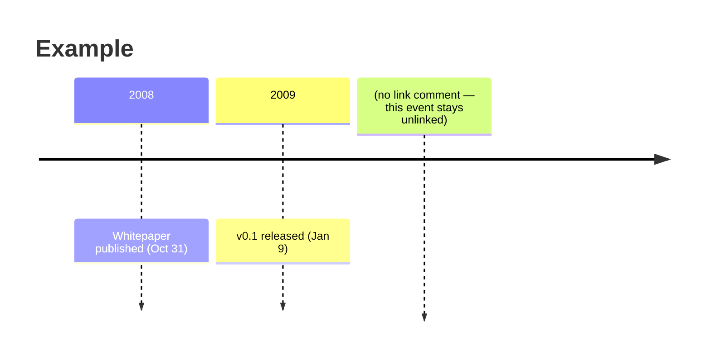
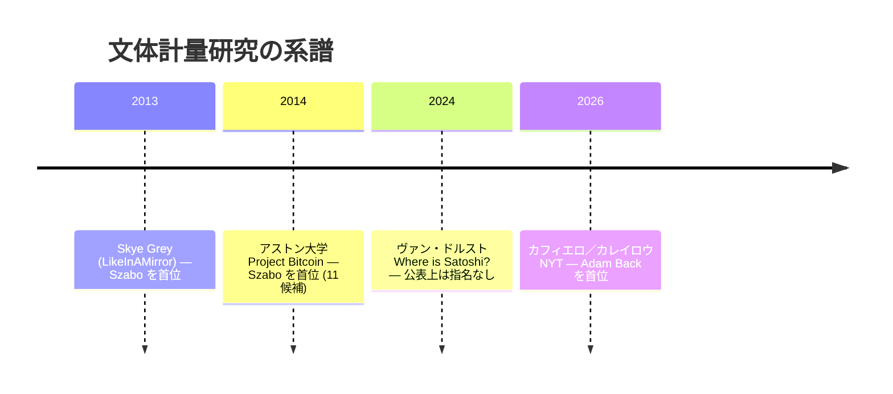

# Bitcoin Institute Style Guide — Visual

Mermaid, d3, and layout implementation rules, split from `STYLE_GUIDE.md` on 2026-08-25 to keep the always-required core (`STYLE_GUIDE_CORE.md`) smaller. Read this file when creating or editing a chart, diagram, or table; it assumes `STYLE_GUIDE_CORE.md` has already been read in full.

Covers: Layout Width Policy, Design Tokens, Visual Representation.

## Layout Width Policy

The site uses a two-tier container system plus a separate prose-width
constraint. The two concerns — page-tier width and prose readability —
are handled by independent tokens so neither has to do double duty.

### Tokens

Defined at `:root` in `src/styles/global.css`:

| Token | Value | Concern |
|---|---|---|
| `--max-width-prose` | 640px | Prose paragraph readability (env- and language-independent) |
| `--max-width-read` | 1000px | Reading-tier page (single document) |
| `--max-width-wide` | 1200px | Dashboard-tier page (lists, viz) |

**Per-page width overrides** (not tokens, single-page exceptions):

| Selector | Value | Where |
|---|---|---|
| `.novel-page` | 720px | `/novel/` and `/ja/novel/` only. The novel intro is denser prose where 720px reads as a published essay rather than a documentation column. |

Use the tier-specific tokens directly. (The former `--max-width` alias
for `--max-width-read` was removed once it had no remaining consumers.)

**Why fixed `px`, not `ch`?** The `ch` unit measures the width of the
"0" glyph in the active font. It is environment-dependent (different
font fallback chains produce different widths) and language-dependent
(Japanese full-width characters are roughly 2× the width assumed by
`ch`). Use `px` for layout boundaries.

### Page-tier allocation

`.container-wide` (1200px) — list / hub / search / dashboard:

- top page (`/`)
- search (`/search/`)
- chart (`/chart/`)
- entries index (`/entries/`)
- participants index (`/participants/`)
- tags index, tags filter (`/tags/`, `/tags/{tag}/`)
- types index, types filter (`/types/`, `/types/{type}/`)
- sources index, sources filter (`/sources/`, `/sources/{source}/`)

`.container` (1000px) — single-document reading pages:

- about
- 404
- entry detail (`/entries/{slug}/`)
- thread detail (`/entries/threads/{id}/`)
- participant biography (`/participants/{slug}/`)

**Rule:** EntryCard list pages all use `.container-wide`. The same
content type should not appear at different widths across the site —
that breaks visual rhythm when navigating between, say, the full
entries list and a tag-filtered list.

### Prose constraint inside containers

Use `.prose` (or set `max-width: var(--max-width-prose)` directly) on
**body paragraphs** that would otherwise stretch across a wide
container, where line length matters for reading flow.

```html
<div class="container-wide">
  <h1>{{title}}</h1>
  <div class="prose">
    <p>Long-form body paragraph that benefits from a 640px width
       constraint so the eye does not have to traverse the full
       1200px container width…</p>
  </div>
  <div class="entries-grid">…</div>
</div>
```

**Do not apply `.prose` to short subtitles like `.page-lead`.** A
single-sentence subtitle does not need a prose-width constraint —
the constraint only causes mid-word wraps without improving
readability. Let the container constrain subtitles. The current
`.page-lead` style intentionally has no `max-width`.

On `.container` (1000px) pages, the container itself already
constrains prose, so `.prose` is usually redundant.

### Responsive

| Breakpoint | Behavior |
|---|---|
| ≥1200 | Containers at fixed max-width (1000 / 1200) |
| 768–1199 | `.container-wide` fluid to viewport (`max-width: 100%`), padding 1.5rem; `.container` is capped at 1000px and shrinks below that width (no override) |
| <768 | Containers full-width, padding 1rem, font-size 16px |

Implemented in `src/styles/global.css` with two `@media` queries
(`max-width: 1199px` and `max-width: 767px`). The 1199 query covers
tablet landscape and small laptops; the 767 query covers phones.

### Header

The site header is always `.container-wide` (1200px) regardless of
the page tier below it. The header is global navigation, not page
content — keeping it at the wide tier matches the industry pattern
(GitHub, Notion, Linear) where chrome is consistent across page types.

The Header component has its own `@media (max-width: 768px)` rule
that switches to a hamburger menu. This is a separate UX concern from
container fluid behavior and intentionally uses a different breakpoint.

### What this policy does not cover

- Hybrid pages (analysis with embedded D3 visualizations) live on
  `.container` (1000px). When a chart is wider than that, the page
  tier does **not** change — the chart wrapper extends at the element
  level via the unified `.figure-outer` + `.figure-block` pattern
  shared by mermaid, tables, and d3. See § d3 components → Layout
  width consideration for the canonical CSS recipe. Switching the
  entire page to a wider tier widens the prose column too, which
  defeats the line-length argument for keeping analysis pages at
  1000px.
- Ultrawide monitors (>1440px viewport) are not fluid-scaled; the
  1200px ceiling holds. Card grids and prose stay readable; left/right
  whitespace is acceptable.
- Print styles are not addressed.

## Design Tokens

The visual identity is **Editorial Sans** — Inter on a white surface
with a deep navy `#1f3a5f` accent. The register is "academic journal,
digital edition": calm, restrained, high-contrast. The previous retro
look (Georgia / sepia / orange-brown) has been retired.

Tokens live in `src/styles/global.css :root` and split into three
families:

- **Color** — `--color-bg`, `--color-text`, `--color-accent`,
  `--color-link`, `--color-border`, plus semantic aliases
  (`--color-bg-quote`, `--color-bg-code`, `--color-divider`).
- **Type** — `--font-body`, `--font-heading`, `--font-mono`, plus
  the type scale (`--text-xs..--text-3xl`, `--line-tight..loose`).
- **Layout** — spacing (`--space-1..--space-8`), radius
  (`--radius-sm..--radius-lg`), shadow (`--shadow-sm..--shadow-lg`),
  width (`--max-width-prose`, `--max-width-read`, `--max-width-wide`).

A dark variant lives in two parallel rules — `@media (prefers-color-scheme: dark) :root:not([data-mode="light"])`
and `:root[data-mode="dark"]` — with the same body. The 3-way header
toggle (light / dark / system) sets `data-mode` on `<html>`; absence
follows the OS. The `<meta name="theme-color">` tag is rewritten at
runtime to track the resolved `--color-bg`.

Mermaid SVG and d3 charts both consume the tokens (`--mermaid-*` and
`--chart-color-*` / `--chart-emphasis` / `--chart-grid` etc.), so a
token change propagates to figures without per-component edits.

Inter is loaded via Google Fonts CDN with `display=swap` (BaseHead).
The system fallback (`-apple-system`, Segoe UI) paints first; Inter
swaps in once available. Self-hosting is a future option without
component-level changes.

## Visual Representation

Long entries — biographies, hypothesis pages, multi-source analyses —
lose readers when they are walls of prose. Default to visual expression
wherever the content can be carried by something other than running
sentences. The bias is toward USE, not toward "is text fine here?"

This is a content-shape policy, not a tooling policy. The rest of this
section is about which tool fits which shape, but the principle stands
on its own: a long analysis without visual structure is a defect to fix,
not a stylistic choice to defend. The cost of an extra table or
diagram is small; the cost of losing a reader halfway through a
2,000-word page is permanent.

### Scope and density target

**Scope.** The visual-density target applies to all entry types
*except* verbatim primary-source transcriptions: `forum-post`,
`mailing-list`, `correspondence`, `whitepaper`, `bip`, `tweet`,
`court-document`. These types reproduce the historical record and
their body text is not editorially modifiable. The target applies to
the remaining editorial types — currently `analysis`, `biography`,
`article`, and `design`.

**Density target (markdown-line proxy).** Count the body lines that
are inside Mermaid code blocks, Markdown table rows (`| ... |`), or
d3 component containers, and divide by total body lines (excluding
frontmatter). This line-count ratio is a proxy for the rendered
visual-area share — not pixel-exact, but stable enough to guide
authoring decisions and script-checkable.

| Threshold | Meaning |
|---|---|
| **≥ 30%** | Design target for new editorial pages. A page at 30% is visually rich — roughly one diagram or table per two to three paragraphs of prose. |
| **≥ 20%** | Floor. Pages below 20% should be reviewed for missing visual opportunities (timeline that could replace a narrated chronology, comparison that could be a table, numeric data that could be a chart). |
| **< 15%** | Flag. The page is a wall of prose; add at least one structural visual before shipping. |

The target is not a hard gate — a 500-word article with one clean
table at 18% is fine; a 3,000-word analysis at 12% with no diagram
is not. The numbers exist to trigger review, not to block commits.

### ⛔ The ratio is not the goal — never add a figure to reach it

A figure added because a page scored low is worse than the low score:
a diagram whose nodes are the rows of the table beneath it, or a table
that compresses the paragraph above it, adds length without adding
anything a reader did not already have.

Two rules, and they are not optional:

1. **Before adding anything — a figure, a table, a section, a
   paragraph — read the page end to end.** Not the section being
   edited: the page. What a page already says is only visible from the
   whole page.
2. **State in one sentence what the new element shows that the page
   does not already show.** If the sentence is only "it makes the same
   point visually", the element is redundant — either give it different
   content or leave it out. A chart of the numbers a table already
   lists is a redraw, not a figure.

A low density score means the page's *content* has not been given its
proper shape — a narrated chronology that should be a timeline, a
repeated paragraph structure that should be a table. It never means
the page needs one more picture.

### ⛔ Write for the reader

Everything here reads as one editorial voice. Two things follow.

- **Do not narrate the page's own construction.** "This page's subject
  is X, not Y", "the supply column is deliberately terse because…",
  "what this table adds is…" — the reader did not ask how the page was
  organised, and a page that ranks the interest of its own contents is
  arguing with its editor in public.
- **Other pages of this archive are not another author's work.** A
  reader sees one site; there is no "over there". Write "the full
  chronology is in [page]" — a fact about the subject. Do not write
  "[page] is the truth source and covers this in depth, so it is not
  repeated here", which credits, defers, and excuses non-repetition as
  though two people wrote them.

Navigation is required; justification is not.

### When to reach for non-text expression

Trigger a visual representation when the content has any of:

| Content shape | Tool of choice |
|---|---|
| Timeline, chronology | Mermaid `timeline` |
| Flow, decision sequence, process | Mermaid `flowchart` |
| Comparison across discrete items (≥3) | Markdown table |
| Numeric distribution, scoring, measurement | d3 component |
| Relationships between entities | Mermaid `graph` / `classDiagram` |
| State transitions, sequence of interactions | Mermaid `sequenceDiagram` / `stateDiagram` |
| Tree / hierarchy | Mermaid `mindmap` |

Prose remains the right tool for argumentation, narrative, nuance, and
contextual color. The signals that prose has stopped being the right
tool: writing the same paragraph structure three times in a row (that's
a table); narrating a chain of dated events in body sentences (that's a
timeline); listing 5+ candidates with attributes (that's a table or
chart). When you notice these shapes mid-draft, switch — do not finish
the prose version "for now."

### Link-color confusion rule

**Non-link text must never use the link color (`--color-link`) or any
hue close enough to be mistaken for a clickable element.** Blue text
and blue underlines are reserved for links. Applying them to
non-interactive text (headings, subtitles, labels, accent spans)
trains readers to click something that does nothing — a basic UX
violation.

This applies to all rendered surfaces: page CSS, Mermaid diagram
labels, d3 chart annotations, and any component that places colored
text on the page.

| Surface | Link color (reserved) | Safe accent alternatives |
|---|---|---|
| Light theme | `--color-link` `#2563eb` (blue) | `--color-hero-subtitle` `#a78347` (gold), `--color-satoshi` `#c2410c` (amber), `--color-text-muted` (slate) |
| Dark theme | `--color-link` `#7ab8ff` (light blue) | `--color-hero-subtitle` `#d4a85c` (gold), `--color-satoshi` `#fbbf24` (amber), `--color-text-muted` (slate) |

When choosing a non-link accent color, prefer warm tones (gold, amber,
rose) or neutral tones (slate, gray) over any blue-adjacent hue. The
`--color-accent` token (`#1f3a5f` light / `#7aa3d4` dark) is
navy-blue and is acceptable for structural UI (borders, badges) where
the element shape already communicates non-clickability, but it should
not be used as standalone text color in a context where a reader might
try to click it.

### Mermaid: editor-friendly diagrams

The archive renders ` ```mermaid ` code blocks to inline SVG at build
time (`rehype-mermaid` in `astro.config.mjs`). Syntax errors fail the
build, so no runtime "Syntax error in graph" red boxes reach production.

Use Mermaid for diagrams that fit one of its built-in shapes:
timelines, flowcharts, sequence diagrams, state diagrams, Gantt charts,
mindmaps, class/ER diagrams. Any writer can add a Mermaid block in
markdown without touching component code.

#### Sizing and overflow

Mermaid SVGs render at their natural pixel size (per-diagram-type
`useMaxWidth: false` is set in `astro.config.mjs`). A custom rehype
plugin (`src/lib/rehype-mermaid-wrapper.mjs`) wraps each rendered
SVG in the unified figure structure
(`<div class="figure-outer"><figure class="figure-block"
data-kind="mermaid">`), and `.figure-block` has `overflow-x: auto`
in `global.css`. See § "Layout width consideration — unified
figure-block + figure-outer" for the full pattern.

The combined effect:

- Diagrams that are narrower than the prose container display at
  natural size, centered (no scroll).
- Diagrams wider than the container (e.g. dense timelines with 20+
  events at ~3000px natural width) keep their full size and scroll
  horizontally inside the wrapper, so readers can pan to see all
  events at readable text size.

Without this wrapper, dense timelines collapse into tiny illegible
text when constrained to the 1000px reading-tier container.

If a specific diagram is too dense even with horizontal scroll
(common signal: still need to zoom the browser to read it), prefer
splitting it into multiple smaller diagrams over forcing it into one.
Splitting strategies that have worked: by decade, by category, or by
phase.

#### Validation

The pipeline `npm run check` includes `check:mermaid`, which extracts
every ` ```mermaid ` block in the corpus and parses it through
`@mermaid-js/mermaid-cli`. Failures report file path, line number, and
parse error. Run `npm run check:mermaid` directly to iterate on a
diagram without the full check.

#### Node emphasis colors (`style fill`)

When a diagram's `style NODE fill:#xxx` directive highlights a node —
network/topology emphasis, a root or center node, a PoW/warning
emphasis, a `stateDiagram-v2` note — pick the color from the
archive's existing Mermaid emphasis tokens rather than an arbitrary
hex value:

| Token | Use |
|---|---|
| `--mermaid-emphasis-blue-bg` | Network / topology node emphasis |
| `--mermaid-emphasis-pink-bg` | Root / center node emphasis |
| `--mermaid-emphasis-yellow-bg` | PoW / warning-style emphasis |
| `--mermaid-note-bg` | `stateDiagram-v2` note background |

Mermaid's `style` directive only accepts literal hex/color values, not
CSS custom properties, so `src/lib/rehype-mermaid-themer.mjs`'s
`COLOR_SUBSTITUTIONS` table rewrites specific hex codes (`#e8f4fd`,
`#ff99ff`/`#f9f`, `#ffff99`/`#ff9`, `#fff5ad`) to the corresponding
`var(--mermaid-*)` token in the build-time SVG output. A color chosen
outside this table renders literally in both themes, including the
pastel-background-plus-light-text combination that is unreadable in
dark mode (`--mermaid-text` tracks the theme; a hardcoded `style fill`
does not).

Introducing a genuinely new emphasis color requires adding both the
CSS token (`src/styles/global.css`, all three `:root` /
`@media (prefers-color-scheme: dark)` / `data-mode="dark"` blocks) and
the matching `COLOR_SUBSTITUTIONS` entry — a color picked only in the
diagram source, with no themer rule, silently loses dark-mode
contrast.

#### Linking diagram items to archive pages (`%% link:`)

Mermaid diagrams in this archive CAN carry links, via a custom
mechanism — do not conclude from Mermaid's own documentation that
they cannot. Mermaid's native `click` directive registers a runtime
JS handler that does not survive the build-time SVG capture (and the
`timeline` type cannot parse `click` at all), so the archive uses a
comment-based syntax handled by `src/lib/rehype-mermaid-link.mjs`:

````markdown

````

Rules:

- Place `%% link: URL` on the line immediately **after** the item it
  links. Items without a following `%% link:` stay unlinked —
  selective linking is normal.
- Supported diagram types: `gantt` and `timeline`. To support another
  type, add a `HANDLERS` entry in the plugin.
- Write URLs in the author-side base form `/BitcoinArchive/...`
  (JA mirrors: `/BitcoinArchive/ja/...`); the deploy environment
  rewrites the base. Only internal entry links are supported in `%% link:`
  comments. External URLs belong in `sourceUrl` / `secondarySources[]`, not
  in a body diagram.
- **One event per line in any block that uses `%% link:`.** The
  pairing between source lines and rendered SVG elements is
  positional: a combined line (`2008 : event A : event B`) counts as
  one source item but renders as two elements, so every link after it
  lands one item off. Split multi-event years into continuation lines
  (`     : event B`).
- **Link each distinct destination at most once per diagram.** When
  multiple items in the same diagram would naturally point at the
  same entry (e.g. two dated events both citing the same email),
  place `%% link:` only after the first occurrence and leave the rest
  unlinked — repeating the same destination link across a diagram is
  visual noise, not additional information.
- **Do not link to `biography`-type entries.** A biography has no
  `/entries/{id}/` detail page — its body renders inside the
  participant page instead (see § Frontmatter `author` semantics) —
  so a `%% link:` pointing at one 404s. Link the person's
  `/participants/{slug}/` page or a primary-source entry instead.
- EN and JA mirrors carry the same `%% link:` lines at the same
  structural positions, pointing at the locale-appropriate paths.

#### Japanese content gotchas

Mermaid v10+ handles Unicode well, but a few patterns trip JA editors.
Quote node labels with `"..."` whenever the label contains anything
that overlaps Mermaid syntax characters.

| Symptom | Cause | Fix |
|---|---|---|
| Parse error on a node like `node[Skye Greyの記事]` containing parens / brackets / colons | Mermaid treats `[]:()` as syntax; full-width forms `「」（）：` mostly OK but mixing is fragile | Always quote: `node["Skye Greyの記事"]` |
| Stray `→` arrow in flowchart syntax | Mermaid expects `-->` `==>` `-.->` etc. for edges; `→` inside an *unquoted* label can confuse parsers | Use `-->` for edges; if `→` appears as text inside a label, wrap label in `"..."` |
| Full-width colon `：` used as a Mermaid syntax separator | Mermaid expects half-width `:` (e.g. in `timeline` event lines) | Always use half-width `:` `;` `(` `)` `[` `]` for syntax positions; full-width forms are fine *inside* quoted labels |
| Tab vs. space indentation mix | Some diagram parsers are whitespace-sensitive | Use 4 spaces consistently; no tabs |
| Diagram height unexpectedly cut off | Default theme styling | Generally not an editor issue; report if it shows up |

#### Authoring example (timeline with mixed JA/EN)

````markdown

````

In `flowchart`, node labels with brackets/parens/colons must be quoted
(`node["..."]`) because those characters are flowchart syntax. In
`timeline`, the event text after `:` is plain text — quoting it
displays the quotes literally inside the rendered card. Avoid
quoting timeline events; use the syntax above.

#### Period headers: year-only

All Mermaid timelines in this archive use **year-only period headers**
(`YYYY`) and group multiple same-year events via the `: Event`
continuation pattern (see the authoring example above). Per-event
headers like `YYYY-MM` or `YYYY-MM-DD` are not used — they fragment
the diagram into one column per event and make the year-by-year ramp
invisible. Within-year ordering and month / day specificity are
preserved by writing `(Jan)`, `(Aug 1)`, etc. inline in each event
description. The convention is the same across biographies,
hypothesis pages, and analysis entries.

#### Title conventions and required diagrams: biographies and hypothesis pages

Two specific entry types have standardized Mermaid timeline conventions:
biographies and hypothesis-page entries
(`analysis/*-satoshi-identity-hypothesis.md`). Both the trigger for
adding a Mermaid and the title format are codified so the page type is
legible from the diagram alone.

**Biographies — required when scope is multi-decade or candidate-relevant.**

Required for: biographies of Satoshi-identity candidates (Adam Back,
Wei Dai, Hal Finney, Nick Szabo, Sassaman, Peter Todd, Kaneko, etc.)
and biographies of core protocol-development participants with
multi-decade scope (Satoshi Nakamoto, Gavin Andresen). Short-scope
biographies (single-event participants, brief mailing-list contacts)
are not required to have a Mermaid timeline. The trigger is multi-decade
narrative or ≥ 6 distinct dated events worth surfacing.

Title — canonical form:

- EN: `<Full Name>'s Bitcoin-relevant timeline`
- JA: `<人物名>のビットコイン関連年表`

The timeline covers Bitcoin-relevant events across the person's
documented life. Even when the active window is narrow (e.g. Andresen
2010–2014), the title remains the generic form; the date range is
visible from the events themselves.

**Hypothesis pages — only when ≥ 2 alibi-relevant events exist.**

A hypothesis-page Mermaid timeline is warranted only when at least
two documented *alibi-relevant* events — events showing the
candidate's documented activity in time-conflict with Satoshi's
documented activity at the same moment — are available to populate
it. The Mermaid is for **physical / time-conflict alibi**, not
general chronology, capability gaps, denials, or third-party
reception patterns. Those structural arguments belong in prose; only
physical / time alibi belongs in the Mermaid.

If the hypothesis page has 0 or 1 alibi-relevant events, do not add a
Mermaid. The candidate's biography Mermaid covers the chronology, and
duplicating it on the hypothesis page adds no information.

Title — canonical form:

- EN: `<Candidate> vs Satoshi - alibi-relevant events`
- JA: `<候補名> vs サトシ - アリバイ関連イベント`

Use the candidate's commonly-referenced short name where unambiguous
(`Hal` / 「ハル」, `Szabo` / 「サボ」), or the full name where shorter
forms are ambiguous (`Wei Dai` / 「ウェイ・ダイ」).

**Currently qualifying.** Hal Finney is the only candidate with ≥ 2
documented physical-alibi events: the April 18, 2009 Santa Barbara
race day (timestamped photograph by Fran Finney) versus Satoshi's
contemporaneous Hearn email and transaction broadcast, and the August
14–15, 2010 SF Singularity Summit (public attendance record) versus
Satoshi's 4 commits and 17 forum posts on the same two days.

Other candidates (Adam Back, Wei Dai, Szabo, Sassaman, Todd, Kaneko)
do not currently have ≥ 2 alibi-relevant events documented and so do
not have hypothesis-page Mermaids. New documented physical alibis can
trigger an addition; structural counter-evidence (capability gaps,
self-denials, third-party reception) cannot.

**Audit.** When adding or renaming such an entry, grep the corpus for
existing title conventions to confirm consistency:

```bash
grep -rn "title.*ビットコイン関連年表\|title.*Bitcoin-relevant timeline" src/data
grep -rn "title.*vs サトシ\|title.*vs Satoshi" src/data
```

### d3 components: numerical and custom visualizations

When the content needs actual numbers — distributions, axes with units,
named-candidate annotation, custom interaction — Mermaid's templates
fall short. Reach for an Astro component under `src/components/` that
uses d3 instead.

Existing examples (browse the directory for current state):

- `StylometricDistanceHistogram.astro` — author distribution with named
  candidates plotted in
- `LoppHashrateAnalysis.astro` — hashrate / nonce-LSB time series
- `SatoshiCodeAnalysis.astro` — comment-density and code-fingerprint
  metrics

Each component owns its EN/JA labels (a `lang` prop plus an internal
`labels` map keyed by locale). Render at build time when the data is
fixed; client-side d3 is acceptable for components that need
viewport-driven sizing or user interaction.

Component subtitles describe **what the chart means**, not **how the
chart is laid out**. A line like "labels in the left margin" or
"legend below" is a layout note for the developer, not the reader —
the reader can see the layout. Keep the subtitle focused on the
data and what to look for.

#### Layout width consideration — unified figure-block + figure-outer

Analysis pages use `.container` (1000px) so prose stays at a readable
line length. When a figure (chart, mermaid diagram, or table) is wider
than that, **break out at the element level** rather than widening
the page tier. All three figure types share the same wrapper
structure:

```html
<div class="figure-outer">
  <figure class="figure-block" data-kind="chart|mermaid|table">
    <!-- svg | table | chart-container -->
  </figure>
</div>
```

The CSS (defined once in `src/styles/global.css`):

```css
/* Outer: provides the breakout context */
.figure-outer { margin-block: 1.5em; }

/* Breakout is gated by `data-breakout`, set by an overflow-only
   script in BaseLayout.astro — a figure that fits its column keeps
   its exact in-column layout at every viewport; only one whose
   content overflows joins the breakout. See the breakout-gating
   table below for the per-kind threshold and required-width check. */
@media (min-width: 1200px) {
  .figure-outer[data-breakout] {
    margin-inline: calc((100vw - 100%) / -2 + 2rem);
  }
  .figure-outer[data-breakout] > .figure-block[data-kind="table"] {
    width: max-content;
    margin-inline: auto;
  }
}

/* Inner block: visual boundary, scrolls horizontally on overflow */
.figure-block {
  box-sizing: border-box;
  margin: 0 auto;
  overflow-x: auto;
  border: 1px solid var(--color-border);
  background: var(--color-bg-alt);
  border-radius: 6px;
  padding: 0.5rem;
}

.figure-block[data-kind="mermaid"],
.figure-block[data-kind="table"] {
  width: max-content;
  max-width: 100%;
}

.figure-block[data-kind="chart"] {
  width: 100%;
  max-width: 100%;
  position: relative;
  overflow-y: hidden;
}
```

**Per-kind sizing**:

| `data-kind` | width | Reason |
|---|---|---|
| `mermaid` | `max-content` + `max-width: 100%` | Mermaid renders SVG at a fixed natural size (`useMaxWidth: false`); the block sizes to content and never wider than wrapper. Small diagrams stay small (no wasted whitespace). |
| `table` | same as mermaid | A table that fits the prose column keeps its exact in-column layout (left-aligned, natural width) at every viewport; only a table whose content overflows joins the breakout (see below), where it then sizes to `max-content` up to the viewport gutter and centers like a mermaid figure. |
| `chart` (d3) | `width: 100%` | D3 sizes its SVG to the wrapper's `clientWidth`, so the block must be 100% width (not `max-content`) for the chart to use the available room. `position: relative` + `overflow-y: hidden` support the tooltip pattern. |

**Breakout gating — always overflow-only, never unconditional on
viewport width**: a figure never breaks out just because the
viewport is wide; only because its content doesn't fit the prose
column. The gating script (`BaseLayout.astro`) withholds
`data-breakout` until a block's required width exceeds its column,
using a per-kind viewport **threshold** and required-width
**predicate**:

| `data-kind` | threshold | required-width predicate | Reason |
|---|---|---|---|
| `table` | 1500px | live `scrollWidth` | Table is natural width and never resizes itself, so `scrollWidth` is stable across the breakout toggle. The higher threshold avoids the "微妙にずれてる" gata zone (1100-1499px) where a small table breakout visually mis-aligns with prose. |
| `mermaid` | 1200px | live `scrollWidth` | Fixed-size SVG (`useMaxWidth: false`, `width: max-content`) is likewise stable under `scrollWidth`. A diagram isn't expected to sit flush with the prose column the way a table is, so the tighter gata-zone concern doesn't apply. |
| `chart` (d3) | 1200px | declared CSS `min-width` (e.g. `.ce-chart{min-width:1080px}` in `ChartEmbedRuntime.astro`) | D3 sizes its SVG to the wrapper's `clientWidth` (`width: 100%`), so `scrollWidth` read *after* breakout is applied always reads "fits" — comparing it against the column would flip `data-breakout` on, then off, then on again. Each chart's own static declared `min-width` is a stable "does this actually need more room" signal that doesn't change with the figure-block's current width. |

Pure CSS cannot branch on "content overflows" (grid `safe center`
clamps in the wrong direction), hence the one-attribute script;
without JS every figure scrolls in its column (status quo).

**Scroll centering**: once a figure needs horizontal scroll at all —
with or without breakout — its initial scroll position is centered
(`scrollLeft` set to the midpoint) instead of left-flush, for mermaid
and chart (never table, which has never auto-centered). Centering is
skipped permanently for a given block after the visitor's first
manual scroll (`wheel`/`touchstart`), so it never fights a deliberate
scroll on a later resize or DOM mutation.

**History — past patches and the present design**: this section once
specified per-wrapper classes (`.mermaid-scroll`, `.table-scroll`,
`.chart-scroll`) with different cap policies (Mermaid uncapped,
table/chart capped at 1200px). The uncapped Mermaid breakout was
introduced in commit `9f93e628` (2026-05-04), then removed in
`64658b7c` (2026-05-13) with the reason "bleeding past the prose
left/right edges". The actual visual problem — figures sticking out
slightly past prose without a clear "this is a separate block"
indicator — is solved by the visual boundary (border + background)
on `.figure-block`, not by the absence of breakout.

The `.figure-outer` + `.figure-block` wrapper unified in commit
`68264517a` (2026-05-31) at a single 1500px threshold, but applied
breakout **unconditionally** to every kind except table (`:has(table)`
was excluded). Because `data-kind="chart"` self-resizes to fill
whatever width it's given, that unconditional rule stretched charts
that already fit their column — `identity-suspect-map` measured at
1866px wide against a 952px column. Commits `ea92f6747` and
`4f8633ab8` (2026-08-14) replaced the unconditional rule with the
overflow-gated `data-breakout` mechanism tables already used,
generalized it to cover mermaid and chart (restoring mermaid's
original pre-`64658b7c` 1200px threshold for the diagram/chart kinds
specifically, while table kept 1500px), and added the scroll-centering
behavior described above.

### Tables: the lowest-cost visual structure

Markdown tables are the cheapest visual tool available — no extra
dependencies, no build-time renderer, no language pairing concerns.
Use them freely for any content that compares ≥3 items across ≥2
attributes. A table is almost always more legible than a paragraph
that says "X does A, Y does B, Z does C."

Failure modes to avoid:

- **Single-column tables** — that's a list, use bullets.
- **Single-row tables** — that's a sentence with extra steps.
- **Tables of free-form prose cells** — if every cell is a paragraph,
  the table structure is decorative; restructure into headed
  paragraphs or convert the comparison into a chart.

JA tables follow the same syntactic rules as EN. Mixed-locale rows
are fine when the comparison is explicitly bilingual (e.g. an English
term and its JA translation in adjacent cells).

### Combining tools

A single page can use all three. A typical analysis page might open
with a Mermaid timeline as a TL;DR, embed a d3 distribution chart in
the methodology section, and use markdown tables in the comparison
section. The tools are complementary; the choice is per-shape, not
per-page.

