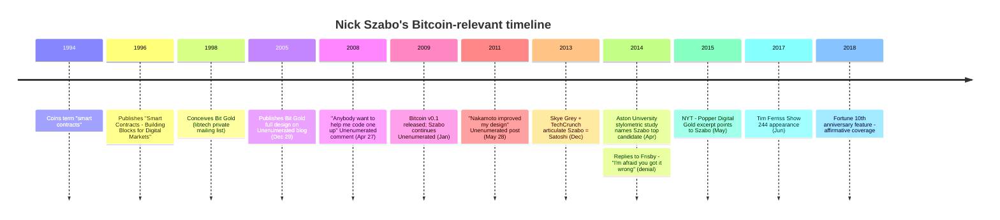

Nick Szabo is a computer scientist, legal scholar, and cryptographer known for his pioneering work on digital currency and smart contracts. His real identity and background remain largely private.

**Smart Contracts:**
In 1994, Szabo coined the term "smart contracts" — self-executing agreements with the terms directly written into code. This concept, decades ahead of its time, would later become the foundation of platforms like Ethereum.

**Bit Gold:**
In 1998, Szabo conceived Bit Gold, a decentralized digital currency system based on proof-of-work. He published the full design on his Unenumerated blog on December 29, 2005. Bit Gold addressed the fundamental problem of creating digital scarcity without a trusted third party — the same problem Bitcoin would solve. Szabo later reflected: "Nearly everybody who heard the general idea thought it was a very bad idea."

Bit Gold shared key concepts with Bitcoin — proof-of-work, chained puzzles, and decentralized verification — but had a significant security weakness: it did not solve the problem of preventing a single party from controlling the majority of nodes. [Satoshi Nakamoto](/BitcoinArchive/participants/satoshi-nakamoto/) improved on this design.

**Relationship to Bitcoin:**
Szabo acknowledged Satoshi's improvement in his [2011 blog post](/BitcoinArchive/entries/aftermath/2011-05-28-nick-szabo-bitcoin-what-took-ye-so-long/): "Nakamoto improved a significant security shortcoming that my design had, namely by requiring proof-of-work to be a node in a Byzantine-resilient peer-to-peer system to greatly reduce the threat of an untrustworthy party controlling the majority of nodes."

[Hal Finney](/BitcoinArchive/participants/hal-finney/), in his early email exchanges about Bitcoin, noted the similarity between Bitcoin and Szabo's Bit Gold. Satoshi discovered Szabo's work through [Wei Dai](/BitcoinArchive/participants/wei-dai/), who suggested reviewing Bit Gold alongside his own [b-money concept](/BitcoinArchive/entries/aftermath/1998-11-26-wei-dai-pipenet-b-money-announcement/).

**Satoshi Speculation:**
Due to the deep conceptual similarities between Bit Gold and Bitcoin, some have speculated that Szabo could be Satoshi Nakamoto. He has denied this. No confirmed direct correspondence between Szabo and Satoshi has been published.
