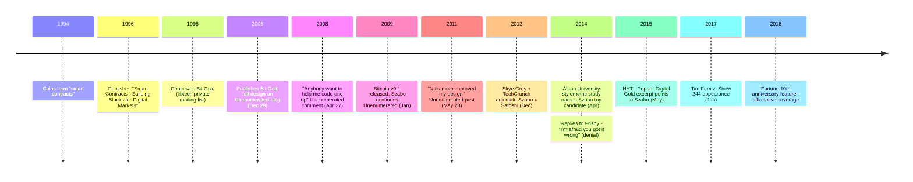

In 1994, Nick Szabo coined the term "smart contracts." In 1998 he conceived Bit Gold — a decentralized digital currency based on proof-of-work — and published the full design on his Unenumerated blog on December 29, 2005. On April 27, 2008, [in a comment on his own blog](/BitcoinArchive/entries/aftermath/2008-04-27-nick-szabo-bit-gold-implementation-request/), Szabo wrote:

> "Bit gold would greatly benefit from a demo, an experimental market. Anybody want to help me code one up?"

Four months later, on August 20, 2008, [Satoshi Nakamoto](/BitcoinArchive/participants/satoshi-nakamoto/) sent his first known email about what would become Bitcoin. Bitcoin v0.1 shipped on January 9, 2009. In [May 2011 Szabo wrote about the new system on Unenumerated](/BitcoinArchive/entries/aftermath/2011-05-28-nick-szabo-bitcoin-what-took-ye-so-long/):

> "Nakamoto improved a significant security shortcoming that my design had, namely by requiring proof-of-work to be a node in a Byzantine-resilient peer-to-peer system to greatly reduce the threat of an untrustworthy party controlling the majority of nodes."

Szabo is a computer scientist, legal scholar, and cryptographer. His real identity and background remain largely private. The deep conceptual similarities between Bit Gold and Bitcoin, the April 2008 "code one up" request relative to Satoshi's August 2008 first email, and Szabo's prolific Unenumerated writing during 2007–2008 have made him a recurring Satoshi-identity candidate — examined in a [dedicated identity-hypothesis entry](/BitcoinArchive/entries/analysis/2013-12-05-szabo-satoshi-identity-hypothesis/) with the [Skye Grey / TechCrunch 2013 stylometric articulation](/BitcoinArchive/entries/aftermath/2013-12-05-techcrunch-skye-grey-szabo-stylometric/), the [Aston University 2014 study](/BitcoinArchive/entries/aftermath/2014-04-16-aston-university-szabo-stylometric-study/), and the [Popper / NYT 2015 *Digital Gold* excerpt](/BitcoinArchive/entries/aftermath/2015-05-15-popper-nyt-szabo-satoshi-investigation/) as the principal supporting articulations. Szabo's consistent denials, e.g., "I'm afraid you got it wrong" to Dominic Frisby (2014), stand as the principal counter-evidence.

### Smart Contracts
In 1994, Szabo coined the term "smart contracts" — self-executing agreements with the terms directly written into code. This concept, decades ahead of its time, would later become the foundation of platforms like [Ethereum](/BitcoinArchive/entries/forum/bitcointalk/topic-428589/2014-01-23-vbuterin-ethereum-welcome-to-the-beginning/).

### Bit Gold
In 1998, Szabo conceived Bit Gold, a decentralized digital currency system based on proof-of-work. He published the full design on his Unenumerated blog on December 29, 2005. Bit Gold addressed the fundamental problem of creating digital scarcity without a trusted third party — the same problem Bitcoin would solve. Szabo later reflected: "Nearly everybody who heard the general idea thought it was a very bad idea."

Bit Gold shared key concepts with Bitcoin — proof-of-work, chained puzzles, and decentralized verification — but had a significant security weakness: it did not solve the problem of preventing a single party from controlling the majority of nodes. [Satoshi Nakamoto](/BitcoinArchive/participants/satoshi-nakamoto/) improved on this design.

### Relationship to Bitcoin

[Hal Finney](/BitcoinArchive/participants/hal-finney/), in his [November 7, 2008 reply](/BitcoinArchive/entries/emails/cryptography/bitcoin-p2p-e-cash-paper/2008-11-07-re-bitcoin-p2p-e-cash-paper-finney/) to Satoshi's whitepaper announcement on the cryptography mailing list, noted that Bitcoin "could be an implementation" of Szabo's Bit Gold concept — the first public framing of the lineage. When Satoshi himself first became aware of Bit Gold is not directly attested in any primary source available to this archive; the whitepaper's reference list cites b-money but not Bit Gold.
