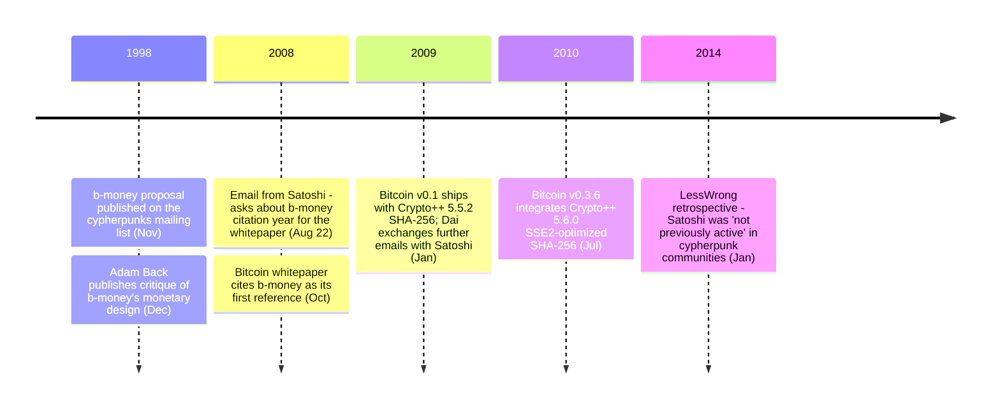

In November 1998, Wei Dai published [b-money](/BitcoinArchive/entries/aftermath/1998-11-26-wei-dai-pipenet-b-money-announcement/) — a proposal for distributed digital cash — on the cypherpunks mailing list. Ten years later, on August 22, 2008, [Satoshi Nakamoto](/BitcoinArchive/participants/satoshi-nakamoto/) [emailed Dai directly](/BitcoinArchive/entries/correspondence/wei-dai/2008-08-22-satoshi-to-wei-dai/):

<!-- speaker: Satoshi Nakamoto -->
> "I was very interested to read your b-money page. I'm getting ready to release a paper that expands on your ideas into a complete working system. Adam Back (hashcash.org) noticed the similarities and pointed me to your site. I need to find out the year of publication of your b-money page for the citation in my paper."

Two months later, the [Bitcoin whitepaper](/BitcoinArchive/entries/emails/cryptography/bitcoin-p2p-e-cash-paper/2008-10-31-bitcoin-p2p-e-cash-paper/) cited b-money as reference [1]. Bitcoin v0.1 also shipped with Dai's [Crypto++ library](https://www.cryptopp.com/) for its SHA-256 implementation — making Dai's code a direct dependency of Bitcoin from the first release.

In January 2014, asked on LessWrong whether Satoshi might be a known figure from the cryptography or cypherpunk communities, Dai answered:

> "My guess is that he's not anyone who was previously active in the academic cryptography or cypherpunks communities, because otherwise he probably would have been identified by now based on his writing and coding styles."

Wei Dai is a computer scientist and cryptographer who studied at the University of Washington and worked at Microsoft. The combination of b-money as whitepaper reference [1], the Crypto++ codebase dependency, and Satoshi's pre-launch outreach has made Dai a recurring Satoshi-identity candidate — examined in a [dedicated identity-hypothesis entry](/BitcoinArchive/entries/analysis/2008-08-22-wei-dai-satoshi-identity-hypothesis/). The retrospective above is treated as the principal self-denial. The smallest denomination in the Ethereum cryptocurrency, "wei," is named after him.

### b-money (1998)
In November 1998, Dai published ["b-money"](/BitcoinArchive/entries/aftermath/1998-11-26-wei-dai-pipenet-b-money-announcement/), a proposal for an anonymous, distributed electronic cash system, on the cypherpunks mailing list. The b-money proposal described a system where participants could create money by broadcasting the solution to a computational puzzle — a concept conceptually similar to Bitcoin's proof-of-work mining. The paper outlined two protocols: one requiring a synchronous broadcast channel, and another using a set of servers to keep track of balances. B-money was never implemented, but it became one of the key intellectual precursors to Bitcoin.

### Crypto++
Dai created and maintained Crypto++, a free, open-source C++ library providing a comprehensive collection of cryptographic algorithms and schemes. The library is widely used in academic and commercial projects and remains one of the most respected cryptographic libraries available. Bitcoin used Crypto++ for its SHA-256 implementation from the earliest archived release: Bitcoin v0.1.3 ALPHA (early 2009) carries `src/sha.cpp` and `src/sha.h` with a header note stating that the routines were "extracted as a standalone file from Crypto++ Version 5.5.2 (9/24/2007)" — the latest Crypto++ release available at the time Bitcoin was being designed (mid-2007 onward).

The Crypto++ 5.6.0 SSE2-assembly-optimized SHA-256 was integrated into Bitcoin in version 0.3.6 (July 29, 2010 release). Primary-source timeline:

- 2010-07-25: BitcoinTalk member "BlackEye" [demonstrated integrating Crypto++ 5.6.0 SHA-256 with SSE2 assembly](/BitcoinArchive/entries/forum/bitcointalk/topic-453/2010-07-25-blackeye-msg5774/) — "the fastest SHA256 yet using the SSE2 assembly code."
- 2010-07-26: Satoshi [responded](/BitcoinArchive/entries/forum/bitcointalk/topic-501/2010-07-26-re-bitcoin-x64-for-windows/) — "Is that still starting from Crypto++? Lets get this into the main sourcecode."
- 2010-07-27 (SVN rev 114): Satoshi [confirmed adding the library subset](/BitcoinArchive/entries/forum/bitcointalk/topic-572/2010-07-27-sni282-re-bitcoin-x86-for-windows/) — "I added a subset of the Crypto++ 5.6.0 library to the SVN. I stripped it down to just SHA and 11 general dependency files... The combined speedup is about 2.5x faster than version 0.3.3. This is SVN rev 114."
- 2010-07-29: [v0.3.6 release alert](/BitcoinArchive/entries/forum/bitcointalk/topic-626/2010-07-29-alert-upgrade-to-0-3-6/) — Satoshi credited BlackEye for the Crypto++ ASM SHA-256 and tcatm for the midstate cache optimization: "Total generating speedup 2.4x faster."
- 2010-08-09: Satoshi [stated explicitly](/BitcoinArchive/entries/forum/bitcointalk/topic-765/2010-08-09-version-0-3-8-1-update-for-linux-64-bit/) — "When we switched to Crypto++ 5.6.0 SHA-256 in version 0.3.6, generation got broken on the Linux 64-bit build."

Dai's code contributions to Bitcoin are twofold: b-money as an intellectual precursor, and Crypto++ as a direct codebase dependency from the earliest released version.

### Satoshi's First Contact
On August 22, 2008, [Satoshi Nakamoto](/BitcoinArchive/participants/satoshi-nakamoto/) [emailed Dai directly](/BitcoinArchive/entries/correspondence/wei-dai/2008-08-22-satoshi-to-wei-dai/), writing that he was preparing to publish a paper expanding on Dai's b-money ideas. Satoshi asked Dai for the year of b-money's publication to properly cite it. This email, along with [a similar one](/BitcoinArchive/entries/correspondence/adam-back/2008-08-20-satoshi-to-adam-back/) sent to [Adam Back](/BitcoinArchive/participants/adam-back/) two days earlier, represents the earliest known evidence of Satoshi reaching out to existing cryptographers before publishing the Bitcoin white paper. The [white paper](/BitcoinArchive/entries/emails/cryptography/bitcoin-p2p-e-cash-paper/2008-10-31-bitcoin-p2p-e-cash-paper/), published on October 31, 2008, cites b-money as its first reference.

### Later Correspondence
In January 2009, following Bitcoin's launch, Dai and Satoshi exchanged further emails. Satoshi [wrote to Dai](/BitcoinArchive/entries/correspondence/wei-dai/2009-01-10-satoshi-to-wei-dai/) about the upcoming release, and [Dai responded](/BitcoinArchive/entries/correspondence/wei-dai/2009-01-10-wei-dai-to-satoshi/) with thoughts on Bitcoin's design, noting both its similarities to and differences from b-money. Dai also made philosophical observations about the nature of money and cryptocurrency that demonstrated a deep understanding of the challenges involved.

### Significance

Dai's 2014 retrospective combined with Satoshi's own [August 21, 2008 b-money disclaimer to Adam Back](/BitcoinArchive/entries/correspondence/adam-back/2008-08-21-satoshi-to-adam-back-b-money/) anchors [the cypherpunk independent-arrival analysis](/BitcoinArchive/entries/analysis/2008-10-31-cypherpunk-independent-arrival/) — two independent observations converging on the same picture of where Satoshi stood relative to the cypherpunk community during development.
