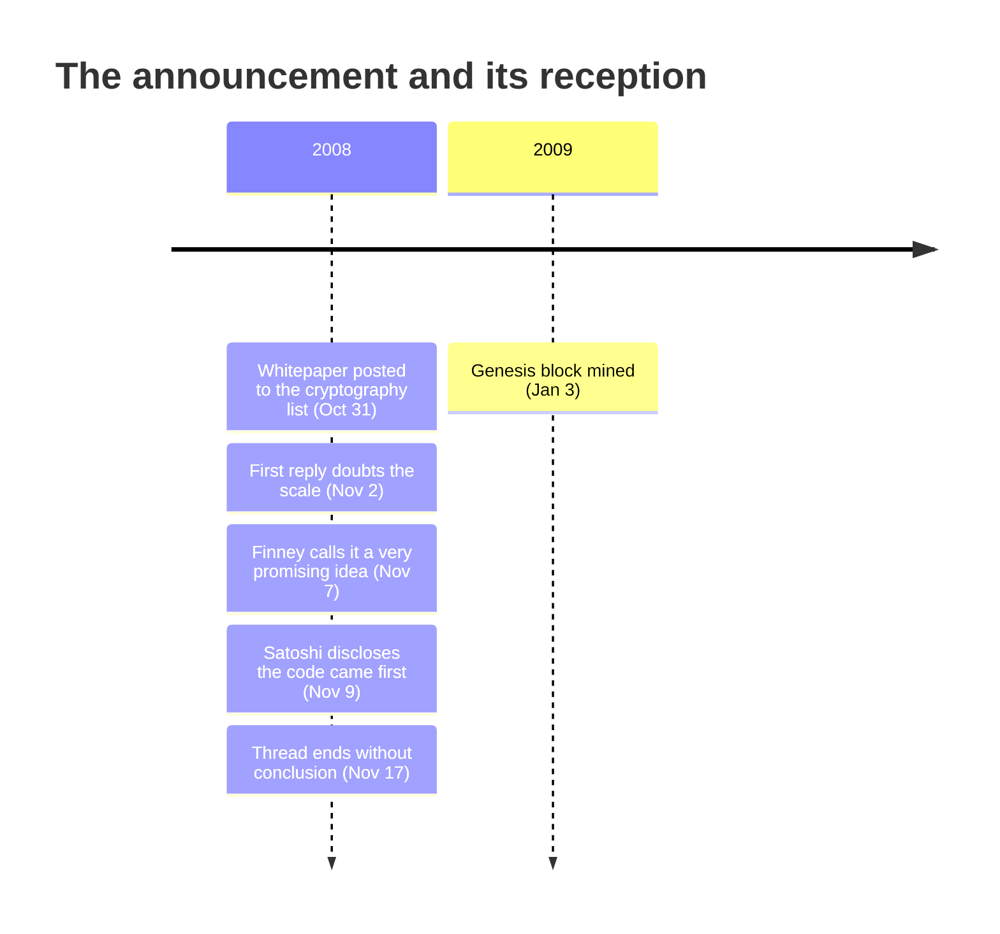

Bitcoin first appeared publicly as a nine-page PDF and an unknown name, not as a running network. On Friday, October 31, 2008, at 18:10 UTC, that message landed on the cryptography mailing list at metzdowd.com:

<!-- quote: q1 -->
> "I've been working on a new electronic cash system that's fully peer-to-peer, with no trusted third party."

The name at the bottom was Satoshi Nakamoto. The message linked a nine-page PDF hosted at bitcoin.org, titled *Bitcoin: A Peer-to-Peer Electronic Cash System*, and listed five properties: double-spending prevented by a peer-to-peer network, no mint or trusted parties, anonymous participants, new coins issued through Hashcash-style proof-of-work, and that same proof-of-work powering the network that prevents the double-spending. [The paper itself is archived here](/BitcoinArchive/entries/emails/cryptography/2008-10-31-bitcoin-whitepaper-final/), alongside [an October 3 draft](/BitcoinArchive/entries/emails/cryptography/2008-10-03-bitcoin-whitepaper-draft/) that preserves the wording before the final revision.

Then, for two days, nothing.

The first reply in the record arrived on November 2, and it opened with a need and closed with a doubt:

<!-- quote: q2 -->
> "We very, very much need such a system, but the way I understand your proposal, it does not seem to scale to the required size."

[James A. Donald](/BitcoinArchive/participants/james-donald/), a longtime cypherpunk, had named in the thread's first response the objection that would follow Bitcoin for the rest of its documented history: scale. John Levine answered from the anti-spam trenches, where the arithmetic looked hopeless — the blacklist operators he knew logged on the order of a million new hijacked machines a day, so the assumption that honest nodes would hold the most CPU power struck him as already refuted. The list Satoshi had chosen was the one audience for which none of this was abstract: its readers had built, reviewed, or buried a generation of digital-cash designs.

On November 7 the register shifted. [Hal Finney](/BitcoinArchive/participants/hal-finney/) — the one reader who had himself built and shipped a proof-of-work token system, RPOW — replied:

<!-- quote: q3 -->
> "Bitcoin seems to be a very promising idea."

Finney connected the design to Nick Szabo's bit gold and pressed on the well-funded-attacker problem. Satoshi answered point by point over the following two days, working through follow-up questions on block propagation, competing chains, and Finney's request for concrete data structures, until one reply, sent November 9, fixed the project's chronology in a single disclosure:

<!-- quote: q4 -->
> "I actually did this kind of backwards. I had to write all the code before I could convince myself that I could solve every problem, then I wrote the paper."

The nine pages were a report, not a proposal. Satoshi first wrote the code, confirmed against a working implementation that every problem could be solved, and then wrote the paper — so by the time the list read the abstract, the system it described already existed as software awaiting release. The paper had also moved privately before it moved publicly: in August, Satoshi wrote to each of the two cypherpunk predecessors it cited, asking [Adam Back](/BitcoinArchive/entries/aftermath/2008-08-20-satoshi-to-adam-back/) and [Wei Dai](/BitcoinArchive/entries/correspondence/wei-dai/2008-08-22-satoshi-to-wei-dai/) about citing their work.

The thread ran to November 17 and then stopped, with the skeptics unconverted. All 24 messages this archive holds from it — every objection, every answer — can be read in sequence in [the thread view](/BitcoinArchive/entries/threads/emails/cryptography/bitcoin-p2p-e-cash-paper/). Nine weeks after the announcement, Satoshi [mined the genesis block](/BitcoinArchive/entries/aftermath/2009-01-03-genesis-block/), and the system the nine pages described stopped being a document.

*[Context: The October 31, 2008 posting is the inciting moment of the novel [*Genesis: The Disappearance of the Founder and the Promise*](/BitcoinArchive/novel/) — the nine pages the protagonist releases into the middle of a financial crisis, carrying what the novel calls the protocol that would overturn, at its root, a concept of money thousands of years old.]*

<!-- entry-closing -->

The first public appearance therefore carries two records at once: a working system presented as a paper, and a paper met first by silence, then by the scaling objection it would spend its history answering. The thread does not show a finished victory; it shows the moment a design entered a skeptical audience and had to remain standing there.
