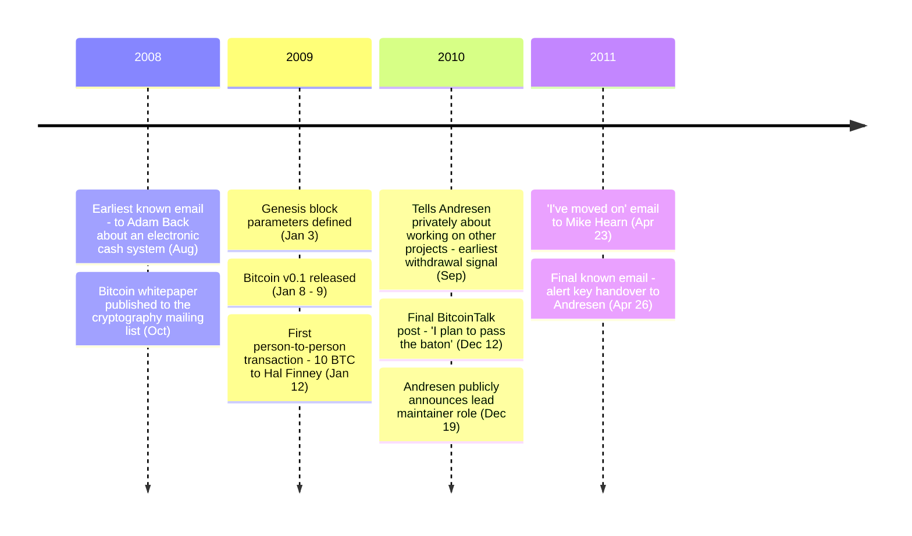

On October 31, 2008, Satoshi Nakamoto published the Bitcoin whitepaper. Two and a half years later, he sent his last known email and stopped. Approximately 1.1 million BTC mined under a single coordinated pattern in those first months have not moved since.

"Satoshi Nakamoto" is a pseudonym. The individual or group behind it has never been identified.

### White Paper

The earliest documented communication is the [August 20, 2008 email to Adam Back](/BitcoinArchive/entries/correspondence/adam-back/2008-08-20-satoshi-to-adam-back/) asking about Hashcash citation format. The [whitepaper](/BitcoinArchive/entries/emails/cryptography/bitcoin-p2p-e-cash-paper/2008-10-31-bitcoin-p2p-e-cash-paper/) followed on October 31, 2008, sent to the cryptography mailing list at metzdowd.com — nine pages describing how a chain of digital signatures, secured by proof-of-work, could resist double-spending without a trusted intermediary.

### Launch

On January 3, 2009, Satoshi defined the parameters of [Block 0](/BitcoinArchive/entries/aftermath/2009-01-03-genesis-block/). Embedded in its coinbase field, the front-page headline of *The Times* from that day:

> "The Times 03/Jan/2009 Chancellor on brink of second bailout for banks"

Block 0 is hardcoded as a constant in the source — every node reconstructs it locally from the same parameters (see the [genesis-block hardcode analysis](/BitcoinArchive/entries/analysis/2009-01-03-genesis-block-hardcode-analysis/)). On January 8, [Bitcoin v0.1 was released](/BitcoinArchive/entries/aftermath/2009-01-09-bitcoin-v01-released/). Four days later, Block 170 carried 10 BTC from Satoshi to [Hal Finney](/BitcoinArchive/participants/hal-finney/) — the [first person-to-person Bitcoin transaction](/BitcoinArchive/entries/aftermath/2009-01-12-first-bitcoin-transaction/).

### Development and Communication

Satoshi was active on the cryptography mailing list, the bitcoin-list mailing list on SourceForge, the BitcoinTalk forum (which Satoshi and Martti Malmi created), the P2P Foundation forum, and in private email. Direct correspondents included [Adam Back](/BitcoinArchive/participants/adam-back/), [Wei Dai](/BitcoinArchive/participants/wei-dai/), [Hal Finney](/BitcoinArchive/participants/hal-finney/), [James A. Donald](/BitcoinArchive/participants/james-donald/), [Ray Dillinger](/BitcoinArchive/participants/ray-dillinger/), [Dustin Trammell](/BitcoinArchive/participants/dustin-trammell/), [Martti Malmi](/BitcoinArchive/participants/martti-malmi/), [Mike Hearn](/BitcoinArchive/participants/mike-hearn/), [Gavin Andresen](/BitcoinArchive/participants/gavin-andresen/), [Laszlo Hanyecz](/BitcoinArchive/participants/laszlo-hanyecz/), [Jeff Garzik](/BitcoinArchive/participants/jeff-garzik/), and others. Across 2009–2010, Satoshi authored hundreds of forum posts and emails — explaining design choices, responding to technical objections, coordinating development.

### Transition and Disappearance

By September 2010, Satoshi was telling Gavin Andresen privately that he was [working on other projects](/BitcoinArchive/entries/aftermath/2010-09-01-satoshi-andresen-other-projects-notice/) — the earliest documented signal of withdrawal. Over the following months he transferred control of the Bitcoin source repository and the network alert key to Andresen, while continuing to communicate with a small circle of developers by private email.

The [final public BitcoinTalk post](/BitcoinArchive/entries/forum/bitcointalk/topic-2228/2010-12-12-satoshi-final-post/) was on December 12, 2010:

<!-- speaker: Satoshi Nakamoto -->
> "I plan to pass the baton."

Seven days later, [Andresen publicly announced he would take over project management](/BitcoinArchive/entries/aftermath/2010-12-19-andresen-lead-maintainer-announcement/).

On April 23, 2011, Satoshi [wrote to Mike Hearn](/BitcoinArchive/entries/correspondence/mike-hearn/holding-coins/2011-04-23-satoshi-to-hearn-moved-on/):

<!-- speaker: Satoshi Nakamoto -->
> "I've moved on to other things. It's in good hands with Gavin and everyone."

Three days later, on April 26, 2011, the [final known email — alert key handover to Andresen](/BitcoinArchive/entries/correspondence/gavin-andresen/2011-04-26-satoshi-to-andresen-alert-key/):

<!-- speaker: Satoshi Nakamoto -->
> "I wish you wouldn't keep talking about me as a mysterious shadowy figure."

No verified communication from Satoshi has been recorded since.

### Profile

The P2P Foundation profile listed an April 5, 1975 birth date and a Japanese location — unverified and widely considered fictitious. Satoshi wrote in fluent English with conventions consistent with British or Commonwealth usage. Analysis of posting timestamps has been used to argue for various time zones; no conclusive location has been determined. The "Satoshi Nakamoto" pseudonym sits inside the recognizable techno-orientalist symbolic field of the 1980s–90s — examined as a structural observation about reception, independent of authorial intent, in the [pseudonym-and-AKIRA analysis](/BitcoinArchive/entries/analysis/2008-10-31-satoshi-name-techno-orientalism/). Satoshi's relationship to the cypherpunk movement and the alignment of his documented practice with its philosophical core are treated in the [independent-arrival analysis](/BitcoinArchive/entries/analysis/2008-10-31-cypherpunk-independent-arrival/).

### Development Environment

Bitcoin v0.1 was built on Windows using Microsoft Visual C++ 6.0 SP6 and MinGW GCC 3.4.5. The initial release was Windows-only, distributed as a .rar archive — unusual for an open-source project. No version control system was used for v0.1; [SVN was introduced later](/BitcoinArchive/entries/aftermath/2009-08-30-bitcoin-svn-repository-committers/) with help from Martti Malmi and Gavin Andresen.

From late 2009, Satoshi began porting Bitcoin to Linux (Ubuntu) with Malmi's assistance. He personally set up Ubuntu test environments and debugged deep issues — pthread_cancel, MSG_DONTWAIT, Berkeley DB, GTK thread safety. Linux conventions themselves were unfamiliar territory: config file formats, daemon switch naming, startup scripts. On the forum in December 2009:

<!-- speaker: Satoshi Nakamoto -->
> "That's great because that's where I have less expertise."

In a December 2010 email to Andresen, he described Andresen as "technically much more Linux capable than me." Mac support came entirely from Laszlo Hanyecz — Satoshi had no Mac to test on. BSD knowledge was conceptual (socket origins), not hands-on. Through 2010, cross-platform support for Linux, macOS, and FreeBSD expanded via community-contributed patches. A [statistical analysis of Satoshi's source code](/BitcoinArchive/entries/analysis/2009-01-09-satoshi-code-analysis/) covers coding style, commit time patterns, and v0.1.0–v0.3.19 evolution.

### Bitcoin Holdings

Approximately 1.1 million BTC were mined under a single coordinated pattern in Bitcoin's first months — the [Patoshi pattern](/BitcoinArchive/entries/aftermath/2013-04-17-sergio-lerner-patoshi-analysis/), attributed to Satoshi. None of those coins have moved.

---

### Editorial readings
- **Distribution and tooling**: the `.rar` packaging, absence of version control, Hungarian-notation variable naming, OpenSSL dependency, the [Dan Kaminsky 2011 security audit](/BitcoinArchive/entries/aftermath/2011-10-10-dan-kaminsky-bitcoin-security/), and the foresighted-security-vs-informal-process distinction are examined in [the v0.1 distribution and tooling anomalies analysis](/BitcoinArchive/entries/analysis/2009-01-09-satoshi-distribution-and-tooling-anomalies/).
- **Self-references**: every documented statement in which Satoshi referred to himself — identity claims, design-process disclosures, operational state, expertise self-assessments, departure statements — is inventoried in [the self-references analysis](/BitcoinArchive/entries/analysis/2008-08-20-satoshi-self-statements/).
- **Cypherpunk position**: Satoshi's documented absence from the cypherpunk community despite the alignment of his practice with the cypherpunk philosophical core is treated in [the independent-arrival analysis](/BitcoinArchive/entries/analysis/2008-10-31-cypherpunk-independent-arrival/).
- **Signature reading**: the techno-orientalist symbolic field that the "Satoshi Nakamoto" pseudonym lands inside is treated in [the pseudonym-and-AKIRA analysis](/BitcoinArchive/entries/analysis/2008-10-31-satoshi-name-techno-orientalism/).

Across mailing-list and forum messages, Satoshi explained design choices, responded to technical objections, and made operational decisions — declining the WikiLeaks donation push in December 2010, handing source-repository commit rights and the network alert key to Andresen in late 2010 and early 2011.
