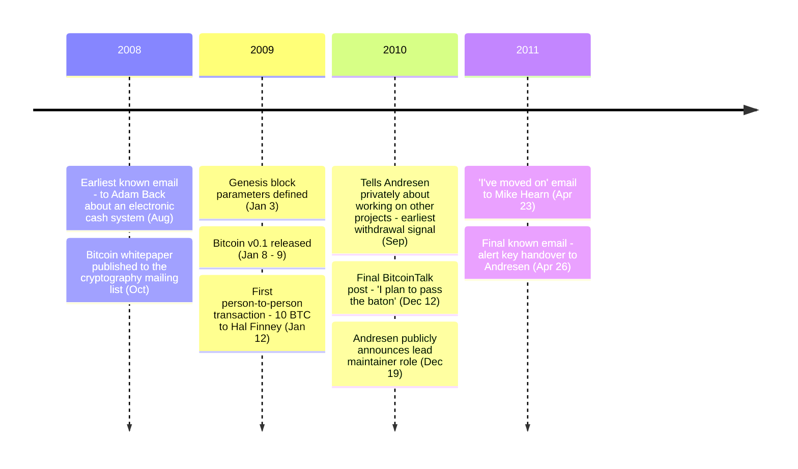

Satoshi Nakamoto is the pseudonym used by the individual or group who created Bitcoin. Their true identity has never been confirmed.

### White Paper
On August 20, 2008, Satoshi [emailed Adam Back](/BitcoinArchive/entries/correspondence/adam-back/2008-08-20-satoshi-to-adam-back/) about a new electronic cash system, marking the earliest known communication about what would become Bitcoin. On October 31, 2008, Satoshi [published "Bitcoin: A Peer-to-Peer Electronic Cash System"](/BitcoinArchive/entries/emails/cryptography/bitcoin-p2p-e-cash-paper/2008-10-31-bitcoin-p2p-e-cash-paper/) to the cryptography mailing list at metzdowd.com. The paper described a decentralized digital currency system using proof-of-work to achieve consensus without a trusted third party.

### Launch
On January 3, 2009, Satoshi defined the parameters of the [genesis block (Block 0)](/BitcoinArchive/entries/sourceforge/2009-01-03-genesis-block/), embedding the text "The Times 03/Jan/2009 Chancellor on brink of second bailout for banks" from the front page of The Times newspaper (Block 0 is hardcoded as a constant in the source and reconstructed locally by every node — see the [genesis-block hardcode analysis](/BitcoinArchive/entries/analysis/2009-01-03-genesis-block-hardcode-analysis/) for details). On January 8, 2009, [Bitcoin v0.1 was released](/BitcoinArchive/entries/sourceforge/2009-01-09-bitcoin-v01-released/) publicly. On January 12, 2009, Satoshi [sent 10 BTC to Hal Finney in Block 170](/BitcoinArchive/entries/aftermath/2009-01-12-first-bitcoin-transaction/) — the first person-to-person Bitcoin transaction.

### Development and Communication
Satoshi was active across multiple platforms: the cryptography mailing list, the bitcoin-list mailing list on SourceForge, the BitcoinTalk forum (which Satoshi and Martti Malmi created), the P2P Foundation forum, and private email correspondence. Satoshi communicated directly with [Adam Back](/BitcoinArchive/participants/adam-back/), [Wei Dai](/BitcoinArchive/participants/wei-dai/), [Hal Finney](/BitcoinArchive/participants/hal-finney/), [James A. Donald](/BitcoinArchive/participants/james-donald/), [Ray Dillinger](/BitcoinArchive/participants/ray-dillinger/), [Dustin Trammell](/BitcoinArchive/participants/dustin-trammell/), [Martti Malmi](/BitcoinArchive/participants/martti-malmi/), [Mike Hearn](/BitcoinArchive/participants/mike-hearn/), [Gavin Andresen](/BitcoinArchive/participants/gavin-andresen/), [Laszlo Hanyecz](/BitcoinArchive/participants/laszlo-hanyecz/), [Jeff Garzik](/BitcoinArchive/participants/jeff-garzik/), and others. Over the course of 2009–2010, Satoshi authored hundreds of forum posts and emails explaining Bitcoin's design, responding to technical questions, and coordinating development.

### Transition and Disappearance
[Starting in September 2010, Satoshi privately told Gavin Andresen he was working on other projects](/BitcoinArchive/entries/aftermath/2010-09-01-satoshi-andresen-other-projects-notice/) — the earliest documented signal of his intent to step back. Over the following months, Satoshi gave Andresen control of the Bitcoin source code repository and the network alert key. Satoshi's [final known public post on BitcoinTalk](/BitcoinArchive/entries/forum/bitcointalk/topic-2228/2010-12-12-satoshi-final-post/) was on December 12, 2010, closing with "I plan to pass the baton." Seven days later, on December 19, [Andresen publicly announced he would take over project management](/BitcoinArchive/entries/aftermath/2010-12-19-andresen-lead-maintainer-announcement/). In private email, Satoshi continued communicating with a small number of developers into early 2011. On April 23, 2011, Satoshi [wrote to Mike Hearn](/BitcoinArchive/entries/correspondence/mike-hearn/holding-coins/2011-04-23-satoshi-to-hearn-moved-on/): "I've moved on to other things. It's in good hands with Gavin and everyone." On April 26, 2011, Satoshi sent what is believed to be the [final known email — to Gavin Andresen](/BitcoinArchive/entries/correspondence/gavin-andresen/2011-04-26-satoshi-to-andresen-alert-key/) — formally handing over the alert key and writing: "I wish you wouldn't keep talking about me as a mysterious shadowy figure." No verified communication from Satoshi has been recorded since.

### Profile
Satoshi's P2P Foundation profile listed a date of birth of April 5, 1975, and a location of Japan. These details are unverified and widely considered to be fictitious. Satoshi wrote in fluent English with conventions consistent with British or Commonwealth usage. Analysis of posting timestamps has suggested various time zones, but no conclusive determination of location has been made. The "Satoshi Nakamoto" pseudonym itself sits inside the recognizable techno-orientalist symbolic field of the 1980s-90s; this is examined as a structural observation about reception (independent of authorial intent) in [an analysis of the pseudonym and AKIRA](/BitcoinArchive/entries/analysis/2008-10-31-satoshi-name-techno-orientalism/). Satoshi's relationship to the cypherpunk movement and the alignment of his documented practice with its philosophical core are analyzed in a companion [analysis of independent arrival at the cypherpunk core](/BitcoinArchive/entries/analysis/2008-10-31-cypherpunk-independent-arrival/).

### Development Environment
Bitcoin v0.1 was developed on Windows using Microsoft Visual C++ 6.0 SP6 and MinGW GCC 3.4.5. The initial release was Windows-only, distributed as a .rar archive — an unusual choice for an open-source project (see analysis below). No version control system was used for v0.1; [SVN was introduced later](/BitcoinArchive/entries/aftermath/2009-08-30-bitcoin-svn-repository-committers/) with help from Martti Malmi and Gavin Andresen.

From late 2009, Satoshi began porting Bitcoin to Linux (Ubuntu) with Martti Malmi's assistance. He personally set up Ubuntu test environments and debugged deep issues (pthread_cancel, MSG_DONTWAIT, Berkeley DB, GTK thread safety), but was unfamiliar with Linux conventions such as config file formats, daemon switch naming, and startup scripts. He wrote on the forum: "That's great because that's where I have less expertise" (December 2009, regarding Linux/FreeBSD testing). In a December 2010 email to Gavin Andresen, he described Gavin as "technically much more Linux capable than me." Mac support was entirely contributed by Laszlo Hanyecz; Satoshi had no Mac to test on. BSD knowledge was conceptual (socket origins) rather than hands-on. Despite these gaps, Satoshi steadily expanded cross-platform support throughout 2010, incorporating community-contributed patches for Linux, macOS, and FreeBSD. A [statistical analysis of Satoshi's source code](/BitcoinArchive/entries/analysis/2009-01-09-satoshi-code-analysis/) — covering coding style, commit time patterns, and code evolution from v0.1.0 to v0.3.19 — is available as a separate entry.

### Bitcoin Holdings
Research by blockchain analysts has identified a pattern of early mining activity attributed to a single entity, often called the ["Patoshi" pattern](/BitcoinArchive/entries/aftermath/2013-04-17-sergio-lerner-patoshi-analysis/), believed to be Satoshi. The bitcoins mined during this period — estimated at approximately 1.1 million BTC — have never been moved.

---

### Editorial readings
- **Distribution and tooling**: the `.rar` packaging, absence of version control, Hungarian-notation variable naming, OpenSSL dependency, the [Dan Kaminsky 2011 security audit](/BitcoinArchive/entries/aftermath/2011-10-10-dan-kaminsky-bitcoin-security/), and the foresighted-security-vs-informal-process distinction are examined in [the v0.1 distribution and tooling anomalies analysis](/BitcoinArchive/entries/analysis/2009-01-09-satoshi-distribution-and-tooling-anomalies/).
- **Self-references**: every documented statement in which Satoshi referred to himself — identity claims, design-process disclosures, operational state, expertise self-assessments, departure statements — is inventoried in [the self-references analysis](/BitcoinArchive/entries/analysis/2008-08-20-satoshi-self-statements/).
- **Cypherpunk position**: Satoshi's documented absence from the cypherpunk community despite the alignment of his practice with the cypherpunk philosophical core is treated in [the independent-arrival analysis](/BitcoinArchive/entries/analysis/2008-10-31-cypherpunk-independent-arrival/).
- **Signature reading**: the techno-orientalist symbolic field that the "Satoshi Nakamoto" pseudonym lands inside is treated in [the pseudonym-and-AKIRA analysis](/BitcoinArchive/entries/analysis/2008-10-31-satoshi-name-techno-orientalism/).

Communications across the cryptography mailing list and BitcoinTalk were calm, clear, and logically structured throughout. Satoshi prioritized, delegated, and made strategic decisions (e.g., declining WikiLeaks support, transitioning leadership to Gavin Andresen). The handoff to Gavin suggests self-awareness that ongoing project operations required a different skill set.
