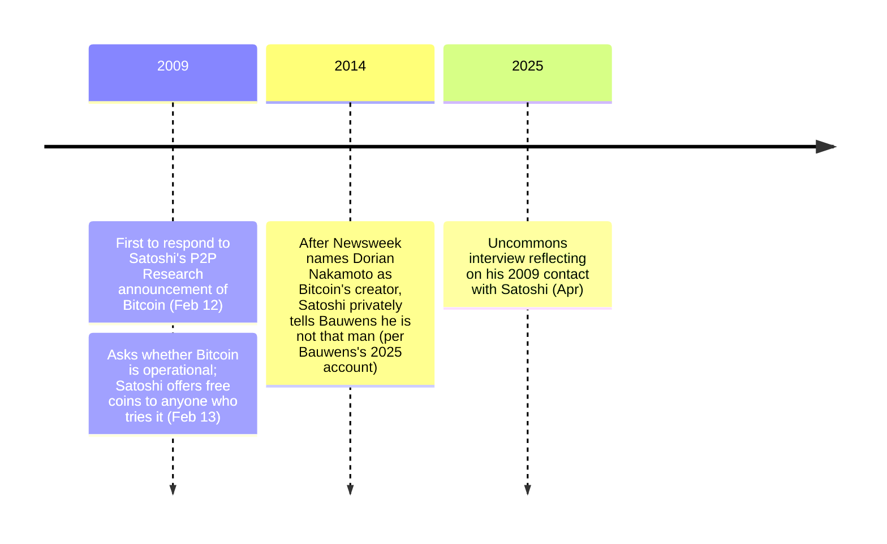

On February 13, 2009, P2P Foundation founder Michel Bauwens asked [Satoshi Nakamoto](/BitcoinArchive/participants/satoshi-nakamoto/) a simple question — and got a now-iconic offer in reply:

<!-- speaker: Satoshi Nakamoto -->
> "It's fully operational and the network is growing. If you try the software, e-mail me your Bitcoin address and I'll send you a few coins."

Bauwens was the first to respond to Satoshi's [P2P Research mailing-list announcement of Bitcoin](/BitcoinArchive/entries/emails/p2p-research/bitcoin-open-source/2009-02-11-bitcoin-open-source-p2p-currency/) on February 12; the next day he followed up with "how operational is your project? how soon do you think people will be able to use it in real life?" and received the line above. Bauwens (born March 21, 1958) is a Belgian political theorist whose P2P Foundation has crafted commons-based transition plans for the government of Ecuador and the city of Ghent.

## Interaction with Satoshi
On February 12, 2009, Bauwens was the first to respond to [Satoshi Nakamoto](/BitcoinArchive/participants/satoshi-nakamoto/)'s [announcement of Bitcoin on the P2P Research mailing list](/BitcoinArchive/entries/emails/p2p-research/bitcoin-open-source/2009-02-11-bitcoin-open-source-p2p-currency/). He thanked Satoshi for sharing the initiative and invited the community's more expert members to weigh in. Notably, Bauwens assumed Satoshi was Japanese, asking him to contribute information about Japanese initiatives to the P2P Foundation wiki.

On February 13, Bauwens asked Satoshi directly:

> "how operational is your project? how soon do you think people will be able to use it in real life?"

Satoshi's reply was the offer quoted above.

## Significance
Satoshi's reply was less a status report than a recruitment pitch. Two days after announcing Bitcoin to the P2P research world — and on the [P2P Foundation forum](/BitcoinArchive/entries/forum/p2pfoundation/bitcoin-open-source/2009-02-11-bitcoin-open-source-implementation/) the same week — its creator was still seeding the network one volunteer at a time, by hand, [just as he had done for Dustin Trammell a month earlier](/BitcoinArchive/entries/aftermath/2009-01-13-satoshi-to-trammell-send-coins/).
