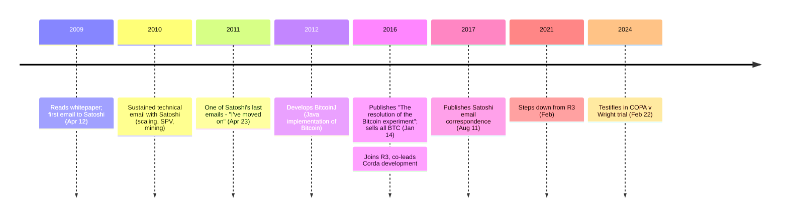

On April 12, 2009, a Google engineer named Mike Hearn read the [Bitcoin whitepaper](/BitcoinArchive/entries/emails/cryptography/2008-10-31-bitcoin-whitepaper-final/) and [emailed Satoshi Nakamoto](/BitcoinArchive/entries/correspondence/mike-hearn/questions/2009-04-12-hearn-to-satoshi-questions/). Over the next two years they exchanged sustained technical correspondence — scaling, simplified payment verification, the long-run shape of mining. Hearn received one of the last private emails Satoshi ever sent:

<!-- speaker: Satoshi Nakamoto -->
> "I've moved on to other things. It's in good hands with Gavin and everyone."

Almost five years later, on January 14, 2016, Hearn published ["The resolution of the Bitcoin experiment"](/BitcoinArchive/entries/aftermath/2016-01-14-mike-hearn-resolution-bitcoin-experiment/) on Medium. It opened with three words:

> "Bitcoin has failed."

He sold all his bitcoins, left the project, and joined R3, an enterprise-blockchain consortium where he co-led development of the Corda distributed ledger. In [August 2017 he made his Satoshi correspondence public](/BitcoinArchive/entries/aftermath/2017-08-11-mike-hearn-publishes-emails/) — one of the largest documented bodies of Satoshi's technical thinking. In February 2024 he testified in the [COPA v Wright trial](/BitcoinArchive/entries/aftermath/2024-02-22-mike-hearn-copa-trial-testimony/).

Hearn worked at Google on Maps, Earth, and Gmail's anti-spam systems. He developed [BitcoinJ](https://github.com/bitcoinj/bitcoinj), a Java implementation of the protocol — the first major alternative to the original C++ client and the basis for many Android Bitcoin wallets.

### Correspondence with Satoshi

Between April 2009 and April 2011, Hearn and Satoshi exchanged sustained technical email. Topics included how the system could scale, how simplified payment verification (SPV) clients would work, and how Satoshi envisioned the evolution of mining from CPUs to specialized hardware. Hearn was among the very first people outside the initial cypherpunk circle to take a serious technical interest in Bitcoin, and the published archive of his correspondence with Satoshi documents the technical thinking Satoshi never spelled out in public posts.

### Departure from Bitcoin

The January 2016 "Bitcoin has failed" essay cited two principal grievances: the inability of the development community to reach consensus on raising the 1-megabyte block size limit, and what Hearn described as systemically important institutions emerging within what was supposed to be a decentralised system. He sold his coins concurrent with publication.
