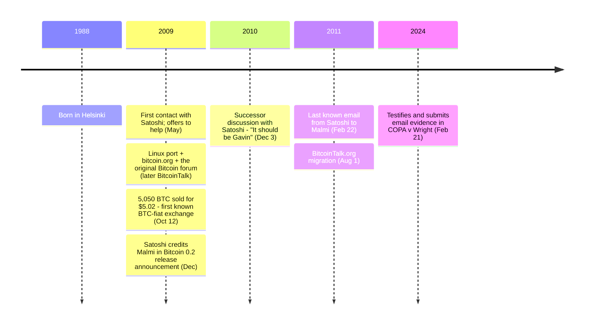

In May 2009, a 20-year-old Helsinki computer-science student wrote to Satoshi Nakamoto offering to help. Over the next two years they exchanged roughly 260 emails — the largest known volume of correspondence between Satoshi and any single individual. Malmi kept the archive private for thirteen years. In February 2024 he submitted it as evidence in the [COPA v Wright trial](/BitcoinArchive/entries/aftermath/2024-03-14-copa-v-wright-ruling/).

Martti Malmi (born 1988, Helsinki, Finland) studied computer science at Helsinki University of Technology (now Aalto University). His contributions to Bitcoin's first two years included the Linux port, the bitcoin.org website, the original Bitcoin forum (which became BitcoinTalk), and the first known bitcoin-for-fiat sale.

### First Contact with Satoshi
In May 2009, Malmi discovered Bitcoin and contacted [Satoshi Nakamoto](/BitcoinArchive/participants/satoshi-nakamoto/), offering to help with the project. Their correspondence would grow to approximately 260 emails — the largest known volume of communication between Satoshi and any single individual. These emails were entered into evidence during the [COPA v Wright trial](/BitcoinArchive/entries/aftermath/2024-03-14-copa-v-wright-ruling/) in February 2024.

### Contributions to Bitcoin
Malmi ported the Bitcoin software to Linux, making it accessible beyond Windows for the first time. He set up and managed the bitcoin.org website, the project's primary information hub. He also created the original Bitcoin forum (which later became BitcoinTalk), the community's first dedicated discussion platform. Satoshi acknowledged the contributions in the Bitcoin 0.2 release announcement (December 2009):

<!-- speaker: Satoshi Nakamoto -->
> "Many thanks to Martti (sirius-m) for all his development work."

### First Bitcoin-to-Fiat Transaction
On [October 12, 2009](/BitcoinArchive/entries/aftermath/2009-10-12-martti-malmi-first-btc-sale/), Malmi sold 5,050 BTC to [NewLibertyStandard](/BitcoinArchive/participants/newlibertystandard/) for $5.02 via PayPal. This is widely recognized as the first known exchange of bitcoin for fiat currency, establishing that bitcoin had real-world monetary value. Malmi later confirmed this transaction on Twitter, stating he made the sale "to help him get the world's first bitcoin trading service started."

### Role in the Succession Discussion
On [December 3, 2010](/BitcoinArchive/entries/aftermath/2010-12-03-handover-to-gavin/), as Satoshi was [stepping back from active development](/BitcoinArchive/entries/aftermath/2010-09-01-satoshi-andresen-other-projects-notice/), Malmi asked who should take over Bitcoin development and management. Satoshi's reply was direct:

<!-- speaker: Satoshi Nakamoto -->
> "It should be Gavin [Andresen]. I trust him, he's responsible, professional, and technically much more Linux capable than me."

This private exchange anchored the [formal SVN handover to Andresen on December 12, 2010](/BitcoinArchive/entries/aftermath/2010-12-12-satoshi-handover-to-andresen/) and [Andresen's public assumption of project management on December 19, 2010](/BitcoinArchive/entries/aftermath/2010-12-19-andresen-lead-maintainer-announcement/).

### Later Years
Malmi continued occasional correspondence with Satoshi into early 2011. The [final known email Satoshi sent to Malmi was on February 22, 2011](/BitcoinArchive/entries/aftermath/2011-02-22-satoshi-final-email-to-malmi/) — two months before Satoshi's last private exchanges with Mike Hearn and Gavin Andresen. Malmi gradually reduced his involvement in Bitcoin development around 2011 as other developers took on larger roles. He went on to work in the technology industry in Finland.
