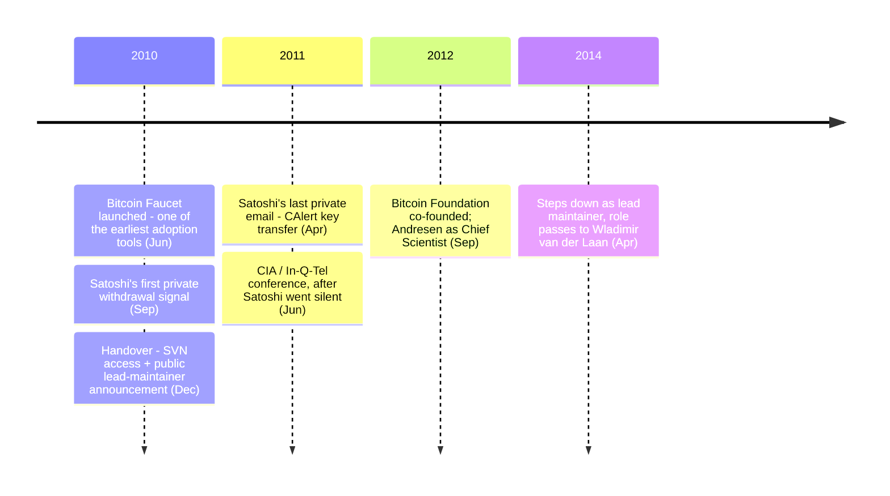

Gavin Andresen (born Gavin Bell in 1966 in Melbourne, Australia) is a software developer who became the lead maintainer of Bitcoin after [Satoshi Nakamoto](/BitcoinArchive/participants/satoshi-nakamoto/)'s departure. He grew up in the United States, earned a degree in Computer Science from Princeton University in 1988, and later founded Wasabi Software, a 3D graphics software company.

**Gavin Andresen's Bitcoin-relevant timeline**

**Discovery of Bitcoin:**
Andresen first encountered Bitcoin in 2010. He quickly became one of the most active contributors, creating the Bitcoin Faucet — a website that gave away free bitcoins to help people learn about and start using the technology. He [announced the Faucet on the BitcoinTalk forum](/BitcoinArchive/entries/correspondence/gavin-andresen/2010-06-11-andresen-bitcoin-faucet/) on June 11, 2010. This was one of the earliest efforts to promote Bitcoin adoption.

**Satoshi's successor — handover in stages (2010–2011):**
The handover from Satoshi to Andresen was not a single appointment but a gradual transfer of operational authority over seven months, recorded across the following archive entries:

| Date | Event | Scope |
|------|-------|-------|
| 2010-09-01 | [Private notice to Andresen: "working on other things"](/BitcoinArchive/entries/aftermath/2010-09-01-satoshi-andresen-other-projects-notice/) | Earliest documented withdrawal signal |
| 2010-12-03 | [Email to Malmi recommending Gavin for development and management](/BitcoinArchive/entries/correspondence/martti-malmi/2010-12-03-handover-to-gavin/) | Recommendation |
| 2010-12-12 morning | [SVN access handover and endorsement email](/BitcoinArchive/entries/correspondence/gavin-andresen/2010-12-12-satoshi-handover-to-andresen/) | Codebase + private leadership endorsement |
| 2010-12-12 18:22 UTC | [Final BitcoinTalk forum post](/BitcoinArchive/entries/forum/bitcointalk/topic-2228/2010-12-12-satoshi-final-post/) | Last public communication |
| 2010-12-19 | [Public announcement: "With Satoshi's blessing..."](/BitcoinArchive/entries/aftermath/2010-12-19-andresen-lead-maintainer-announcement/) | Public acceptance of role; same day Andresen creates the `bitcoin/bitcoin` GitHub repository |
| 2011-04-23 | [Email to Mike Hearn: "It's in good hands with Gavin"](/BitcoinArchive/entries/correspondence/mike-hearn/holding-coins/2011-04-23-satoshi-to-hearn-moved-on/) | Departure statement endorsing Andresen (private email; published later) |
| 2011-04-26 10:29 UTC | [Last known private email: CAlert key transfer](/BitcoinArchive/entries/correspondence/gavin-andresen/2011-04-26-satoshi-to-andresen-alert-key/) | Network emergency-shutdown authority |

What did *not* transfer with the role: the ~1.1 million BTC attributed to Patoshi mining patterns (no on-chain movement since 2010), the Satoshi identity itself, and the genesis-block coinbase address private keys.

Andresen recalled the gradual nature of this transition in a [2016 retrospective](/BitcoinArchive/entries/aftermath/2016-05-02-gavin-andresen-satoshi-retrospective/):

> "Eventually, he pulled a fast one on me because he asked me if it'd be OK if he put my email address on the Bitcoin homepage, and I said yes, not realizing that when he put my email address there, he'd take his away. ... Satoshi started stepping back as leader of project and pushing me forward as the leader of the project."

**Lead Maintainer (December 2010 – April 2014):**
[Andresen's December 19, 2010 announcement](/BitcoinArchive/entries/aftermath/2010-12-19-andresen-lead-maintainer-announcement/) opened with:

> "With Satoshi's blessing, and with great reluctance, I will begin to do more active project management for Bitcoin."

Andresen led Bitcoin development openly from that point, while Satoshi continued private correspondence into early 2011. Satoshi's [April 23, 2011 email to Mike Hearn](/BitcoinArchive/entries/correspondence/mike-hearn/holding-coins/2011-04-23-satoshi-to-hearn-moved-on/) — a private message at the time, published later — carried the departure line:

> "I've moved on to other things. It's in good hands with Gavin and everyone."

Three days later, the [last known private email](/BitcoinArchive/entries/correspondence/gavin-andresen/2011-04-26-satoshi-to-andresen-alert-key/) closed with the line *"I wish you wouldn't keep talking about me as a mysterious shadowy figure"* — both an admonition and a goodbye, accompanying the formal CAlert key transfer. Andresen later became the Chief Scientist of the Bitcoin Foundation when it was established in September 2012.

**CIA Visit:**
On June 14, 2011, Andresen presented about Bitcoin at CIA headquarters in Langley, Virginia, as part of an In-Q-Tel conference on emerging technologies. He had informed Satoshi of the invitation beforehand, after which Satoshi's communications became less frequent and eventually ceased entirely.

**Later Years:**
On April 8, 2014, Andresen stepped down as lead maintainer, passing the role to Wladimir van der Laan. He continued to contribute to Bitcoin development and advocated for increasing the block size limit to improve transaction capacity.
