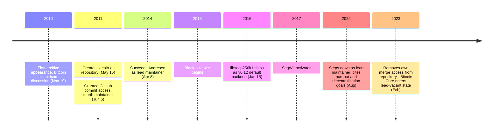

Wladimir van der Laan, known online as **laanwj**, is a Dutch software developer who became Bitcoin Core's second lead maintainer after [Gavin Andresen](/BitcoinArchive/participants/gavin-andresen/). Beyond his public role in Bitcoin development, his personal biographical details remain largely outside published record.

### Early Involvement
Van der Laan first appears in the archive on November 19, 2010, in [a discussion about the Bitcoin client's icons](/BitcoinArchive/entries/forum/bitcointalk/topic-64/2010-11-19-laanwj-msg22887/), where he asked for SVG versions so they could be rescaled — a small but characteristic request from someone approaching the software from a polish-and-quality angle. Over the following months he contributed patches to the Qt-based GUI client, and on May 15, 2011, he created a separate `bitcoin-qt` repository to organize that work. This repository was later merged back into the main `bitcoin/bitcoin` project.

### GitHub Commit Access
On June 5, 2011, Andresen granted van der Laan [commit access to the `bitcoin/bitcoin` GitHub repository](/BitcoinArchive/entries/aftermath/2011-09-13-bitcoin-github-migration-committers/) — the fourth contributor to receive access after Chris Moore, Pieter Wuille, and Jeff Garzik. Over the subsequent years he became one of the most consistent reviewers and release managers on the project.

### Lead Maintainer (2014–2022)
On April 8, 2014, Andresen stepped down as lead maintainer and handed the role to van der Laan. Under his stewardship, Bitcoin Core shipped critical work including [the replacement of OpenSSL's `secp256k1` implementation with the purpose-built libsecp256k1 library in v0.12](/BitcoinArchive/entries/aftermath/2016-01-15-libsecp256k1-replaces-openssl-bitcoin-core-v012/). His tenure spanned the entirety of the 2015–2017 block size debate, the 2017 SegWit activation, and the subsequent years of quieter but substantial infrastructure work.

### Departure
In August 2022, van der Laan stepped down as lead maintainer, citing burnout and a desire to further decentralize the project's governance. In February 2023 he formally removed his own merge privileges from the repository, ending his direct commit access. The lead-maintainer role has remained vacant since — Bitcoin Core is now maintained by a distributed group of developers with commit rights rather than a single lead.

### Significance
Where Andresen's tenure was defined by Satoshi's handoff and the early growth phase, van der Laan's was defined by quiet execution through the project's most contested years. His eight-year continuity kept the reference implementation moving forward through leadership transitions, protocol disputes, and external pressure, and his final act — voluntarily relinquishing commit access — extended the decentralization of Bitcoin from the protocol layer into the project's governance itself.
