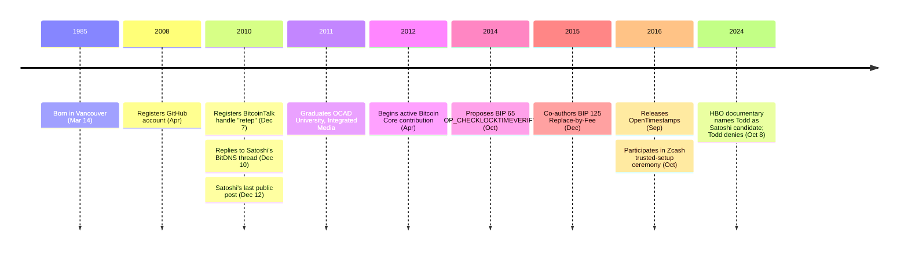

Peter Todd (born March 14, 1985 in Vancouver, Canada) is a cryptographer, applied cryptography consultant, and Bitcoin Core developer. He graduated from OCAD University (Ontario College of Art and Design) in 2011 with a degree in Integrated Media, and previously worked as an analog electronics designer at geophysics startup Gedex Inc. He registered a GitHub account in April 2008. He is known for his focus on Bitcoin protocol security, scalability, and his outspoken views on technical trade-offs.

### BitcoinTalk and Satoshi
Todd registered on BitcoinTalk on December 7, 2010 under the username "retep." At the time, few noticed that the handle was Peter spelled backwards — Bitcoin Core developer Gregory Maxwell commented in October 2024 on Hacker News that "it took me nearly a decade to realize retep was peter backwards." Years later, Todd changed the account's username to "Peter Todd." Three days after registration, on December 10, he [replied to a Satoshi Nakamoto post](/BitcoinArchive/entries/forum/bitcointalk/topic-2181/2010-12-10-retep-re-fees-in-bitdns-confusion/) in the "Fees in BitDNS confusion" thread, where Satoshi had described a concept for transaction replacement — what would later become known as Replace-by-Fee. This was only Todd's second post on the forum. Satoshi's [last public post](/BitcoinArchive/entries/forum/bitcointalk/topic-2228/2010-12-12-satoshi-final-post/) came two days later, on December 12, 2010.

### Bitcoin Core Contributions
Todd became an active Bitcoin Core contributor starting in April 2012, eventually becoming the 11th most prolific contributor to Bitcoin Core's GitHub repository. He focused on protocol-level security, transaction policy, and network resilience.

### BIP 65: OP_CHECKLOCKTIMEVERIFY (October 2014)
Todd proposed [BIP 65](/BitcoinArchive/entries/aftermath/2014-10-01-peter-todd-bip-65-checklocktimeverify/), introducing a new opcode that allows transaction outputs to remain unspendable until a specified future time. Deployed as a soft fork, it became a building block for payment channels and the Lightning Network.

### Replace-by-Fee (RBF) — BIP 125 (December 2015)
Todd is best known for championing Replace-by-Fee (RBF), which allows unconfirmed transactions to be replaced by new versions with higher fees. The concept was formalized in [BIP 125](/BitcoinArchive/entries/bip/2015-11-03-bip-0125/), co-authored by David A. Harding and Peter Todd. The BIP's rationale explicitly traces the concept back to [Satoshi Nakamoto](/BitcoinArchive/participants/satoshi-nakamoto/)'s original transaction replacement mechanism.

### [OpenTimestamps](/BitcoinArchive/entries/aftermath/2016-09-15-peter-todd-opentimestamps-announcement/) (September 2016)
Todd created OpenTimestamps, an open-source project that uses the Bitcoin blockchain to create tamper-proof timestamps, allowing anyone to prove that a document existed at a particular point in time. The project generalizes the timestamping function that Satoshi built into Bitcoin's core design.

### Zcash Trusted Setup Ceremony (October 2016)
Todd was one of six participants in the Zcash trusted setup ceremony. He conducted his computation while driving across British Columbia, shielded his laptop in a Faraday cage, and destroyed the hardware with a propane torch. Despite participating, he was deeply critical of the process, stating that collusion among participants was unprovable and the unaudited deterministic builds made the ceremony "crypto hocus pocus."

### Other Roles
Todd served as Chief Scientist at Mastercoin and Dark Wallet, and contributed to the design of stealth addresses (BIP 63, unimplemented) for enhanced privacy. He worked as a consultant at Coinkite starting July 2014.

### HBO Documentary (October 2024)
In October 2024, the HBO documentary ["Money Electric: The Bitcoin Mystery"](/BitcoinArchive/entries/aftermath/2024-10-08-hbo-money-electric-peter-todd/) named Todd as a candidate for Satoshi Nakamoto's true identity, pointing to his December 2010 reply to Satoshi's post as evidence. Todd denied the claim, calling it irresponsible and dangerous.

