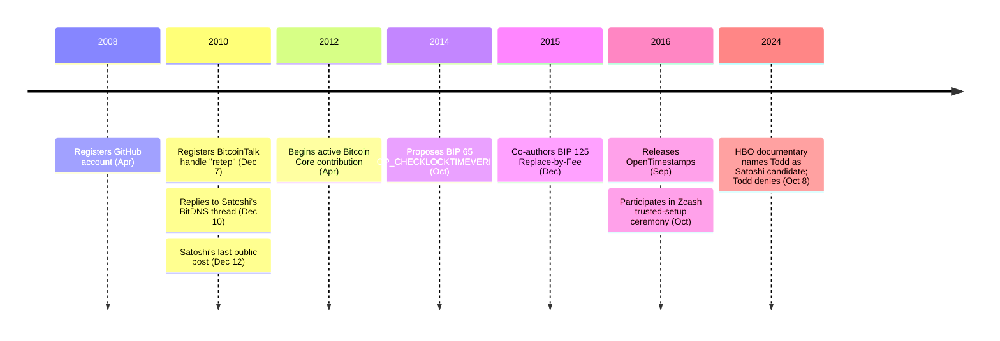

On December 7, 2010, a new account named "retep" registered on BitcoinTalk. Three days later, the account's second post [replied to a Satoshi Nakamoto thread](/BitcoinArchive/entries/forum/bitcointalk/topic-2181/2010-12-10-retep-re-fees-in-bitdns-confusion/) on transaction-replacement fees:

> "Of course, to be specific, the inputs and outputs can't match *exactly* if the second transaction has a transaction fee."

Two days later, [Satoshi posted his last public message](/BitcoinArchive/entries/forum/bitcointalk/topic-2228/2010-12-12-satoshi-final-post/) and went silent. Years later the account's username was changed to Peter Todd. Bitcoin Core developer Gregory Maxwell later noted on Hacker News that "it took me nearly a decade to realize retep was peter backwards."

In October 2024, the HBO documentary ["Money Electric: The Bitcoin Mystery"](/BitcoinArchive/entries/aftermath/2024-10-08-hbo-money-electric-peter-todd/) named Todd as a candidate for Satoshi's true identity, pointing to the December 2010 reply as evidence. On the day of broadcast Todd told CoinDesk directly, "Of course, I'm not Satoshi," calling filmmaker Cullen Hoback "grasping at straws." In the film itself, asked on camera whether he was Satoshi, Todd answered sarcastically, "It's ludicrous. But I'll say, yeah, of course I'm Satoshi." He treats the documentary as irresponsible.

Peter Todd is a Canadian cryptographer, applied-cryptography consultant, and Bitcoin Core developer. Before Bitcoin, he held a fine-arts degree and worked in analog-electronics design for a geophysics startup. His major Bitcoin contributions include [BIP 65 OP_CHECKLOCKTIMEVERIFY](/BitcoinArchive/entries/aftermath/2014-10-01-peter-todd-bip-65-checklocktimeverify/) (2014), co-authorship of [BIP 125 Replace-by-Fee](/BitcoinArchive/entries/bip/2015-11-03-bip-0125/) (2015), and [OpenTimestamps](/BitcoinArchive/entries/aftermath/2016-09-15-peter-todd-opentimestamps-announcement/) (2016).

```mermaid
timeline
    2008 : Registers GitHub account (Apr)
    2010 : Registers BitcoinTalk handle "retep" (Dec 7)
    %% link: /BitcoinArchive/entries/aftermath/2010-12-07-retep-diaspora-invite-first-post/
         : Replies to Satoshi's BitDNS thread (Dec 10)
    %% link: /BitcoinArchive/entries/forum/bitcointalk/topic-2181/2010-12-10-retep-re-fees-in-bitdns-confusion/
         : Satoshi's last public post (Dec 12)
    %% link: /BitcoinArchive/entries/forum/bitcointalk/topic-2228/2010-12-12-satoshi-final-post/
    2012 : Begins active Bitcoin Core contribution (Apr)
    2014 : Proposes BIP 65 OP_CHECKLOCKTIMEVERIFY (Oct)
    %% link: /BitcoinArchive/entries/aftermath/2014-10-01-peter-todd-bip-65-checklocktimeverify/
    2015 : Co-authors BIP 125 Replace-by-Fee (Dec)
    %% link: /BitcoinArchive/entries/aftermath/2015-12-04-peter-todd-bip-125-replace-by-fee/
    2016 : Releases OpenTimestamps (Sep)
    %% link: /BitcoinArchive/entries/aftermath/2016-09-15-peter-todd-opentimestamps-announcement/
         : Participates in Zcash trusted-setup ceremony (Oct)
    %% link: /BitcoinArchive/entries/aftermath/2016-10-22-peter-todd-zcash-trusted-setup/
    2024 : HBO documentary names Todd as Satoshi candidate; Todd denies (Oct 8)
    %% link: /BitcoinArchive/entries/aftermath/2024-10-08-hbo-money-electric-peter-todd/
```

## Bitcoin Core Contributions

From April 2012, Todd's Bitcoin Core work concentrated on the adversarial edge of the protocol — transaction policy, transaction replacement, network resilience: the parts where the requirement is set by an attacker rather than a user. By commit count he became the repository's 11th most prolific contributor.

## BIP 65: OP_CHECKLOCKTIMEVERIFY (October 2014)
Todd proposed [BIP 65](/BitcoinArchive/entries/aftermath/2014-10-01-peter-todd-bip-65-checklocktimeverify/), introducing a new opcode that allows transaction outputs to remain unspendable until a specified future time. Deployed as a soft fork, it became a building block for payment channels and the Lightning Network.

## Replace-by-Fee (RBF) — BIP 125 (December 2015)
Todd is best known for championing Replace-by-Fee (RBF), which allows unconfirmed transactions to be replaced by new versions with higher fees. The concept was formalized in [BIP 125](/BitcoinArchive/entries/bip/2015-11-03-bip-0125/), co-authored by David A. Harding and Peter Todd. The BIP's rationale explicitly traces the concept back to [Satoshi Nakamoto](/BitcoinArchive/participants/satoshi-nakamoto/)'s original transaction replacement mechanism.

## [OpenTimestamps](/BitcoinArchive/entries/aftermath/2016-09-15-peter-todd-opentimestamps-announcement/) (September 2016)
Todd created OpenTimestamps, an open-source project that uses the Bitcoin blockchain to create tamper-proof timestamps, allowing anyone to prove that a document existed at a particular point in time. The project generalizes the timestamping function that Satoshi built into Bitcoin's core design.

## Zcash Trusted Setup Ceremony (October 2016)
Todd was one of six participants in the Zcash trusted setup ceremony. He conducted his computation while driving across British Columbia, shielded his laptop in a Faraday cage, and destroyed the hardware with a propane torch. Despite participating, he was deeply critical of the process, stating that collusion among participants was unprovable and the unaudited deterministic builds made the ceremony "crypto hocus pocus."

## Other Roles
Todd contributed to the design of stealth addresses (BIP 63, unimplemented) for enhanced privacy. He joined Coinkite in an advisory role in May 2014.

