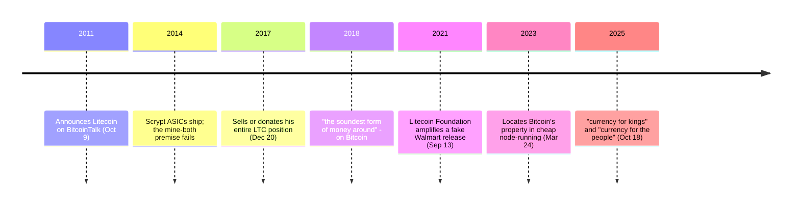

## Why he built Litecoin

On October 9, 2011, Charlie Lee posted to BitcoinTalk. He was a Google engineer at the time; Bitcoin was two and a half years old and traded in single-digit dollars. The post announced [Litecoin](/BitcoinArchive/entries/currency/2026-07-27-litecoin-currency-overview/), and in doing so left a primary record of what its author thought he was building.

<!-- audit:quote-skip -->
> Litecoin is the result of some of us who joined together on IRC in an effort to create a real alternative currency similar to Bitcoin.

An alternative — not a replacement. The same post carries the line that has been quoted ever since:

<!-- audit:quote-skip -->
> We wanted to make a coin that is silver to Bitcoin's gold.

The metaphor concedes the argument it might have picked. People hold silver alongside gold; nobody claims silver retires it.

## A design defined by what it refused to change

The announcement's stated philosophy is one of restraint rather than addition.

<!-- audit:quote-skip -->
> One of the goals of Litecoin is to not change what's working (from Bitcoin) unless there was a good reason to.

Four things changed, and each is Bitcoin's figure multiplied or divided by exactly four:

| Parameter | Bitcoin | Litecoin | Relation |
|---|---|---|---|
| Proof-of-work | SHA-256 | Scrypt | different function, framed at launch as letting one miner do both |
| Block target | 10 minutes | 2.5 minutes | ÷ 4 |
| Supply cap | 21 million | 84 million | × 4 |
| Halving interval | 210,000 blocks | 840,000 blocks | × 4 |

The set is internally consistent, as [the launch record](/BitcoinArchive/entries/aftermath/2011-10-13-litecoin-launch/) sets out.

Even the choice of Scrypt was framed as coexistence, not competition:

<!-- audit:quote-skip -->
> We really liked Tenebrix's Scrypt proof of work. Using Scrypt allows one to mine Litecoin while also mining Bitcoin.

That premise — mining one while mining the other — did not survive. Scrypt ASICs shipped from 2014, and Litecoin mining became as machine-dominated as Bitcoin's; [Jihan Wu's record](/BitcoinArchive/participants/jihan-wu/) covers the same shift from the manufacturing side.

## The altcoin founder who kept praising Bitcoin

Lee is unusual among altcoin founders in consistently ranking his own coin second. From a 2018 interview:

<!-- audit:quote-skip -->
> Bitcoin is obviously the soundest form of money around, and Litecoin, I would say, is the second soundest.

In the same interview, on why he leaves things alone:

<!-- audit:quote-skip -->
> Bitcoin has the strongest developers in this space, and there's no reason to change things, especially if I don't understand them well, just for the sake of changing them.

By 2023 he was locating Bitcoin's property in the machine rather than the market:

<!-- audit:quote-skip -->
> The reason why #Bitcoin fixes this is because everyone can easily and cheaply run their own node.

And in 2025, a formulation that gives his own coin the smaller claim:

<!-- audit:quote-skip -->
> Bitcoin is currency for kings and Litecoin is currency for the people.

Asked in the same interview what a newcomer should do, he named Bitcoin, not Litecoin:

<!-- audit:quote-skip -->
> buy Bitcoin, store it away, don't sell anything and don't do anything else related to crypto. Just sit on it and be anonymous

## Selling everything he held

On December 20, 2017, Lee announced he had sold or donated his entire LTC position. The reason he gave was not profit but the weight of his own voice:

<!-- audit:quote-skip -->
> Some people even think I short LTC! So in a sense, it is conflict of interest for me to hold LTC and tweet about it because I have so much influence.

Founders divesting from their own currency is rare in this history. The announcement landed near a price peak, and he was accused of exiting at the top. The reason above is the one he stated; the public record does not settle any other.

## Amplifying a fake

On September 13, 2021, the Litecoin Foundation's official account amplified a fabricated press release announcing a Walmart partnership. The price spiked and collapsed within the hour. Walmart's denial is on the record:

<!-- audit:quote-skip -->
> Walmart had no knowledge of the press release issued by GlobeNewswire and there is no truth to it. Walmart has no relationship with litecoin.

Lee's own account of it was brief:

<!-- audit:quote-skip -->
> This time, we really screwed up and we will try harder to not do that.

## What Litecoin left behind

Little of [Litecoin's](/BitcoinArchive/entries/currency/2026-07-27-litecoin-currency-overview/) technical distinctiveness survived. The ASIC resistance failed; the block time and the cap are differences of number rather than kind. It stays in [the fork-and-altcoin genealogy](/BitcoinArchive/entries/analysis/2008-10-31-bitcoin-fork-and-altcoin-genealogy/) because it established the second instance — after Namecoin — of the pattern of copying Bitcoin and changing the constants, and because [Dogecoin](/BitcoinArchive/entries/aftermath/2013-12-06-dogecoin-launch/) came directly out of that pattern. Dogecoin forked Litecoin, not Bitcoin.

On the monetary axis Litecoin sits squarely on Bitcoin's side: a hard cap inherited whole, with only the scale changed — which is where [the fixed-supply comparison](/BitcoinArchive/entries/analysis/2008-10-31-fixed-supply-vs-adjustable-money/) places it. The designs that dropped the cap altogether came later.
