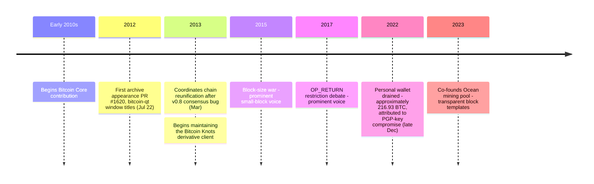

Luke Dashjr, known on GitHub and BitcoinTalk as **Luke-Jr**, is an American software developer and long-tenured Bitcoin Core contributor. His personal biographical details outside his public Bitcoin work are not in wide circulation.

### Bitcoin Core
Dashjr appears in the archive starting July 22, 2012, opening [PR #1620](/BitcoinArchive/entries/forum/github/pr-1620/2012-07-22-pr-1620-change-window-titles-to-bitcoin-qt-purpose-misc-re/) on bitcoin-qt window titles. He has been a consistent Bitcoin Core contributor since the early 2010s, reviewing patches, proposing improvements, and pushing back against changes he considered inconsistent with Bitcoin's original intent. In March 2013, when a consensus bug in v0.8 caused Bitcoin to split into two incompatible chains, Dashjr helped coordinate the community response that reverted nodes to v0.7-compatible behavior and reunited the chain.

### Bitcoin Knots
Dashjr maintains **Bitcoin Knots**, a derivative of Bitcoin Core with additional configurability — notably around mempool filtering and limits on `OP_RETURN` data-carrying outputs. Bitcoin Knots has occupied a recurring position in the ongoing community debate over whether and how much non-monetary data Bitcoin nodes should be willing to relay.

### Ocean Mining Pool
In 2023, Dashjr co-founded the **Ocean** mining pool with a stated goal of decentralizing Bitcoin mining by publishing block templates transparently and giving miners control over the transaction set they mine.

### Wallet Theft (2022–2023)
In late December 2022, Dashjr's personal Bitcoin wallet — reportedly containing around 216.93 BTC — was drained. He attributed the attack to a compromise of his PGP key that then allowed the attacker to reach his hot wallet. The incident was one of the more publicly discussed individual-developer wallet losses of that period.

### Significance
Dashjr is one of the few participants whose active involvement spans the full post-Satoshi era of Bitcoin — from the early Core patches, through the block size debate (on the small-block side), through the OP_RETURN / inscription disputes, and into the recent mining-decentralization work. His positions have been consistently conservative about changes to base-layer behavior, and his ongoing maintenance of Bitcoin Knots is a concrete expression of that conservatism.
