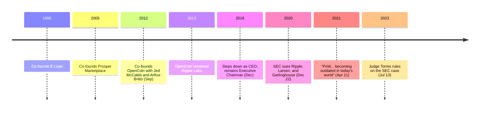

Chris Larsen had already built and sold two fintech companies before he touched a cryptocurrency. In September 2012, he co-founded the company that would build the XRP Ledger — and nine years later, he told the industry that the mechanism securing Bitcoin was a mistake worth correcting.

## Two exits before Ripple

Larsen co-founded E-Loan in 1996, an online mortgage lender that made E-LOAN the first company to give consumers free access to their own FICO credit scores — a small transparency bet that became one of the company's defining features. E-Loan reached a market value of roughly $1 billion by February 2000. Larsen stepped down as CEO in 2005, the same year the company was sold.

He did not stop building. In 2005 he co-founded Prosper Marketplace, a peer-to-peer lending platform modeled on *hui*, a traditional Vietnamese rotating-credit arrangement, and served as its CEO from 2006 to 2012. Prosper ran into the same regulatory question that would later follow Larsen into cryptocurrency: in 2008 the SEC challenged Prosper's loan notes as unregistered securities, and the company filed a prospectus and restructured its lending formula in response. Larsen resigned as Prosper's CEO on March 15, 2012, remaining chairman.

## Removing mining from the ledger

Six months later, in September 2012, Larsen co-founded OpenCoin with Jed McCaleb and Arthur Britto — the company built around the ledger McCaleb had begun designing the year before specifically to remove Bitcoin's mining step. [McCaleb's own account of that design choice](/BitcoinArchive/participants/jed-mccaleb/) is direct about what it cost as well as what it bought. OpenCoin was renamed Ripple Labs in September 2013, with Larsen serving as CEO before moving to Executive Chairman in December 2016.

The full mechanics of the ledger this company built — Unique Node Lists, the 100 billion XRP generated at genesis, the escrow schedule, and what founders and executives received — are covered in [the XRP currency profile](/BitcoinArchive/entries/currency/2026-07-27-xrp-currency-overview/). Larsen's own account of the trade, offered without hedging, names the property Bitcoin has that Ripple's design does not:

<!-- audit:quote-skip -->
> Bitcoin is obviously extremely decentralized, and there's no central company driving it forward, and that's a really awesome model, but it's very hard to replicate.

## "Becoming outdated"

On April 21, 2021 — Earth Day — Larsen published an essay arguing that the entire industry, not just Bitcoin, needed to abandon proof-of-work. He led with a number:

<!-- audit:quote-skip -->
> Bitcoin alone consuming an average of 132 TWh a year (equivalent to roughly 12 million U.S. homes)

And he named what he thought that number meant for the technology underneath it:

<!-- audit:quote-skip -->
> We should see PoW for what it is — a brilliantly designed technology that is becoming outdated in today's world.

Larsen was careful to separate the criticism from the asset: his argument was that Bitcoin and other proof-of-work chains should move to a different validation method, not that they were failing on their own terms. He pointed to the ledger his own company had built nine years earlier as the alternative already running at scale:

<!-- audit:quote-skip -->
> The XRP Ledger has been using Federated Consensus to validate transactions... uses the energy equivalent of just 50 U.S. homes per year.

The comparison is exact in its own terms and silent on a different one: the XRP Ledger's validator list is a recommendation from two named organizations, not an open competition for hash power — the trade [the currency profile](/BitcoinArchive/entries/currency/2026-07-27-xrp-currency-overview/) treats as the mirror image of the energy question Larsen raised.

## Five years in the case his design invited

The initial distribution Larsen helped set in September 2012 — 80 billion XRP to the new company, 20 billion retained personally by the three founders — became the subject of a five-year SEC lawsuit. On December 22, 2020, the SEC sued Ripple Labs, Larsen, and Brad Garlinghouse over $1.3 billion in XRP sales dating to 2013. Judge Analisa Torres's July 2023 ruling drew a line the complaint hadn't offered: XRP itself was not inherently a security, but institutional sales negotiated directly with Ripple were, while sales to anonymous buyers on exchanges were not. The court's own summary of the undisputed record states the design intent behind the ledger Larsen co-founded:

<!-- audit:quote-skip -->
> They aimed to create a faster, cheaper, and more energy-efficient alternative to the bitcoin blockchain, the first blockchain ledger which was introduced in 2009.

## Significance to Bitcoin

Larsen is one of the few founders in this record who built two companies before ever encountering Bitcoin, which makes his read on it a comparison across a longer career rather than a first reaction. His argument was never that Bitcoin's engineering failed; it was that the specific mechanism securing it — mining — costs more than it needs to, measured against a ledger he helped design specifically to avoid that cost. That ledger's own concentration, in people and in initial supply, is the trade [the fixed-supply comparison](/BitcoinArchive/entries/analysis/2008-10-31-fixed-supply-vs-adjustable-money/) and [the digital-gold structural analysis](/BitcoinArchive/entries/analysis/2008-10-31-bitcoin-digital-gold-structural-features/) both price against Bitcoin's own answer: no mining pool to court, and no founder left to ask.
