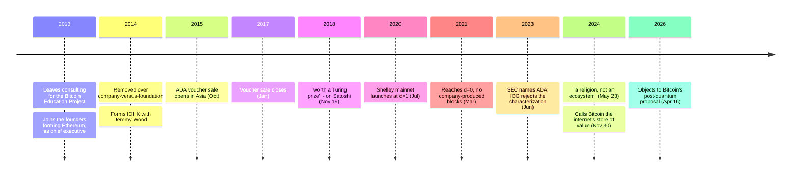

Charles Hoskinson entered this history as a teacher. In 2013 he left a consulting job to start the Bitcoin Education Project, an online course about the thing that then had no courses. Late that year he joined the group forming around [Vitalik Buterin](/BitcoinArchive/participants/vitalik-buterin/) as one of [Ethereum's](/BitcoinArchive/entries/currency/2026-07-27-ethereum-currency-overview/) original founders and held the chief-executive position. In 2014 the rest of the team removed him, over whether Ethereum should be a company or a foundation — Hoskinson wanted the former, Buterin the latter. Later that year he and former Ethereum colleague Jeremy Wood formed IOHK, and from it came [Cardano](/BitcoinArchive/entries/currency/2026-07-27-cardano-currency-overview/).

The chain is not the interesting part. For twelve years he has commented on Bitcoin in public, at length, from a position that kept changing.

## The 2018 verdict: a Turing prize, and a hashrate objection

In November 2018, at the StartEngine Summit, Hoskinson gave Bitcoin Magazine an assessment that led with unreserved credit.

<!-- audit:quote-skip -->
> Satoshi did something completely magical and wonderful. It's worth a Turing prize. It's an amazing thing.

In the same interview he set out the two limits he read into it. The first was categorical:

<!-- audit:quote-skip -->
> This is not money. It's a commodity or a store of value.

The second was empirical, and it is the same objection that runs through the mining-concentration literature:

<!-- audit:quote-skip -->
> Less than 10 percent of the actors are in charge of the hashrate power of the bitcoin network.

Both statements are load-bearing for Cardano's design. If Bitcoin is a commodity rather than money, a chain aimed at payments and contracts is not competing with it. If proof-of-work concentrates control among a small number of actors, then replacing proof-of-work is not a shortcut but a correction.

## Cardano was built on the opposite choices

Cardano's own documentation states its design decisions against Bitcoin explicitly, and unusually, admits their contested status. On consensus:

<!-- audit:quote-skip -->
> Using proof of stake for a cryptocurrency is a hotly debated design choice, however because it adds a mechanism to introduce secure voting, has more capacity to scale, and permits more exotic incentive schemes, we decided to embrace it.

On architecture, the project split accounting from computation — the settlement layer moves value, a separate computation layer runs contract logic:

<!-- audit:quote-skip -->
> Thus, we have chosen the position that the accounting of value should be separated from the story behind why the value was moved.

And on anonymity, where the divergence from Bitcoin's design is deliberate and total:

<!-- audit:quote-skip -->
> In the effort to anonymize and disintermediate central actors, Bitcoin and its contemporaries have also discarded the need for stable identities, metadata and reputation in commercial transactions.

Bitcoin's refusal of stable identity is not treated as an unfortunate limitation to be engineered around; it is named as a thing Cardano chose not to inherit. [The twelve-chain design comparison](/BitcoinArchive/entries/analysis/2026-07-26-altcoin-count-and-design-comparison/) uses the same framing to summarize Cardano's stated reasoning against Bitcoin's design.

| Axis | Bitcoin | Cardano |
|---|---|---|
| Consensus | Proof-of-work | Proof-of-stake, adopted for secure voting, capacity to scale and incentive design |
| Identity | Stable identity, metadata and reputation discarded | Kept, as a stated requirement of commerce |
| Supply | Hard cap | Hard cap — the one axis where the two agree |

That last row is why [the fixed-supply comparison](/BitcoinArchive/entries/analysis/2008-10-31-fixed-supply-vs-adjustable-money/) places Cardano in the hard-cap cluster alongside Bitcoin and Litecoin. The split runs through consensus and identity, not scarcity.

## The 2024 verdict: not needed anymore

Six years after the Turing-prize line, the assessment had inverted. From a recorded interview published in May 2024:

<!-- audit:quote-skip -->
> The industry doesn't need Bitcoin anymore to survive.

And, in the same remarks, on Bitcoin's culture rather than its code:

<!-- audit:quote-skip -->
> It's a religion, not an ecosystem.

The reversal is not clean, and Bitcoin Institute does not tidy it. Six months later, in a November 2024 livestream, he was describing Bitcoin as the store of value for the internet — which is the 2018 position restated, not withdrawn. What changed between the statements is not visibly the analysis. Reading the sequence as a single evolving judgment would impose a coherence the record does not carry.

In April 2026 he intervened in Bitcoin's own post-quantum debate, over a proposal that would make funds in legacy address types unspendable after a deadline:

<!-- audit:quote-skip -->
> At least 1.7 million Bitcoin will be rendered unrecoverable with your design. Have fun stealing Satoshi's coins.

The objection is a real one and Bitcoin developers argue it among themselves. It is also the point at which his commentary stops being about his own chain's superiority and becomes a technical claim about a specific Bitcoin proposal.

## What his own record shows

Two matters in Cardano's history sit against its public framing, both documented by the project itself or by regulators, and both relevant to the decentralization argument he makes against Bitcoin.

**Block production started fully centralized.** IOG's own engineering blog describes the parameter that governed it: when the decentralization parameter `d` equals 1, every block comes from the company's own nodes.

<!-- audit:quote-skip -->
> When d=1, all blocks are produced by IOG core nodes, running in Ouroboros Byzantine Fault Tolerance (OBFT) mode.

Cardano launched its Shelley mainnet in July 2020 at `d=1` and reached `d=0` — no company-produced blocks — in March 2021. The gap is eight months, and the account of it is the company's own rather than a critic's.

**The distribution.** In November 2023 Hoskinson stated on X that Cardano never held an ICO:

<!-- audit:quote-skip -->
> There was no Cardano ICO. There was an airdrop onto a distribution and then thousands of people who never met each other traded Ada on exchanges and used Cardano for their projects.

Cardano's own genesis-distribution page describes a public voucher sale conducted in Asia in four stages between October 2015 and the start of January 2017, and records 5,185,414,108 ADA — 20% of the vouchers sold — allocated to IOHK, EMURGO and the Cardano Foundation. Whether that arrangement is an "ICO" is a question about the word. The distribution itself is not in dispute; the project publishes it.

Separately, the U.S. Securities and Exchange Commission named ADA among the assets it alleged were unregistered securities in its June 2023 actions against Coinbase and Binance. IOG rejected the characterization the same week:

<!-- audit:quote-skip -->
> Under no circumstances is ADA a security under U.S. securities laws. It never has been.

The SEC later moved to drop ADA from the Binance case and dismissed the Coinbase case entirely, so the classification was a litigating position that was abandoned rather than adjudicated. Bitcoin was not named in either of those actions — an asymmetry that follows from the absence of an issuer, not from any regulator's favor.

## Significance to Bitcoin

Hoskinson is the clearest case of a pattern worth naming: the founders who diverged from Bitcoin most sharply are frequently the ones who studied it most closely, and their objections are technically specific rather than dismissive. Proof-of-stake, layered architecture and optional on-chain identity are all answers to questions Bitcoin's design leaves closed on purpose. Cardano is outside the technical lineage traced in [the fork-and-altcoin genealogy](/BitcoinArchive/entries/analysis/2008-10-31-bitcoin-fork-and-altcoin-genealogy/) — its consensus derives from academic proof-of-stake research, not from Bitcoin's source code. His record of statements about Bitcoin belongs to Bitcoin's history regardless, on the same basis as [Wei Dai's monetary critique](/BitcoinArchive/entries/aftermath/2013-04-21-wei-dai-bitcoin-monetary-policy-critique/): what people said about this system is part of what happened to it.
