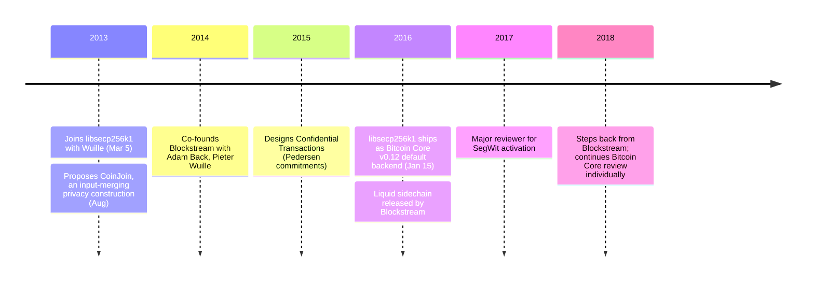

CoinJoin and Confidential Transactions are the two best-known proposals for Bitcoin privacy that the base layer never adopted; both are designs from Gregory Maxwell. CoinJoin (2013) lets multiple users combine payments into a single transaction to break input-to-output heuristics. Confidential Transactions (2015) hides transaction amounts behind Pedersen commitments while preserving verifiable conservation of value. Neither runs on Bitcoin's main chain, but they shaped a generation of privacy work — Wasabi, JoinMarket, [Liquid](https://en.wikipedia.org/wiki/Blockstream) — and the broader cryptocurrency-privacy literature.

Maxwell (known online as **gmaxwell**) is a long-time Bitcoin Core contributor. He joined [Pieter Wuille](/BitcoinArchive/participants/pieter-wuille/)'s [libsecp256k1](/BitcoinArchive/entries/aftermath/2016-01-15-libsecp256k1-replaces-openssl-bitcoin-core-v012/) effort in March 2013, co-founded Blockstream with [Adam Back](/BitcoinArchive/participants/adam-back/) and Wuille in 2014, and remains a major reviewer of the modern Bitcoin protocol stack.

### libsecp256k1
Shortly after [Pieter Wuille](/BitcoinArchive/participants/pieter-wuille/) started the [libsecp256k1 library](/BitcoinArchive/entries/aftermath/2016-01-15-libsecp256k1-replaces-openssl-bitcoin-core-v012/) on March 5, 2013, Maxwell joined the effort. Under their joint work the library expanded from a performance experiment into a purpose-built replacement for OpenSSL's secp256k1 implementation, shipping as the default backend in Bitcoin Core v0.12 on January 15, 2016.

### CoinJoin and Confidential Transactions
Maxwell's most widely cited privacy contributions are the **CoinJoin** construction — a method for combining multiple users' payments into one transaction to break simple input-to-output heuristics — and **Confidential Transactions**, a scheme that hides transaction amounts behind Pedersen commitments while preserving verifiability of conservation of value. Neither design has been deployed on Bitcoin's base layer, but they have informed a generation of Bitcoin privacy work (Wasabi, JoinMarket, Liquid) and the broader cryptocurrency-privacy literature.

### Blockstream
In 2014 Maxwell co-founded Blockstream, a Bitcoin infrastructure company, with [Adam Back](/BitcoinArchive/participants/adam-back/), [Pieter Wuille](/BitcoinArchive/participants/pieter-wuille/), and others. Blockstream has been associated with sidechain work (Liquid), satellite block delivery, and continued Bitcoin Core engineering.

### Significance
Maxwell sits at the intersection of Bitcoin's cryptographic engineering and its developer culture: a prolific reviewer, a teacher of subtle protocol mechanics in long-form forum and mailing-list posts, and one of the authors of the libraries and primitives that the modern Bitcoin stack relies on. His privacy constructions in particular sketched out much of what Bitcoin "could" be at the confidentiality layer, even when the base protocol itself chose not to incorporate them.
