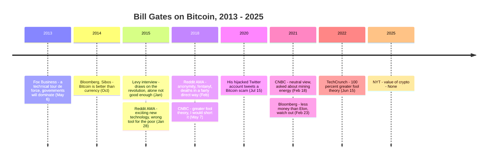

On the afternoon of May 6, 2013, two days after Berkshire Hathaway's annual meeting in Omaha, Fox Business anchor Liz Claman had Warren Buffett and Bill Gates at the desk when Charlie Munger sat down. Her question, preserved in the broadcast's closed captions: "I just had to get your thoughts on Bitcoin, this digital currency that's out there that people say, oh, it might be the next big thing. What do you think?"

Munger answered first:

<!-- audit:quote-skip -->
> I think it's rat poison.

Laughter; someone at the desk offered "put him down as undecided." Pressed on whether he understood what Bitcoin's builders were trying to do, Munger added, "No, but I regard it as deeply flaky." Then Claman turned to the other guest: "Bitcoin, Bill — what do you think?"

<!-- audit:quote-skip -->
> I think it's a technical tour de force, but that's an area where governments are going to maintain a dominant role.

Buffett closed the round without choosing: "I think either Charlie or Bill is right." In one sentence, the co-founder of Microsoft had separated the two questions everyone else at the desk was mixing — what the engineering is worth, and what the asset would be allowed to become. Everything Gates has said about Bitcoin in the twelve years since has kept that line exactly where he drew it.

## A sentence that nearly went missing

The remark's paper trail is thinner than its fame. No 2013 article from a major outlet covering it has surfaced in this archive's searches: the Wayback Machine holds no snapshot of any Fox Business Bitcoin page from that May, and CNBC's own transcript of the Squawk Box program Buffett and Gates did that same morning — seventy pages — contains no mention of Bitcoin at all. The exchange happened once, on one afternoon program, and the network's video page for the segment later went offline.

What preserved the sentence was the Bitcoin forum. The day after the broadcast, a BitcoinTalk thread titled "2013-05-06 Fox Business: Buffet/Gates/Munger on Bitcoin: Rat Poison, Flakey" linked the segment, and by May 8 a reply had set down all three verdicts side by side. A second thread that same May 8 put the Gates line in its title — but heard it as "a **techno** tour de force." Both hearings of the same broadcast circulated for years, and a third form, "a techno**logical** tour de force," spread across quote sites and even printed merchandise — never, in the copies this archive checked, with a source attached. The audio of a surviving copy of the segment settles it: the word is "technical."

| Circulating form | Earliest sourced appearance | What it traces to |
|---|---|---|
| "a technical tour de force" | BitcoinTalk reply, May 8, 2013 | The broadcast audio — confirmed by the surviving clip |
| "a techno tour de force" | BitcoinTalk thread title, May 8, 2013 | The same broadcast, misheard by a second listener |
| "a technological tour de force" | Quote-aggregator sites, undated | No source attached at any occurrence this archive found |

The quote's survival ran through a forum, two competing pairs of ears, and a reuploaded clip — while the more famous "rat poison" beside it went on to a career of its own. Munger, Buffett, and Gates reconvened for a harsher round on Bitcoin in May 2018, and later retellings often merge the two occasions into one.

## The praise stayed on the technology

Gates returned to Bitcoin in October 2014, at the Sibos banking conference, and the engineering half of his 2013 sentence got more specific. "Bitcoin is exciting because it shows how cheap it can be," he told Bloomberg. "Bitcoin is better than currency in that you don't have to be physically in the same place — and, of course, for large transactions, currency can get pretty inconvenient." In a January 2015 interview with Steven Levy he called the underlying movement irreversible in the same breath as he bounded it: "We need things that draw on the revolution of Bitcoin, but Bitcoin alone is not good enough." Days later, in a Reddit AMA: "Bitcoin is an exciting new technology."

That AMA also explained why the Gates Foundation's digital-money work for the poor would not run on Bitcoin, and neither reason touched the protocol's engineering: a volatile currency is the wrong instrument for people with no cushion, and a payment that cannot be reversed is the wrong instrument for people who cannot absorb a mistake. The design was doing exactly what it was built to do; what it was built to do was not what his customers needed.

## The objections aimed elsewhere

From 2018 on, Gates's public remarks on Bitcoin turned sharply negative — and every one of them aimed at something other than the design.

| Date | Venue | What Gates said | What it targets |
|---|---|---|---|
| Feb 2018 | Reddit AMA | Crypto's "main feature" is anonymity, which enables fentanyl purchases — "a rare technology that has caused deaths in a fairly direct way" | Use for crime |
| May 2018 | CNBC, Omaha | "As an asset class, you're not producing anything... pure 'greater fool theory.'" "I would short it if there was an easy way to do it" | The asset, not the machine |
| Feb 2021 | CNBC | "I don't own Bitcoin, I'm not short Bitcoin, so I've taken a neutral view" — asked in the context of mining's energy draw | Operating cost |
| Feb 2021 | Bloomberg | "Elon has tons of money and he's very sophisticated... if you have less money than Elon, you should probably watch out" | Retail speculation |
| Jun 2022 | TechCrunch conference | Crypto and NFTs are "100% based on greater fool theory" | The asset class |
| 2025 | The New York Times (via secondary reports) | Asked crypto's value: "None. There are people with high I.Q.s who have fooled themselves on that one" | The asset class |

The pattern holds across seven years of statements: anonymity and crime, speculation and the greater fool, energy draw, retail harm. The 2018 AMA line about fentanyl is the harshest thing Gates has said about Bitcoin, and it is an objection to what people buy with it. The 2021 energy remark is the closest any of it comes to the technology, and it concerns what the machine costs to run, not whether it works. Across the twelve years of statements collected here, Gates never retracted the engineering verdict — and never repeated it either. Within this record, the 2013 sentence stands as his only assessment of the design itself.

## Significance to Bitcoin

Gates's 2013 sentence did in twenty-one words what [the record of what others said about Satoshi](/BitcoinArchive/entries/analysis/2008-08-21-what-they-said-about-satoshi/) shows examiners doing at length: it graded the work and the phenomenon separately. Dan Kaminsky attacked the code and conceded "team or genius" while the currency itself still frightened him; Gates compressed the same split into a single clause and a caveat. The caveat is the part that kept unfolding. "Governments are going to maintain a dominant role" is the thread that runs through his later objections — anonymity is a problem because states police money laundering, the asset is a mania because nothing backs it, the Foundation's digital money runs on regulated rails. He never argued the machine was broken. He argued the machine's territory belonged to someone else.

One entry of the later record is involuntary. In July 2020, [the largest security breach in Twitter's history](/BitcoinArchive/entries/aftermath/2020-07-15-twitter-hack-bitcoin-scam/) took over his account, among many others, to post a Bitcoin giveaway scam — the man who had warned about crypto and crime became, for an afternoon, a channel for it.

What the record still lacks is symmetrical with how it began. The 2013 remark survives in public reach only through a forum thread and a reuploaded clip — the broadcast recording itself sits access-restricted in a television archive; the 2025 "None" survives so far only through secondary reports of a New York Times interview whose primary text this archive has not located. One of the most technically credentialed compliments Bitcoin's design has received from outside its own world has spent twelve years living the way Satoshi's own record lives — preserved by whoever happened to be listening.
