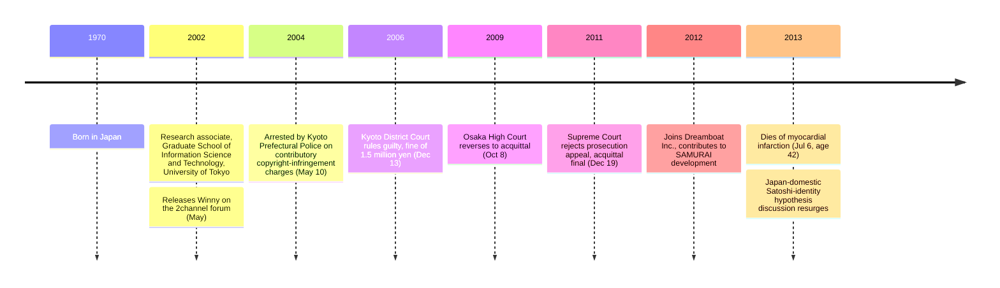

Isamu Kaneko (1970 – July 6, 2013) was a Japanese researcher and software developer. He is documented in this archive primarily because of the posthumous [Satoshi-identity hypothesis](/BitcoinArchive/entries/analysis/2013-07-06-kaneko-isamu-satoshi-identity-hypothesis/) that connects his name to Satoshi Nakamoto in Japanese-language forums and technical media — a hypothesis essentially unknown in English-language Bitcoin discourse.

### Winny (2002)
While serving as a research associate in the Graduate School of Information Science and Technology at the University of Tokyo, Kaneko released a P2P file-sharing system called **Winny** on the [2channel forum](https://en.wikipedia.org/wiki/2channel) in May 2002. Winny used a routing scheme designed to make the origin of each shared file deniable, and grew at peak to a network of millions of Japanese users. Its design drew on Freenet, Gnutella, and the anonymous-routing literature.

### Contributory copyright-infringement trial (2004–2011)
In May 2004, Kyoto Prefectural Police arrested Kaneko on charges of aiding copyright infringement. The prosecution argued that by developing and distributing Winny he had aided the infringement carried out by users who shared copyrighted content using it.

| Date | Event |
|---|---|
| May 10, 2004 | Arrested by Kyoto Prefectural Police |
| Dec 13, 2006 | Kyoto District Court rules guilty (fine of 1.5 million yen) |
| Oct 8, 2009 | Osaka High Court reverses to acquittal |
| Dec 19, 2011 | Supreme Court rejects prosecution appeal; acquittal final |

The trial is widely cited in Japanese tech-policy discussion as a landmark precedent on the criminal liability of tool developers.

### After the trial
Following the final acquittal, Kaneko returned to commercial software development. In 2012 he joined Dreamboat Inc. and contributed to SAMURAI, a content-distribution platform.

### Death
Kaneko died of myocardial infarction on July 6, 2013, at the age of 42.

### Posthumous association with the Satoshi-identity question
All of the archive's Bitcoin-relevant context for Kaneko is posthumous. In Japanese-language venues — particularly 2channel / 5channel derivative threads and Japanese technical media — Kaneko has recurringly been discussed as a possible Satoshi-identity candidate. The arguments cite the fit of "Satoshi Nakamoto" as a Japanese name, the P2P-protocol capability demonstrated by Winny, his Japanese-English bilingual ability as a Tokyo University research associate, and his anti-establishment stance during the Winny trial.

The principal counter-evidence: (a) the social scrutiny he was under as a defendant on appeal during the 2007–2008 Bitcoin development window, (b) the absence of any documented presence in Bitcoin's intellectual lineage (Hashcash, b-money, Bit Gold), (c) the absence of any Japanese-language trace in Bitcoin v0.1 source, (d) the divergence between Satoshi's English register and Kaneko's documented academic English, and (e) the roughly two-year interval between Satoshi's last known email (April 2011) and Kaneko's death (July 2013), during which Kaneko engaged in further public technical work including commercial software development.

For the full hypothesis treatment, see the [Isamu Kaneko = Satoshi hypothesis entry](/BitcoinArchive/entries/analysis/2013-07-06-kaneko-isamu-satoshi-identity-hypothesis/).

*[Editor: Kaneko does not appear in Bitcoin's documented development record. The archive's connection to him is limited to the posthumous identity hypothesis and references to the trial timeline in that context. This biography records Bitcoin-relevant facts at the level of the public record. The legal substance of the Winny trial is not used as material on the Satoshi-identity question (the trial is treated as historical fact about Kaneko's 2007–2008 public visibility). Family statements are not in scope. No narrative connection is drawn between his cause of death (myocardial infarction) and the gap to Satoshi's silence (~2 years).]*
