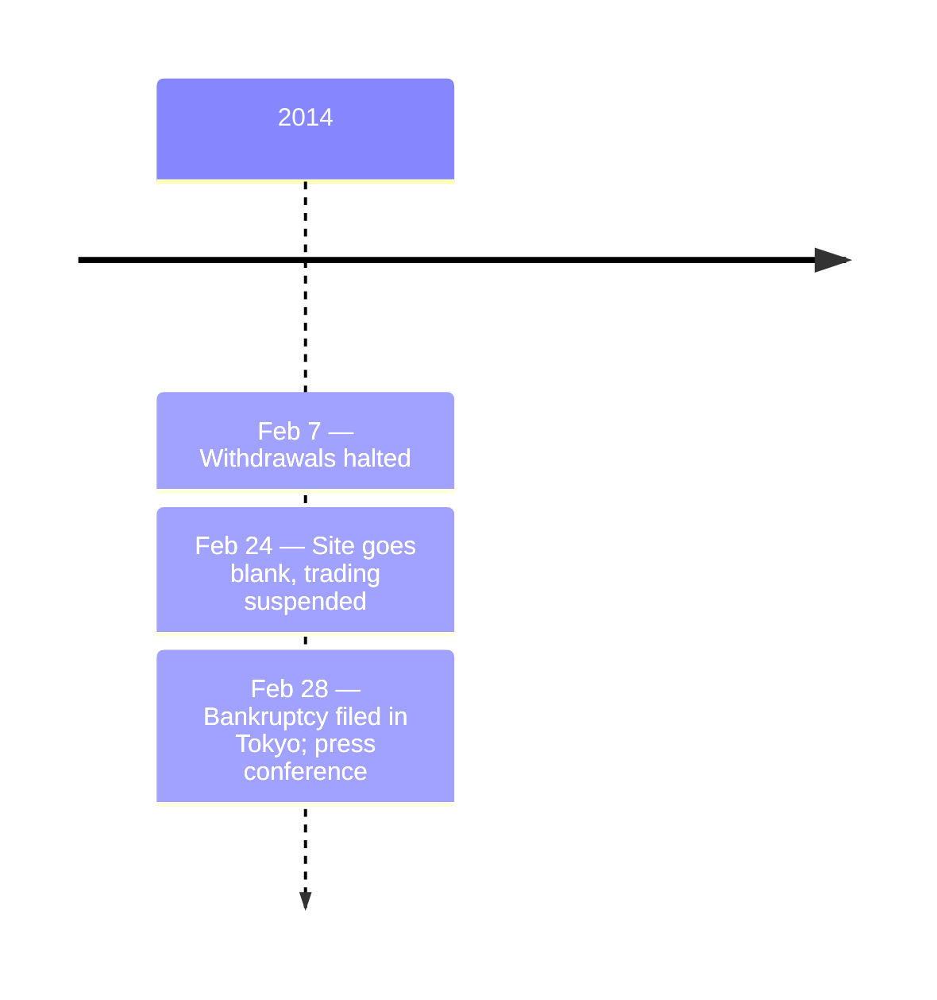

On February 28, 2014, Mt. Gox — once the world's largest Bitcoin exchange, handling approximately 70% of all Bitcoin transactions at its peak — filed for bankruptcy protection in Tokyo District Court.

At the press conference, Karpeles revealed that approximately **850,000 BTC** had been lost — 750,000 BTC belonging to customers and 100,000 BTC belonging to the company — worth approximately $450 million at the time. On March 20, 2014, Mt. Gox reported finding 199,999.99 BTC in an old wallet, reducing the total loss to approximately 650,000 BTC.

The collapse was attributed to a long-running theft exploiting [transaction malleability](/BitcoinArchive/entries/design/2009-01-03-bitcoin-transaction-design/), though subsequent investigations revealed a more complex picture involving possible internal mismanagement. In scale, the crisis dwarfed the [2010 value overflow incident](/BitcoinArchive/entries/aftermath/2010-08-15-value-overflow-incident/) — the previous largest Bitcoin-related incident.

Media declared Bitcoin dead: "Bitcoin is finished." "It was a scam all along." Bitcoin's price crashed. But the protocol itself was unaffected — Mt. Gox was a centralized exchange, not a flaw in Bitcoin's decentralized network.

Mt. Gox began repaying creditors in Bitcoin in July 2024, over a decade after the collapse. As the largest custody-collapse event in Bitcoin's recorded loss history, Mt. Gox is the anchor case in [the lost-Bitcoin canon overview](/BitcoinArchive/entries/analysis/2026-06-02-bitcoin-iconic-losses-overview/), which reads Mt. Gox alongside Stefan Thomas (forgotten-password mode), James Howells (physical-loss mode), QuadrigaCX (custody-collapse via sole-custodian death), and [FTX](/BitcoinArchive/entries/aftermath/2022-11-11-ftx-collapse/) (custody-collapse via misappropriation).
