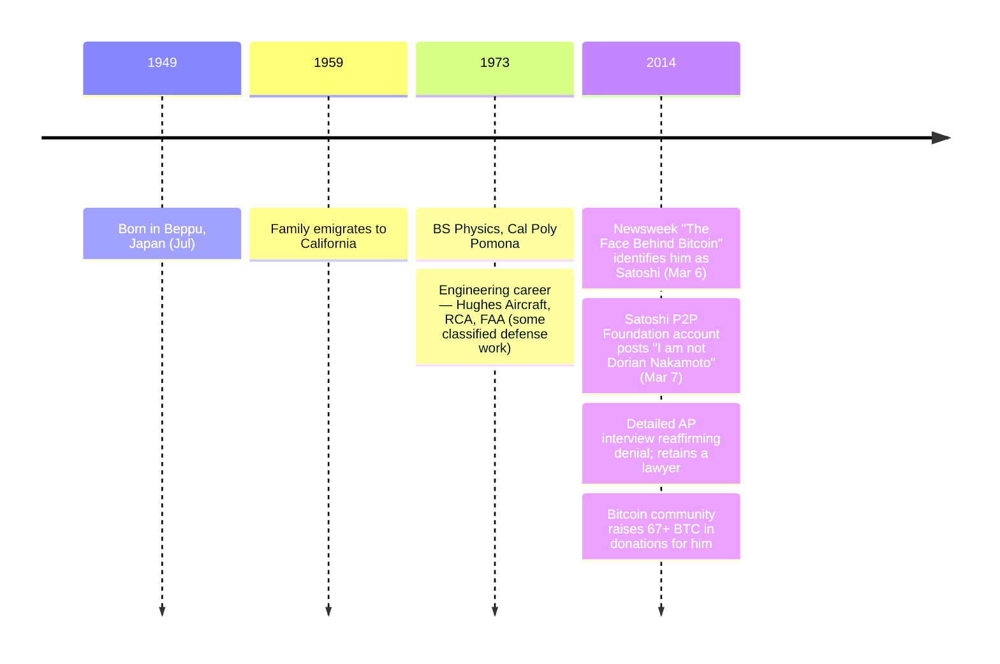

Dorian Prentice Satoshi Nakamoto, born July 1949 in Beppu, Japan, is a Japanese-American physicist and systems engineer. His family emigrated to California when he was ten years old (1959); he attended California State Polytechnic University, Pomona, earning a bachelor's degree in physics. His professional career included engineering work for Hughes Aircraft, RCA, the Federal Aviation Administration, and other defense and aerospace contractors, some of it under classified contracts. He has lived for many years in Temple City, California — a small suburb in the San Gabriel Valley.

### Newsweek Identification

On March 6, 2014, [Newsweek published "The Face Behind Bitcoin"](/BitcoinArchive/entries/aftermath/2014-03-06-newsweek-dorian-nakamoto/) by Leah McGrath Goodman, claiming to have identified Bitcoin's creator. The article rested largely on three threads: that Dorian's birth name was literally "Satoshi Nakamoto," that his career had been in classified-adjacent engineering, and a brief doorstep quote Goodman attributed to him: "I am no longer involved in that and I cannot discuss it." Reporters and photographers descended on his Temple City home, and Newsweek's publication of his street address and a photograph of his house drew widespread criticism.

### Denial

Dorian Nakamoto firmly and repeatedly denied any involvement with Bitcoin. He stated that he had misunderstood the reporter's question and thought she was asking about his prior classified engineering work — an industry where "I cannot discuss it" is the routine response to inquiries about specific projects. He retained legal representation and gave a detailed interview to the Associated Press reaffirming his denial. The day after the Newsweek piece, [the long-dormant Satoshi P2P Foundation account briefly returned to post "I am not Dorian Nakamoto"](/BitcoinArchive/entries/aftermath/2014-03-07-satoshi-p2p-foundation-return/) — though the post's authenticity remains debated, since [the same account showed unexplained login activity again in late 2016](/BitcoinArchive/entries/aftermath/2016-12-12-satoshi-p2pfoundation-profile-login/).

### Geographic Coincidence with Hal Finney

Dorian Nakamoto's address in Temple City placed him a few blocks from [Hal Finney](/BitcoinArchive/participants/hal-finney/), who had lived in the same town for nearly a decade. This geographic coincidence became the central thread of [Andy Greenberg's March 25, 2014 Forbes feature *"Nakamoto's Neighbor"*](/BitcoinArchive/entries/aftermath/2014-03-25-greenberg-forbes-nakamotos-neighbor/), which proposed that Hal Finney may have constructed the "Satoshi Nakamoto" pseudonym from the name of a real person living a few blocks away. Fran Finney has consistently stated that Hal had no awareness of or connection to Dorian Nakamoto.

### Hypothesis Status

Dorian Nakamoto remains in the [identity-hypotheses overview](/BitcoinArchive/entries/analysis/2008-10-31-satoshi-identity-hypotheses-overview/) as a documented candidate primarily for completeness — the candidacy rests on name match alone, with no technical evidence connecting him to the Bitcoin codebase, no cypherpunk credentials, no documented programming work at Bitcoin v0.1 scale, and no monetary-system design history. The Bitcoin community responded to the Newsweek identification by raising over 67 BTC in donations for him.
