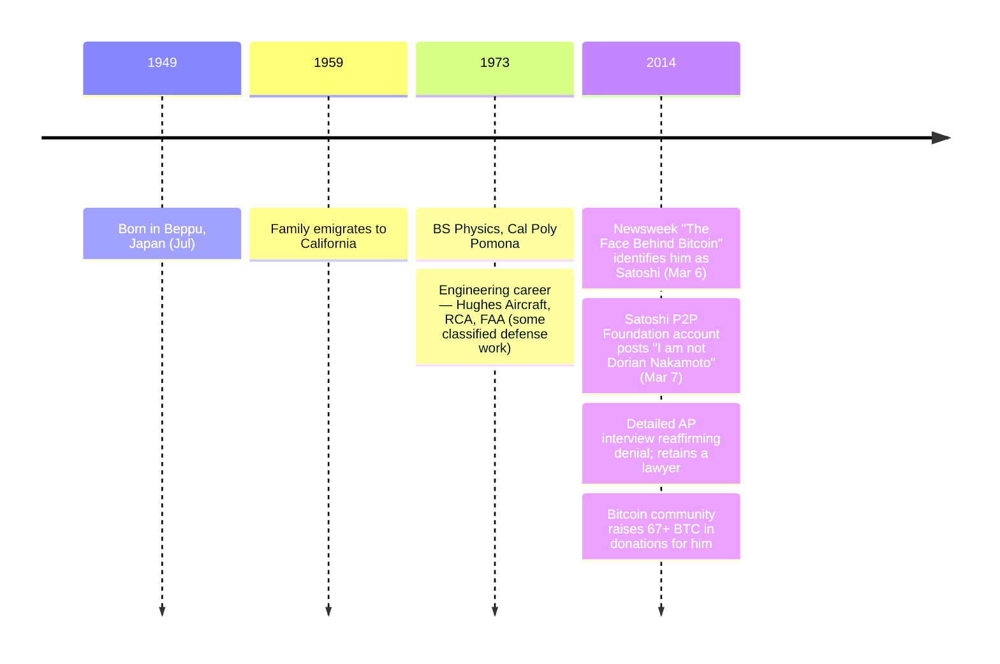

On March 6, 2014, [Newsweek published "The Face Behind Bitcoin"](/BitcoinArchive/entries/aftermath/2014-03-06-newsweek-dorian-nakamoto/) — a cover story claiming the magazine had found Satoshi Nakamoto. The man it named, Dorian Prentice Satoshi Nakamoto, was a 64-year-old Japanese-American engineer in Temple City, California, with no documented connection to cryptography or Bitcoin. The next day, the long-dormant Satoshi P2P Foundation account briefly returned to [post a single line](/BitcoinArchive/entries/aftermath/2014-03-07-satoshi-p2p-foundation-return/):

> "I am not Dorian Nakamoto."

Dorian Nakamoto himself firmly and repeatedly denied any involvement with Bitcoin. The Newsweek identification rested on three threads: that his birth name was literally "Satoshi Nakamoto," that his career had been in classified-adjacent engineering, and a brief doorstep quote — "I am no longer involved in that and I cannot discuss it" — which Nakamoto said referred to his prior classified work, not Bitcoin. After Newsweek published his street address and a photograph of his house, the Bitcoin community raised over 67 BTC in donations for him.

Born July 1949 in Beppu, Japan, Dorian Nakamoto emigrated with his family to California at age ten (1959) and earned a bachelor's degree in physics from California State Polytechnic University, Pomona. His professional career included engineering work for Hughes Aircraft, RCA, the Federal Aviation Administration, and other defense and aerospace contractors, some of it under classified contracts. He has lived for many years in Temple City, California — a small suburb in the San Gabriel Valley.

### P2P Foundation Post Authenticity

Whether the March 7, 2014 "I am not Dorian Nakamoto" post genuinely came from Satoshi remains debated. The same long-dormant Satoshi P2P Foundation account [showed unexplained login activity again in late 2016](/BitcoinArchive/entries/aftermath/2016-12-12-satoshi-p2pfoundation-profile-login/), leaving open the possibility that the account was compromised rather than reactivated by Satoshi.

### Geographic Coincidence with Hal Finney

Dorian Nakamoto's address in Temple City placed him a few blocks from [Hal Finney](/BitcoinArchive/participants/hal-finney/), who had lived in the same town for nearly a decade. This geographic coincidence became the central thread of [Andy Greenberg's March 25, 2014 Forbes feature *"Nakamoto's Neighbor"*](/BitcoinArchive/entries/aftermath/2014-03-25-greenberg-forbes-nakamotos-neighbor/), which proposed that Hal Finney may have constructed the "Satoshi Nakamoto" pseudonym from the name of a real person living a few blocks away. In Greenberg's reporting on his visit, the Finney household denied any awareness of or connection on Hal's part to Dorian Nakamoto — answered by Hal himself via eye-controlled communication, with Fran interpreting; no separate on-record statement from Fran specifically about the Dorian question has been published.

### Hypothesis Status

Dorian Nakamoto remains in the [identity-hypotheses overview](/BitcoinArchive/entries/analysis/2008-10-31-satoshi-identity-hypotheses-overview/) as a documented candidate primarily for completeness — the candidacy rests on name match alone, with no technical evidence connecting him to the Bitcoin codebase, no cypherpunk credentials, no documented programming work at Bitcoin v0.1 scale, and no monetary-system design history. The Bitcoin community responded to the Newsweek identification by raising over 67 BTC in donations for him.
