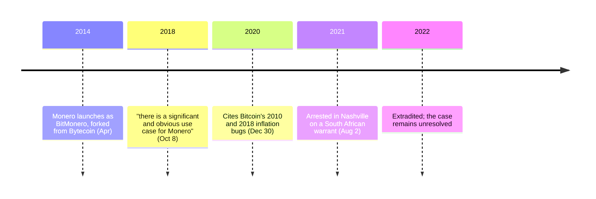

[Monero](/BitcoinArchive/entries/currency/2026-07-27-monero-currency-overview/) launched in April 2014 as BitMonero, forked away from Bytecoin — an implementation of the CryptoNote protocol whose own supply had, on the community's reading, been largely mined before anyone outside knew it existed. Riccardo Spagni, online as `fluffypony`, became the project's most visible maintainer and held that role for most of a decade.

He is the clearest single voice for the position that Bitcoin's transparency is not a bug and not a feature but a fact — one that creates a use case Bitcoin itself cannot serve.

## The design argument against Bitcoin's ledger

The CryptoNote whitepaper Monero implements does not hedge about what it is measuring Bitcoin against. It sets out two criteria for electronic cash and states plainly that Bitcoin fails one:

<!-- audit:quote-skip -->
> Untraceability: for each incoming transaction all possible senders are equiprobable. Unlinkability: for any two outgoing transactions it is impossible to prove they were sent to the same person. ... Unfortunately, Bitcoin does not satisfy the untraceability requirement.

Its second objection is about mining, and it quotes Satoshi's own phrase back at the network:

<!-- audit:quote-skip -->
> Therefore, Bitcoin creates favourable conditions for a large gap between the voting power of participants as it violates the "one-CPU-one-vote" principle since GPU and ASIC owners posses a much larger voting power when compared with CPU owners.

The third targets the halving schedule, arguing that stepwise reward drops are a security event rather than a monetary one:

<!-- audit:quote-skip -->
> The original intention was to create a limited smooth emission with exponential decay, but in fact we have a piecewise linear emission function whose breakpoints may cause problems to the Bitcoin infrastructure.

Monero's answer was a smooth emission curve followed by a permanent tail emission — 0.6 XMR per block forever, so block production is never left funded by fees alone. Bitcoin's answer is the opposite: the subsidy goes to zero and the fee market takes over. The archive treats that unresolved question in [the fixed-supply comparison](/BitcoinArchive/entries/analysis/2008-10-31-fixed-supply-vs-adjustable-money/); Monero decided against Bitcoin's side of it before the question became urgent, and has been paying the tail emission since May 2022.

## What he says about Bitcoin

Spagni's public position is not that Bitcoin failed. It is that Bitcoin's transparency is a property with consequences, one of which is Monero.

<!-- audit:quote-skip -->
> As Bitcoin proved not to be anonymous, there is a significant and obvious use case for Monero.

On whether Bitcoin can acquire the property later — the question every privacy proposal for Bitcoin runs into — he was pessimistic in 2018 and, in the same interview, allowed the opposite:

<!-- audit:quote-skip -->
> I'm not convinced that adding strong privacy to Bitcoin is going to be an easy road. I think it's going to be very, very challenging.

<!-- audit:quote-skip -->
> I think at the same time that we're moving towards an interesting point of inflection in Bitcoin's history where real privacy has a shot at coming to Bitcoin on chain.

And on Bitcoin's durability, from a 2020 interview:

<!-- audit:quote-skip -->
> I think that Bitcoin is not going away; the first 10 years of Bitcoin have proven that. It is an extremely robust protocol that has withstood all measures of attacks from a social and regulatory perspective as well as an actual cryptographic and technical perspective, so it's still going to be around in ten years.

## The claim about Bitcoin's two inflation bugs — checked against this archive

The most substantive technical claim he makes about Bitcoin concerns supply auditability. Monero's privacy has an inherent cost: hidden amounts make it harder to verify that no coins were created out of nothing. Spagni's reply is that transparency does not deliver the guarantee people think it does.

<!-- audit:quote-skip -->
> At the end of the day, Bitcoin is not immune to auditibility risks. And you can see that because there have been two clear inflation bugs on Bitcoin. The first was actually exploited in 2010 when someone created billions of bitcoins... The second one was a little more of an issue and that was the 2018 CVE, which was double spending transaction outputs.

Both events are in this archive, and the record supports the first half of the claim and qualifies the second.

|  | 2010 — [value overflow incident](/BitcoinArchive/entries/aftermath/2010-08-15-value-overflow-incident/) | 2018 — CVE-2018-17144 |
|---|---|---|
| Defect | Integer overflow in the output-sum check | Missing duplicate-input check |
| Coins created | ~184 billion BTC, in a single transaction | None |
| Exploited on mainnet | Yes | No |
| Resolved by | Fix and chain reorganization, ~15 hours end to end | Coordinated disclosure, before anyone used it |

The [structural analysis of the two incidents](/BitcoinArchive/entries/analysis/2010-08-15-overflow-incident-structure-and-paradox/) treats the pair precisely because one was used and one was not. Calling the 2018 bug "more of an issue" describes its class, not its consequences; nothing was created.

So the argument survives in its useful form and not in its strong one. Transparent supply is auditable in principle and was audited too late once, in 2010. It is not a guarantee that no bug exists — but on the record, transparency is also what made both bugs findable, and the second one was found before anyone used it.

## The Bytecoin premine, in his own words

Monero exists because its founders concluded that the chain they forked from had been distributed dishonestly. Spagni's account is blunt:

<!-- audit:quote-skip -->
> The reality is that 82% of the coins were already mined before its 'public' release. Even if the premined coins weren't done so maliciously, it still means 82% of the coins in the hands of persons unknown and invisible.

Monero's own launch carried no premine and no founder allocation, which is the one structural property it shares completely with Bitcoin — and the property that most of the chains in [the altcoin genealogy](/BitcoinArchive/entries/analysis/2008-10-31-bitcoin-fork-and-altcoin-genealogy/) do not.

## The prosecution

In July 2021 Spagni was arrested in Nashville on a South African warrant and extradited in 2022 to face charges in Cape Town relating to allegedly falsified invoices submitted to a pre-Monero employer between 2009 and 2011. The matter concerns personal conduct predating Monero rather than project finances, it is reported as unresolved, and Spagni disputes the prosecution's account. It bears on the technical record above not at all; it is part of the same person's record.

## Significance to Bitcoin

Monero is explicitly outside the lineage traced in [the fork-and-altcoin genealogy](/BitcoinArchive/entries/analysis/2008-10-31-bitcoin-fork-and-altcoin-genealogy/) — CryptoNote's ring signatures are independent of Bitcoin's code. Spagni's record belongs to Bitcoin's history anyway, and for a sharper reason than most: his central claim is a claim about Bitcoin, checkable against Bitcoin's own record, and it half survives the check. That is a more useful thing to preserve than either praise or dismissal.
