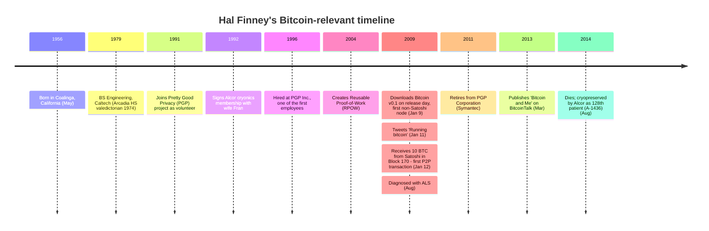

Harold Thomas Finney II was born on May 4, 1956, in Coalinga, California, and grew up in Arcadia, California. He graduated as valedictorian from Arcadia High School in 1974 and earned a Bachelor of Science in Engineering from the California Institute of Technology (Caltech) in 1979. His combination of cypherpunk credentials, his 2004 Reusable Proof-of-Work system, his role as recipient of the first person-to-person Bitcoin transaction, and his geographic proximity to Dorian Nakamoto have made him one of the most-discussed Satoshi-identity candidates — documented as the [Hal Finney = Satoshi hypothesis](/BitcoinArchive/entries/analysis/2014-03-25-hal-finney-satoshi-identity-hypothesis/), with the [April 18, 2009 race-day alibi](/BitcoinArchive/entries/aftermath/2014-03-25-greenberg-forbes-nakamotos-neighbor/) and Patoshi-scale inconsistency as the principal counter-evidence.

**Cryptography and PGP:**
In 1991, Finney began volunteering for Phil Zimmermann's Pretty Good Privacy (PGP) project, writing code for free. He became one of the principal developers of PGP 2.0. When Zimmermann founded PGP Inc. in 1996, Finney was hired as one of the first employees (the company later became part of Symantec through acquisitions).

**Extropianism and Cryonics:**
Finney was an active participant in the Extropy Institute's discussions on cryonics, life extension, space colonization, nanotechnology, and artificial intelligence. He became interested in cryonics during his freshman year at Caltech. On October 15, 1992, he and his wife Fran signed their Alcor cryonics membership paperwork in Riverside, California. He remained an Alcor member for over 20 years.

**Reusable Proof-of-Work:**
In 2004, Finney created the first Reusable Proof-of-Work (RPOW) system — a precursor concept to Bitcoin's proof-of-work mechanism. He was deeply engaged with the cypherpunk movement's goal of creating digital cash. The technical lineage from Adam Back's Hashcash through Wei Dai's b-money, Nick Szabo's Bit Gold, and RPOW into Bitcoin is examined alongside the question of Satoshi's own position relative to that movement in [an analysis of the cypherpunk core and Satoshi's intellectual location](/BitcoinArchive/entries/analysis/2008-10-31-cypherpunk-independent-arrival/).

**Bitcoin:**
On January 9, 2009, Finney downloaded [Bitcoin v0.1](/BitcoinArchive/entries/sourceforge/2009-01-09-bitcoin-v01-released/) on its release day and became the first person other than [Satoshi Nakamoto](/BitcoinArchive/participants/satoshi-nakamoto/) to run a Bitcoin node. He began mining around Block 70. On January 11, 2009, he [tweeted "Running bitcoin"](/BitcoinArchive/entries/aftermath/2009-01-11-hal-finney-running-bitcoin-tweet/) — the first public mention of running the software. On January 12, 2009, he [received 10 BTC from Satoshi in Block 170](/BitcoinArchive/entries/aftermath/2009-01-12-first-bitcoin-transaction/) — the first person-to-person Bitcoin transaction in history.

**ALS and Final Years:**
In August 2009, Finney was diagnosed with amyotrophic lateral sclerosis (ALS). Despite progressive paralysis, he continued writing code for Bitcoin — eventually using eye-tracking software to communicate and program. He retired from PGP Corporation (Symantec) in early 2011. On March 19, 2013, he published ["Bitcoin and Me"](/BitcoinArchive/entries/aftermath/2013-03-19-bitcoin-and-me-hal-finney/) on BitcoinTalk, describing his experience as Bitcoin's first user.

Hal Finney [died on August 28, 2014](/BitcoinArchive/entries/aftermath/2014-08-28-hal-finney-passes-away/), at 8:50 AM in Scottsdale, Arizona. He was cryopreserved by Alcor Life Extension Foundation as their 128th patient (member A-1436). He is survived by his wife [Fran](/BitcoinArchive/participants/fran-finney/), son Jason, and daughter Erin.
