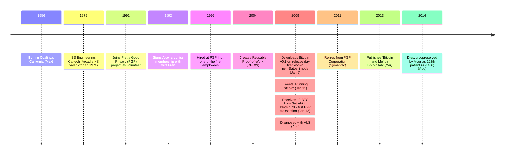

<!-- speaker: Hal Finney -->
> "Even as my body is dying outside, I will remain alive inside."

Hal Finney wrote this in October 2009, two months after his ALS diagnosis. By then he had become the first known person besides Satoshi to run Bitcoin — at least, that is how he later told it. On January 11, 2009, a two-word tweet, ["Running bitcoin"](/BitcoinArchive/entries/aftermath/2009-01-11-hal-finney-running-bitcoin-tweet/), was the first public trace of the software actually running. The next day Satoshi sent him [10 BTC in Block 170](/BitcoinArchive/entries/aftermath/2009-01-12-first-bitcoin-transaction/) — the first person-to-person Bitcoin transaction in history. For five more years he kept writing code as the paralysis advanced — in the end through eye-tracking software, at roughly one-fiftieth of his former speed, and still he wrote. He [died on August 28, 2014](/BitcoinArchive/entries/aftermath/2014-08-28-hal-finney-passes-away/). Alcor preserved him as their 128th patient.

That is why his name still comes up first among Satoshi candidates. The case fits almost too well — a veteran cypherpunk, his 2004 Reusable Proof-of-Work, his receipt of the first person-to-person Bitcoin transaction, and a home down the road from Dorian Nakamoto. Which is exactly why it deserves suspicion: two pieces of counter-evidence are hard to wave away — the [April 18, 2009 race-day alibi](/BitcoinArchive/entries/aftermath/2014-03-25-greenberg-forbes-nakamotos-neighbor/) and a Patoshi mining scale that does not match his activity. The full case is set out in the [Hal Finney = Satoshi hypothesis](/BitcoinArchive/entries/analysis/2014-03-25-hal-finney-satoshi-identity-hypothesis/).

Harold Thomas Finney II was born on May 4, 1956, in Coalinga, California, and grew up in Arcadia, California. He graduated as valedictorian from Arcadia High School in 1974 and earned a Bachelor of Science in Engineering from the California Institute of Technology (Caltech) in 1979.

```mermaid
timeline
    1956 : Born in Coalinga, California (May)
    1979 : BS Engineering, Caltech (Arcadia HS valedictorian 1974)
    1991 : Joins Pretty Good Privacy (PGP) project as volunteer
    1992 : Signs Alcor cryonics membership with wife Fran
    1996 : Hired at PGP Inc., one of the first employees
    2004 : Creates Reusable Proof-of-Work (RPOW)
    2009 : Downloads Bitcoin v0.1 on release day, first known non-Satoshi node (Jan 9)
    %% link: /BitcoinArchive/entries/aftermath/2009-01-09-bitcoin-v01-released/
         : Tweets 'Running bitcoin' (Jan 11)
    %% link: /BitcoinArchive/entries/aftermath/2009-01-11-hal-finney-running-bitcoin-tweet/
         : Receives 10 BTC from Satoshi in Block 170 - first P2P transaction (Jan 12)
    %% link: /BitcoinArchive/entries/aftermath/2009-01-12-first-bitcoin-transaction/
         : Diagnosed with ALS (Aug)
    2011 : Retires from PGP Corporation (Symantec)
    2013 : Publishes 'Bitcoin and Me' on BitcoinTalk (Mar)
    %% link: /BitcoinArchive/entries/aftermath/2013-03-19-bitcoin-and-me-hal-finney/
    2014 : Dies; cryopreserved by Alcor as 128th patient (A-1436) (Aug)
    %% link: /BitcoinArchive/entries/aftermath/2014-08-28-hal-finney-passes-away/
```

## Cryptography and PGP
Finney's working life began the way it would end — giving the code away. In 1991 he volunteered for Phil Zimmermann's Pretty Good Privacy (PGP), writing it for free, and became one of PGP 2.0's principal developers. When Zimmermann incorporated PGP Inc. in 1996, Finney was among the first hired; the company later became part of Symantec.

## Extropianism and Cryonics
Long before ALS gave that opening line its weight, Finney had bet on outlasting the body. He had been drawn to cryonics since his freshman year at Caltech, and was an active voice in the Extropy Institute's debates on life extension, space colonization, nanotechnology, and artificial intelligence. On October 15, 1992, he and his wife Fran signed their Alcor cryonics membership in Riverside, California, and held it for the more than two decades until Alcor received him.

## Reusable Proof-of-Work
In 2004 he built Reusable Proof-of-Work (RPOW), and gave that away too. It took Adam Back's Hashcash — a proof-of-work token good for a single use — and made it reusable: work that could be spent, returned, and handed on. And it ran: where Wei Dai's b-money and Nick Szabo's Bit Gold stayed proposals, RPOW was a working system. Where it sits in that line — Hashcash, b-money, Bit Gold, then Bitcoin — and where Satoshi stood relative to it is the subject of [a separate reading of the cypherpunk core](/BitcoinArchive/entries/analysis/2008-10-31-cypherpunk-independent-arrival/).

## Bitcoin
He was there on the first day. On January 9, 2009 — release day for [Bitcoin v0.1](/BitcoinArchive/entries/aftermath/2009-01-09-bitcoin-v01-released/) — Finney downloaded it and ran a node, the first known besides [Satoshi Nakamoto](/BitcoinArchive/participants/satoshi-nakamoto/) himself, and began mining around Block 70. The ["Running bitcoin"](/BitcoinArchive/entries/aftermath/2009-01-11-hal-finney-running-bitcoin-tweet/) tweet came on the 11th, and [10 BTC from Satoshi in Block 170](/BitcoinArchive/entries/aftermath/2009-01-12-first-bitcoin-transaction/) on the 12th.

## ALS and Final Years

In August 2009 came the diagnosis: amyotrophic lateral sclerosis (ALS). He retired from PGP Corporation (Symantec) in early 2011 — and did not stop working. On March 19, 2013, he published ["Bitcoin and Me"](/BitcoinArchive/entries/aftermath/2013-03-19-bitcoin-and-me-hal-finney/) on BitcoinTalk — life after the diagnosis: paralyzed, fed through a tube, working the computer through an eye-tracker, and still programming:

<!-- speaker: Hal Finney -->
> "I recently discovered that I can even write code. It's very slow, probably 50 times slower than I was before. But I still love programming and it gives me goals."

Hal Finney died on August 28, 2014, at 8:50 AM in Scottsdale, Arizona. Alcor Life Extension Foundation cryopreserved him as their 128th patient (member A-1436). He is survived by his wife [Fran](/BitcoinArchive/participants/fran-finney/), son Jason, and daughter Erin.

*[Context: Hal Finney appears in the novel [*Genesis: The Disappearance of the Founder and the Promise*](/BitcoinArchive/novel/) as the second-node operator whose "Running bitcoin" tweet signals that the protagonist's system is no longer his alone, and whose later cryopreservation provides a parallel motif on persistence beyond the recorded life.]*
