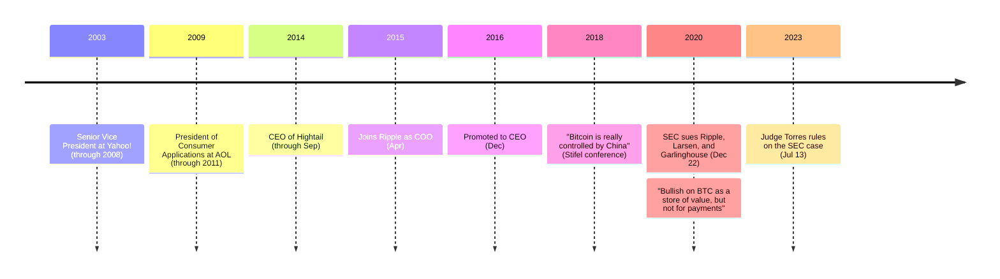

Brad Garlinghouse spent over a decade running consumer divisions at some of Silicon Valley's largest companies before he ran a cryptocurrency company. He joined Ripple as Chief Operating Officer in April 2015, reporting to co-founder [Chris Larsen](/BitcoinArchive/participants/chris-larsen/), and became CEO in December 2016. His public record on Bitcoin runs in two directions that never quite meet: a skeptic of its concentration, and separately, bullish on its role as a holding.

## A career built on other people's platforms

Before Ripple, Garlinghouse's career was a tour of the consumer internet's largest platforms rather than a founder's path. He held early roles at @Home Network and as a general partner at @Ventures, then served as CEO of Dialpad from 2000 to 2001. From 2003 to 2008 he was Senior Vice President at Yahoo!, running the Homepage, Flickr, Yahoo! Mail, and Yahoo! Messenger divisions — the period in which he authored the internally circulated "Peanut Butter Manifesto," arguing the company was spreading its resources too thin across too many products. After Yahoo!, he served as a senior advisor at Silver Lake Partners before becoming President of Consumer Applications at AOL from 2009 to 2011, and then CEO of Hightail (formerly YouSendIt) until September 2014.

None of that record involved building a payment network or a monetary system. Ripple, which he joined as COO in April 2015 and came to lead as CEO in December 2016, was his first company built around a ledger rather than a product line.

## "Controlled by China"

At the 2018 Stifel Cross Sector Insight Conference in Boston, Garlinghouse told the room what he thought the market wasn't pricing into Bitcoin's decentralization story:

<!-- audit:quote-skip -->
> Bitcoin is really controlled by China. There are four miners in China that control over 50 percent of Bitcoin.

The claim is about mining-pool geography, not about who holds the coins, and it is the same concentration argument that runs through the mining-power literature this archive tracks elsewhere — a claim about where hash power physically sits, made by the CEO of a company that never built a mining step into its own ledger at all.

## "Bullish... but not for payments"

By January 2020, at a different venue, Garlinghouse drew a line inside his own skepticism rather than abandoning it:

<!-- audit:quote-skip -->
> I'm bullish on BTC as a store of value, but not for payments.

The split matters because it is the same line [the archive's electronic-cash-versus-digital-gold analysis](/BitcoinArchive/entries/analysis/2008-10-31-bitcoin-electronic-cash-vs-digital-gold/) traces through Bitcoin's own history — a chain whose scarcity properties suit holding better than spending. Garlinghouse is not arguing Bitcoin fails; he is arguing it succeeds at one of the two things its own whitepaper subtitle promised, and that his company's ledger is built for the other one.

## The lawsuit his own sales record produced

On December 22, 2020, the SEC sued Ripple Labs, Chris Larsen, and Garlinghouse personally over $1.3 billion in XRP sales dating to 2013 — sales that took place, in Garlinghouse's case, mostly under his tenure as COO and CEO rather than at the ledger's 2012 founding. Judge Analisa Torres's July 2023 ruling split the claim by buyer: institutional sales negotiated directly with Ripple were unregistered securities offerings; sales to anonymous buyers on exchanges were not. The August 2024 final judgment imposed a $125,035,150 penalty — far below what the SEC had sought — and enjoined future unregistered institutional sales without banning institutional sales outright.

## What the record does not resolve

Garlinghouse's two positions on Bitcoin — a concentration critique in 2018, a store-of-value endorsement in 2020 — are not presented as a change of mind in the public record, and this archive does not reconcile them into one. Both can be true of the same asset: a network whose mining power clusters geographically, and a store of value regardless of where its production happens. What the sequence does show is a pattern shared with other altcoin executives in this record — a specific, statable objection to one property of Bitcoin's design, paired with genuine respect for a different one, held by the same person without apparent tension.

## Significance to Bitcoin

Garlinghouse is the only figure in this altcoin-founder record who joined his company as an executive rather than helping design it — his authority over what Ripple says about Bitcoin comes from running the business [Chris Larsen](/BitcoinArchive/participants/chris-larsen/) and [Jed McCaleb](/BitcoinArchive/participants/jed-mccaleb/) built, not from writing its ledger. That distinction matters for how to read his mining-concentration critique: it is a CEO's observation about the market Ripple competes in, not a technical objection from someone who chose a different consensus mechanism at the drafting stage. [The XRP currency profile](/BitcoinArchive/entries/currency/2026-07-27-xrp-currency-overview/) records what that mechanism actually is, and what trading Bitcoin's mining for a validator list run by two named organizations costs in return.
