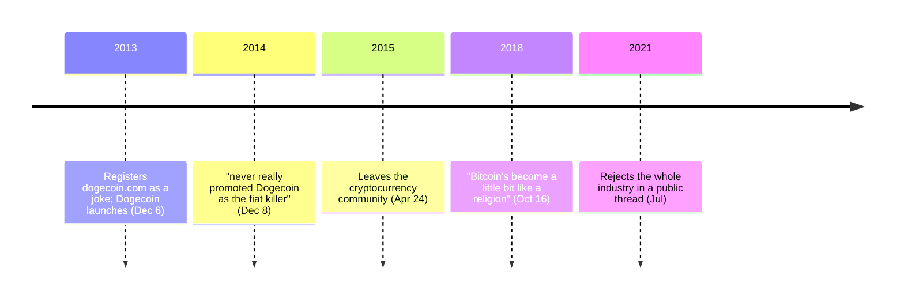

Jackson Palmer worked in marketing at Adobe in Sydney when, watching the number of cryptocurrencies multiply through 2013, he registered dogecoin.com as a joke. Billy Markus saw the joke and made it run, forking Litecoin. [Dogecoin launched on December 6, 2013](/BitcoinArchive/entries/aftermath/2013-12-06-dogecoin-launch/) and is still, more than a decade later, among the larger cryptocurrencies by market capitalization.

What matters about Palmer is not the launch. It is the sequence of public repudiations that followed it — running from his first year in the community to a rejection of the entire category in 2021 — and the fact that the position barely moved across those seven years.

## The joke was aimed at Bitcoin's imitators

Interviewed a year after the launch, Palmer described the original tweet as what it was:

<!-- audit:quote-skip -->
> a jab at the Bitcoin and altcoin scene at the time

And he set out the claim he refused to make, in words that name the rhetoric directly:

<!-- audit:quote-skip -->
> I've never really promoted Dogecoin as the 'fiat killer' like Bitcoin and its community like to prophesize.

That is a founder declining the standard altcoin pitch on the record, in 2014, while his chain was in the top twenty. He was equally clear about what Dogecoin was for:

<!-- audit:quote-skip -->
> Dogecoin is a really fun, absurd community and a currency that people use to throw change at each other on the internet in the form of micro-tips. ... Is Dogecoin ever going to rock the foundations of the financial world? No, and that was never its intent.

[Dogecoin's](/BitcoinArchive/entries/currency/2026-07-27-dogecoin-currency-overview/) design matches the disclaimer: it has no whitepaper, its repository describes it as adapted from Bitcoin Core, and its supply is uncapped and permanently inflationary. Every other chain in this record argues for its parameters. Dogecoin's co-creator argued that the parameters were beside the point.

## The exit

In April 2015 Palmer left the cryptocurrency community, and the interview announcing it contained a specific commercial observation rather than a general complaint:

<!-- audit:quote-skip -->
> I've yet to see a bitcoin business receive VC funding that has a provable business model (ie: one that generates profit) outside of exchanges and merchant services who simply take a slice of their customers' business.

Read a decade later, the sentence is more interesting than it was at the time. The businesses that have proved durable in this industry are, overwhelmingly, exchanges and custodians — the ones that take a slice.

## "A religion"

By 2018 the critique had moved from business models to the culture:

<!-- audit:quote-skip -->
> Bitcoin's become a little bit like a religion, a little cult-like, and I think that's not a good way to treat a technology.

The same observation appears from very different directions in this archive — [Charles Hoskinson](/BitcoinArchive/participants/charles-hoskinson/) reached almost the same phrasing six years later, from a competing chain rather than from outside the industry. That two people with nothing else in common arrived at the same word is itself part of the record.

## The 2021 thread

In July 2021 Palmer posted a public rejection of the whole industry. Its central sentence:

<!-- audit:quote-skip -->
> After years of studying it, I believe that cryptocurrency is an inherently right-wing, hyper-capitalistic technology built primarily to amplify the wealth of its proponents through a combination of tax avoidance, diminished regulatory oversight and artificially enforced scarcity.

This archive records the statement and does not arbitrate it. One clause in it is not about politics but about a specific design decision: "artificially enforced scarcity" is the 21-million cap, and Palmer is asserting that a fixed supply functions as a wealth-concentration mechanism rather than as a defense against debasement. [The fixed-supply comparison](/BitcoinArchive/entries/analysis/2008-10-31-fixed-supply-vs-adjustable-money/) sets out both readings of that same parameter and does not close the question either.

The thread also stated why he stopped arguing in public — that critics get smeared rather than answered. Whether or not one accepts the characterization, it is the stated reason a founder went quiet, and it belongs to the record of what this community was like to be inside.

## Significance to Bitcoin

Every other founder here built something in the belief that it improved on Bitcoin. Palmer built something that was *about* the belief, then spent seven years saying the belief was the problem — including about his own coin, which he told an interviewer in 2014 was never intended to rock the foundations of the financial world. Dogecoin sits in [the fork-and-altcoin genealogy](/BitcoinArchive/entries/analysis/2008-10-31-bitcoin-fork-and-altcoin-genealogy/) as the chain that proved a network effect can be carried by community alone. Its co-creator's position is that this is not a discovery to celebrate.
