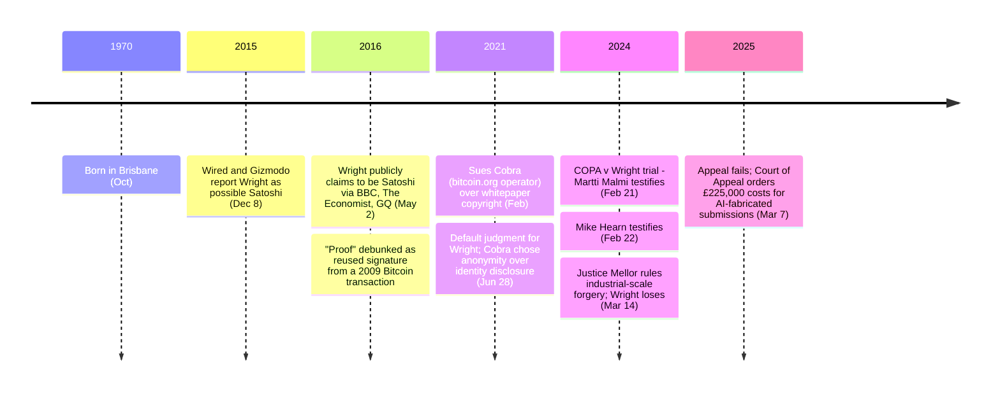

On May 2, 2016, Craig Wright publicly declared himself to be [Satoshi Nakamoto](/BitcoinArchive/participants/satoshi-nakamoto/) in coordinated [interviews with the BBC, The Economist, and GQ](/BitcoinArchive/entries/aftermath/2016-05-02-craig-wright-bbc-economist-claim/). He offered cryptographic proof — a digitally signed message using keys associated with early Bitcoin blocks. Within hours, security researchers showed he had reused an existing signature from a 2009 Bitcoin transaction rather than producing a new signature with the claimed keys.

Eight years later, on March 14, 2024, Justice Mellor of the UK High Court delivered the [ruling](/BitcoinArchive/entries/aftermath/2024-03-14-copa-v-wright-ruling/) in the case brought by the Crypto Open Patent Alliance:

<!-- quote: q1 -->
> 1. Dr. Wright is not the author of the Bitcoin White Paper.
> 2. Dr. Wright is not the person who adopted or operated under the pseudonym Satoshi Nakamoto in the period 2008 to 2011.
> 3. Dr. Wright is not the person who created the Bitcoin System.
> 4. Dr. Wright did not author the initial versions of the Bitcoin software.

The judge characterised Wright as an extremely dishonest witness and concluded he had engaged in deliberate and extensive forgery of documents to support his false claim of being Satoshi Nakamoto. The self-claim, the arguments it rested on, and the counter-evidence are laid out as a Satoshi-identity hypothesis in [Was Craig Wright Satoshi?](/BitcoinArchive/entries/analysis/2016-05-02-craig-wright-satoshi-identity-hypothesis/)

Craig Steven Wright is an Australian computer scientist and businessman, born in October 1970 in Brisbane, Australia.

## Withdrawal

The December 2015 [Wired and Gizmodo investigations](/BitcoinArchive/entries/aftermath/2015-12-08-wired-gizmodo-craig-wright-claims/) had preceded the May 2016 claim — the journalists had been the first to suggest Wright as a possible Satoshi candidate, citing materials later shown to be fabricated. After the May 2016 "proof" collapsed under scrutiny, Wright promised further evidence but never delivered. He instead posted:

> "I believed that I could put the years of anonymity and hiding behind me. But I can't."

## Whitepaper Lawsuit
In February 2021, Wright [sued](/BitcoinArchive/entries/aftermath/2021-06-28-wright-v-cobra-whitepaper-lawsuit/) the pseudonymous operator of bitcoin.org ([Cobra](/BitcoinArchive/participants/cobra/)) over Bitcoin whitepaper copyright. On June 28, 2021, the court issued a default judgment in Wright's favor — not because the claim had merit, but because Cobra chose to protect his anonymity rather than reveal his identity to defend himself. Hours later, Cobra [posted a public rebuttal](/BitcoinArchive/entries/aftermath/2021-06-28-cobra-response-to-whitepaper-ruling/) declaring cryptographic rules superior to rules a court can buy.

Wright's identity claims rested on signing with the keys to early blocks (1–9) but never extended to the genesis-block coinbase key — the single demonstration that would be dispositive, which [the genesis-block hardcode analysis](/BitcoinArchive/entries/analysis/2009-01-03-genesis-block-hardcode-analysis/) notes has never been performed by anyone, including Wright.

## The failed appeal

Wright sought permission to appeal the COPA ruling, and lost. On March 7, 2025, the Court of Appeal ordered him to pay £225,000 in costs — £100,000 to COPA and £125,000 to the Bitcoin developers he had also sued — after finding that his written submissions, prepared with an AI tool, cited non-existent cases and made false statements about the trial that risked seriously misleading the court. It is reported as the first time a UK civil court has ordered costs over a litigant's misuse of AI.

