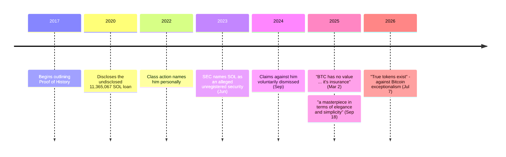

Anatoly Yakovenko spent more than a decade at Qualcomm as a systems engineer on wireless systems, then worked at Mesosphere and Dropbox on distributed systems. In 2017 he began outlining the idea he called Proof of History. [Solana](/BitcoinArchive/entries/currency/2026-07-27-solana-currency-overview/) grew out of it, and by the mid-2020s it was one of the largest chains by market capitalization.

His statements about Bitcoin are unusual in that the praise and the dismissal are both maximal, and were made months apart.

## What Solana was built to fix

Solana's whitepaper states its problem plainly: blockchains have no shared, verifiable notion of time, so no participant can independently confirm the order of messages.

<!-- audit:quote-skip -->
> Current publicly available blockchains do not rely on time, or make a weak assumption about the participant's abilities to keep time. [...] The lack of a trusted source of time means that when a message timestamp is used to accept or reject a message, there is no guarantee that every other participant in the network will make the exact same choice.

Proof of History is the answer — a cryptographic clock that encodes the passage of time into the ledger itself, so validators do not have to exchange messages to agree on ordering. The design's stated payoff is throughput, and the paper is explicit about how far it aims:

<!-- audit:quote-skip -->
> The protocol is analyzed on a 1 gbps network, and this paper shows that throughput up to 710k transactions per second is possible with today's hardware.

Where Bitcoin uses proof-of-work's capital expense to make attacks costly, Solana uses slashable stake, and the whitepaper draws the analogy directly:

<!-- audit:quote-skip -->
> Bonds are equivalent to a capital expense in Proof of Work. A miner buys hardware and electricity, and commits it to a single branch in a Proof of Work blockchain. A bond is coin that the validator commits as collateral while they are validating transactions.

The whitepaper also names the trade-off it accepts, which is the honest part of the document:

<!-- audit:quote-skip -->
> CAP systems that deal with partitions have to pick Consistency or Availability. Our approach eventually picks Availability, but because we have an objective measure of time, Consistency is picked with reasonable human timeouts.

Three axes, and on each one the whitepaper states the Bitcoin position it is departing from:

| Design axis | Bitcoin | Solana |
|---|---|---|
| Ordering messages | No shared, verifiable notion of time | Proof of History — a cryptographic clock written into the ledger |
| What deters an attack | Capital expense: hardware and electricity committed to one branch | Slashable stake: coin committed as collateral while validating |
| Under a network partition | Halts rather than diverges | Keeps producing, with consistency restored on a human timeout |

The last row is the one with a name in this archive: Bitcoin's conservatism under partition is treated as a property rather than a limitation by the [structural features of digital gold](/BitcoinArchive/entries/analysis/2008-10-31-bitcoin-digital-gold-structural-features/).

## "A masterpiece"

In September 2025, on the All-In podcast, Yakovenko was asked about Bitcoin and answered without hedging.

<!-- audit:quote-skip -->
> the coolest piece of software written in the last 20 years is, I would say, the Bitcoin like Nakamoto implementation

On proof-of-work specifically, and on why it has held:

<!-- audit:quote-skip -->
> proof of work is... it is a brilliant—It's a masterpiece. [...] it's a masterpiece in terms of elegance and simplicity. [...] The reason it hasn't been hacked is because it's so simple.

That last clause is the substantive claim, and it cuts against his own project. Solana's throughput comes from complexity, which he acknowledges elsewhere in the same conversation — the hyper-performance target, he says, is "just hard." Simplicity as a security property is exactly what a high-performance chain cannot buy.

He also credits Bitcoin with surviving its own institutions:

<!-- audit:quote-skip -->
> Bitcoin is resilient to these entities collapsing. [...] all the properties of Bitcoin that people value will remain through that transition

And he takes Bitcoin's role as settled rather than contested:

<!-- audit:quote-skip -->
> Bitcoin is designed for a very simple settlement layer

## "No value"

Six months earlier, in March 2025, he had posted an assessment that is difficult to reconcile with the above.

<!-- audit:quote-skip -->
> BTC has no value. In the best light, it's insurance. [...] It's not an investment, it's a cost, and there is no guarantee it will work. [...] If it works, it has very little to do with technology outside of the initial innovation that happened 15 years ago.

Both statements can be held at once — software can be a masterpiece while the asset it issues is, on someone's reading, a premium paid against a tail risk. Whether they *are* held at once is not something the record settles, and this archive does not resolve it on his behalf. What can be said is that the two are aimed at different objects: the first at the machine, the second at the holding. The distinction between the two is the same one that [the digital-gold analysis](/BitcoinArchive/entries/analysis/2008-10-31-bitcoin-digital-gold-structural-features/) turns on.

In July 2026 he restated the general position, this time against the claim that Bitcoin is the only asset in the category with any basis:

<!-- audit:quote-skip -->
> True tokens exist, as apposed to bad equity or debt. Network rights are unenforceable because no one has the obligation to run your software.

The transcription is his; the argument is that no token carries an enforceable claim, Bitcoin included.

## The supply disclosure

Solana's own account of its early token supply is on the record and belongs next to the statements above, because the disclosure question is exactly the one Bitcoin's launch does not raise.

<!-- audit:quote-skip -->
> The problem: we did not disclose this information to the public, as well as the size and nature of the loan, during the CoinList auction and subsequent Binance listing.

The loan was 11,365,067 SOL, lent from the Foundation to a market-making firm. Solana states the full amount was removed from circulating supply; a separate company post states that 3,365,067 of it was actually returned by the market maker into a Foundation-controlled wallet. Both figures appear in Solana's own writing and should be read together rather than collapsed into one number. [The twelve-chain design comparison](/BitcoinArchive/entries/analysis/2026-07-26-altcoin-count-and-design-comparison/) reads the same disclosure as one case among several: founders holding supply before their own chain's monetary philosophy was ever tested.

The SEC named SOL among the crypto assets it alleged were unregistered securities in its June 2023 actions; the Foundation rejected the characterization, the agency later moved to drop SOL from the Binance case, and the Coinbase case was dismissed in February 2025. A 2022 class action naming Yakovenko personally was voluntarily dismissed as to him without prejudice in 2024, per the court's order — the case continued against other defendants.

None of this has a Bitcoin counterpart, and the reason is structural rather than reputational: a chain with no premine, no foundation and no issuer has no disclosure to fail to make. [The fixed-supply comparison](/BitcoinArchive/entries/analysis/2008-10-31-fixed-supply-vs-adjustable-money/) records the issuance side of the same difference.

## Significance to Bitcoin

Yakovenko is the most technically credentialed critic of Bitcoin's asset case who is simultaneously its most unreserved admirer as engineering. He is also, on the quantum question, a public advocate for changing Bitcoin — in the same 2025 conversation he said the network should migrate to a quantum-resistant signature scheme and put the odds of a breakthrough within five years at roughly even. Solana is outside the technical lineage in [the fork-and-altcoin genealogy](/BitcoinArchive/entries/analysis/2008-10-31-bitcoin-fork-and-altcoin-genealogy/) — Proof of History does not descend from Bitcoin's code. The record of what he said about Bitcoin does not depend on that lineage.
