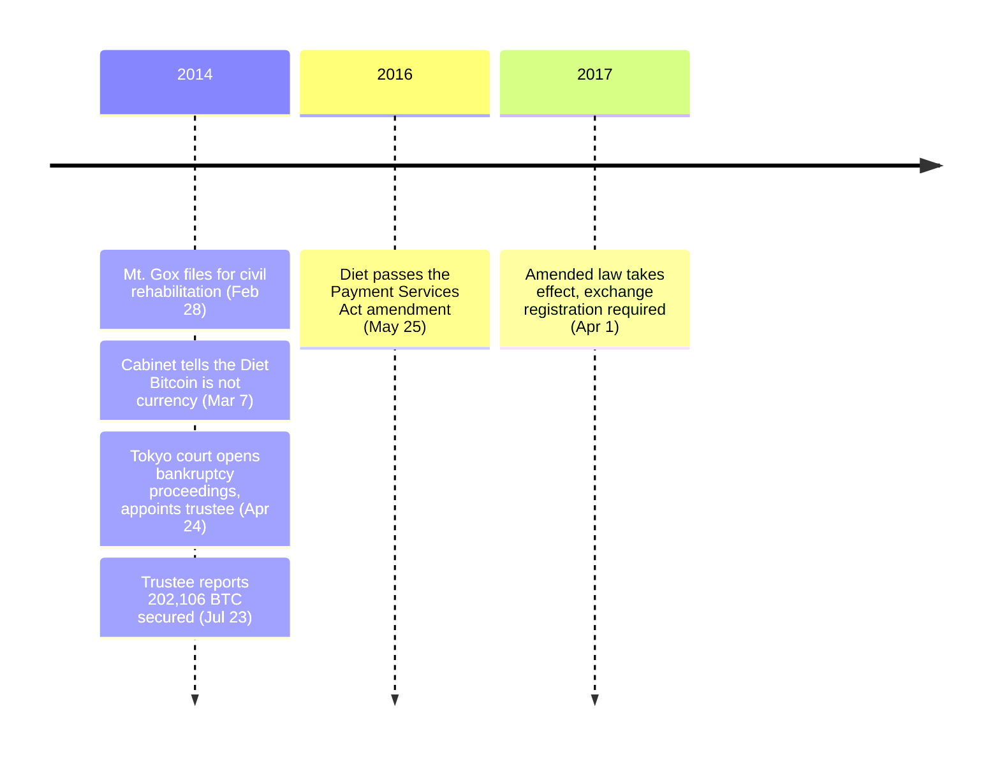

On March 7, 2014, Japan's Cabinet told the Diet that Bitcoin is not currency — not under the Currency Unit and Coinage Act, not the Bank of Japan Act, not the Civil Code, not the Foreign Exchange Act. Three years and twenty-five days later, the same government required every operator in the country that exchanges it for yen to register with a financial regulator or stop operating.

## The Cabinet says Bitcoin isn't currency

One week after Mt. Gox told the Tokyo District Court it could not pay its debts, Japan's Cabinet approved a formal written answer to a Diet interpellation — written question no. 28 of the 186th Diet session. Translated, the answer states:

<!-- audit:quote-skip -->
> Bitcoin does not constitute currency ... transactions in Bitcoin itself do not constitute an act carried out as banking business under the Banking Act.

The same answer placed Bitcoin outside three further statutes by name: the Currency Unit and Coinage Act, the Bank of Japan Act, and the Civil Code.

## Mt. Gox: the collapse the answer didn't reach

[Mt. Gox](/BitcoinArchive/entries/aftermath/2014-02-28-mt-gox-bankruptcy/), then the world's largest Bitcoin exchange, filed for civil rehabilitation protection with the Tokyo District Court on February 28, 2014. The trustee later appointed to the case, Nobuaki Kobayashi, set out the cause in his report to the court. Translated, it reads:

<!-- audit:quote-skip -->
> The company filed a petition for commencement of civil rehabilitation proceedings with the Tokyo District Court on February 28, 2014 ... as a result of, among other things, the possibility that BTC under its management had been improperly withdrawn through unauthorized access exploiting a system bug in BTC's underlying software, and the fact that its cash deposits had also decreased for reasons unknown — leaving it, at the time of the petition, unable to pay its debts and insolvent.

The civil rehabilitation petition did not hold: the Tokyo District Court rejected it on April 16, 2014, issuing a preservation order the same day. Eight days later:

<!-- audit:quote-skip -->
> On April 24, 2014, the Tokyo District Court ordered the commencement of bankruptcy proceedings against the company and appointed attorney Nobuaki Kobayashi as bankruptcy trustee.

Kobayashi's report to the court, filed July 23, 2014, put a number on what remained under Mt. Gox's control: 202,106.000721 BTC held at addresses the company still controlled at the moment the preservation order took effect, falling to 202,105.837821 BTC after transfer fees once he moved it to an address of his own.

<!-- audit:quote-skip -->
> Immediately after the preservation order was issued, I secured the private keys to the addresses holding the company's 202,106.000721 BTC ... and transferred them to an address under my control (balance after transfer fees: 202,105.837821 BTC). I am also still investigating whether any further BTC remains in the company's data.

The trustee's own report leaves the larger question open: as of that July 23 filing, the investigation into how the rest of Mt. Gox's BTC had disappeared was still ongoing, and unresolved.

## From a Cabinet answer to a statute

The Diet closed the gap the 2014 answer had described. On May 25, 2016, it passed a law amending the Payment Services Act to create a statutory registration regime for virtual-currency exchange businesses, promulgated on June 3, 2016 as Act No. 62 of 2016.

## April 1, 2017: registration becomes law

The amended act entered into force on April 1, 2017. From that date, any operator exchanging virtual currency for legal tender inside Japan needed to register as a licensed exchange business with the Financial Services Agency (FSA) — or stop. Translated, the FSA's own guidance page — describing the regime in terminology Japan would not adopt in law until 2019 — states:

<!-- audit:quote-skip -->
> Starting April 1, 2017, a new system concerning "cryptoassets" began, and in order to provide services exchanging cryptoassets for legal tender within Japan, registration as a cryptoasset exchange business became required.

| | Before April 1, 2017 | After April 1, 2017 |
|---|---|---|
| Running an exchange | No license specific to virtual currency — the Cabinet had ruled it outside the Banking Act | FSA registration required for any operator exchanging virtual currency for fiat |
| Statutory basis | None specific to virtual currency | Payment Services Act, as amended (Act No. 62 of 2016) |

The amendment never touched the Cabinet's 2014 finding that Bitcoin is not currency; it regulated something the 2014 answer was never asked about — not what Bitcoin is, but who is allowed to run the business of exchanging it.

## After 2017, the rules only tightened

In January 2018, less than a year after the registration regime took effect, Coincheck — one of Japan's cryptoasset exchanges — lost roughly 523 million NEM (about 58 billion yen) to a hack, and the FSA ordered a report the same day. What followed was not retreat. The Diet renamed "virtual currency" to "cryptoasset" in 2019, created a licensed "electronic payment instrument" category for stablecoins in 2022, and in 2025 registered JPYC as the country's first licensed yen-stablecoin issuer, which began issuing that October. On April 10, 2026, the Cabinet approved a bill moving cryptoasset regulation out of the Payment Services Act altogether and into the stricter Financial Instruments and Exchange Act. Where [other governments have loosened, banned, and re-allowed crypto rules](/BitcoinArchive/entries/analysis/2026-07-28-bitcoin-nation-state-policy-history/) within the same decade, Japan's have moved only one direction since April 1, 2017: toward more registration, not less.

## Significance to Bitcoin

Bitcoin itself was never the subject of either the Cabinet's answer or the law that followed it — both regulate whoever exchanges it, not the protocol that creates it. That is the same distinction Mt. Gox's collapse exposed: a network with no central operator for any government to license, and an exchange that had one — and that one went bankrupt. Japan's 2017 registration regime closes the gap on the second half of that pair. It has no purchase on the first.
