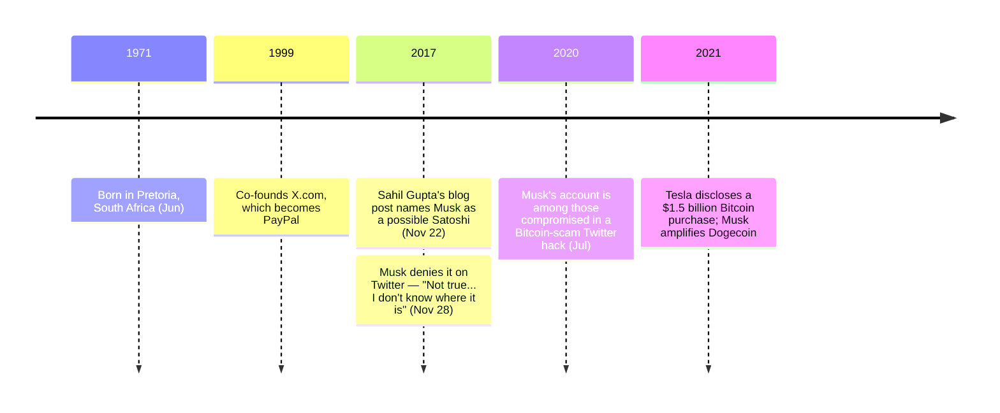

Elon Musk (born June 28, 1971, Pretoria, South Africa) is the founder of Tesla and SpaceX and a co-founder of the payments company that became PayPal. His connection to Bitcoin's history is recent and external: it is the connection of a high-profile investor and commentator, not of an early participant. In a [2017 blog post a former SpaceX intern named him as a possible Satoshi Nakamoto](/BitcoinArchive/entries/analysis/2017-11-22-elon-musk-satoshi-identity-hypothesis/) — a fringe claim Musk denied within a week.

## Bitcoin-Relevant Role

Musk's documented involvement with Bitcoin is that of a market-moving public figure rather than a developer or cryptographer. In 2021 Tesla disclosed a $1.5 billion Bitcoin purchase and briefly accepted Bitcoin for vehicles before suspending it over energy-use concerns. He has repeatedly amplified [Dogecoin](/BitcoinArchive/entries/aftermath/2013-12-06-dogecoin-launch/) on social media. In July 2020 his account was [among the high-profile accounts compromised in a Bitcoin-scam Twitter hack](/BitcoinArchive/entries/aftermath/2020-07-15-twitter-hack-bitcoin-scam/), where he was a victim rather than a subject. None of this places him in Bitcoin's 2007–2011 origin period.

## Satoshi candidacy

Musk's standing as a Satoshi candidate rests entirely on a single non-forensic 2017 blog post and resemblance of skills and manner — there is no cypherpunk record, no cryptographic linkage, and no profile fit on the candidate dimensions. The case and the counter-evidence are laid out in the [Elon Musk = Satoshi hypothesis](/BitcoinArchive/entries/analysis/2017-11-22-elon-musk-satoshi-identity-hypothesis/); the [identity-hypotheses overview](/BitcoinArchive/entries/analysis/2008-10-31-satoshi-identity-hypotheses-overview/) places him among the named candidates as the clearest example of a theory built on impression alone.
