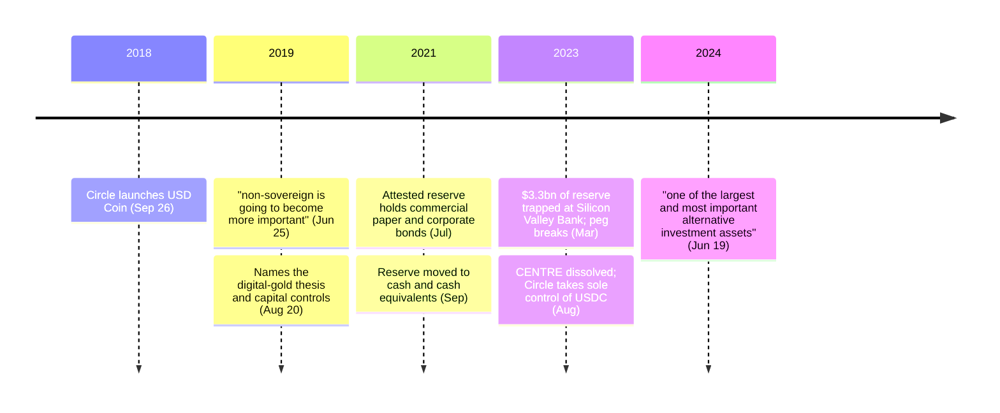

Jeremy Allaire was already an internet entrepreneur twice over before he touched cryptocurrency. With his brother JJ he co-founded Allaire Corporation in 1995, which went public in 1999 and was acquired by Macromedia in 2001, where he became chief technology officer. He later founded Brightcove. Circle came after that, and on September 26, 2018 Circle launched [USD Coin](/BitcoinArchive/entries/currency/2026-07-27-usdc-currency-overview/).

Allaire built the largest regulated dollar-denominated stablecoin — a design that inverts nearly every property Bitcoin was built for — while stating, repeatedly and on the record, that Bitcoin's importance lies precisely in the property his own product does not have.

## What he says about Bitcoin

In June 2019, on CNBC:

<!-- audit:quote-skip -->
> Bitcoin thesis is very much that we are going to see continued growth in non-sovereign money and non-sovereign is going to become more important and not less important.

<!-- audit:quote-skip -->
> More people are going to see the value of a censorship-resistant, highly secure digital asset such as Bitcoin.

Two months later, again on CNBC, he located that value in a specific population rather than in a market thesis:

<!-- audit:quote-skip -->
> Clearly, a non-sovereign digital asset like bitcoin is attractive to people who are interested in moving capital into a place where they can control it themselves.

<!-- audit:quote-skip -->
> That's the digital gold thesis, and I think a lot of both institutional accumulators of bitcoin, individuals, very specifically individuals in jurisdictions or environments where the intense concern about capital controls are there.

And in 2024:

<!-- audit:quote-skip -->
> Bitcoin itself has become one of the largest and most important alternative investment assets on the planet.

Nothing here is grudging, and none of it is the usual altcoin-founder move of praising Bitcoin's past to license a claim about its obsolescence. Allaire's business does not compete with Bitcoin's use case; it competes with wire transfers.

## USDC is the deliberate opposite

The CENTRE whitepaper names the four possible stablecoin designs and states which one it took, along with the cost:

<!-- audit:quote-skip -->
> CENTRE aims to provide the first: a fiat-collateralized approach. One unit of tokenized fiat currency is backed by one unit of reserved fiat. More so than the other approaches to stablecoin development, the fiat-collateralized approach requires meeting firm traditional regulatory requirements, requires issuing members to have strong auditable reserve capability for traditional backing assets (such as fiat banking relationships), and provides less decentralization -- and it is also currently the most robust approach in terms of price stability.

That is a clean statement of a trade the Bitcoin design refuses. Bitcoin buys censorship-resistance by having no issuer, no reserve and no redemption promise; USDC buys price stability by having all three. The whitepaper does not pretend otherwise:

<!-- audit:quote-skip -->
> CENTRE addresses the centralization tradeoff by envisioning a network of multiple token-issuing members, thus providing multiple reserves and liquidity sources for network users rather than presenting a single collateralization gateway point of failure. This approach is distributed, though it does not purport to be -- or aim to be -- entirely decentralized.

"Distributed, though it does not purport to be entirely decentralized" is one of the more honest sentences in the stablecoin literature. It also states the exact axis on which the [structural features of digital gold](/BitcoinArchive/entries/analysis/2008-10-31-bitcoin-digital-gold-structural-features/) separates Bitcoin from everything with a balance sheet behind it.

One stated use case for the token is Bitcoin-specific, and it is the reason stablecoins grew as fast as they did:

<!-- audit:quote-skip -->
> A hypothetical investor may choose to protect himself from bitcoin's fluctuating value by trading his bitcoin for US dollar tokens on a supporting exchange, and be certain that the value of those US dollar tokens will not fluctuate.

## Where the design was tested

Three episodes in USDC's history put the trade-off under load, and Circle documented all three itself.

| Episode | What it put under load | What happened |
|---|---|---|
| Reserve composition (2021) | Whether "backed by cash reserves," the phrase used at launch, meant cash | A July attestation reported 61% cash and cash equivalents, 13% Yankee certificates of deposit, 12% US Treasuries, 9% commercial paper, 5% corporate bonds; Circle moved the reserve to 100% cash and cash equivalents that September |
| Silicon Valley Bank (Mar 2023) | Whether the reserve was reachable | $3.3 billion — about 8% — sat at the bank that had just failed; USDC traded below a dollar until the deposit was confirmed recoverable |
| CENTRE dissolved (Aug 2023) | Whether the whitepaper's own answer to the centralization objection would hold | Circle and Coinbase dissolved the consortium and Circle took sole control of USDC's governance and smart-contract keys, on the stated reasoning that regulatory clarity had made a separate governance body unnecessary |

Bitcoin has no analogous question on the first two rows, because nothing backs it — a property that reads as a weakness until the backing is the thing in doubt.

Allaire's own framing in the Silicon Valley Bank press release states the principle that episode tested:

<!-- audit:quote-skip -->
> Trust, safety and 1:1 redeemability of all USDC in circulation is of paramount importance to Circle.

The peg held as a promise and broke as a price for roughly two days. That gap between the two is the whole content of counterparty risk, and it is what a bearer asset does not have. And whatever one makes of the reasoning on the third row, the structural mitigation the whitepaper offered no longer exists: the design is now what the whitepaper said it was trying not to be.

## Significance to Bitcoin

USDC is not a Bitcoin fork, an altcoin in the usual sense, or a competing monetary design — it is a dollar with a blockchain interface, and its issuance follows the Federal Reserve's discretion at one remove. [The fixed-supply comparison](/BitcoinArchive/entries/analysis/2008-10-31-fixed-supply-vs-adjustable-money/) places the fiat-pegged stablecoins as a separate cluster for exactly that reason: they inherit the issuer's discretion rather than choosing a schedule.

What makes Allaire's record worth keeping is that he argues both sides without contradiction. [The twelve-chain design comparison](/BitcoinArchive/entries/analysis/2026-07-26-altcoin-count-and-design-comparison/) calls this the clearest statement of both sides among the chains it covers. Non-sovereign money matters and will matter more; a fully sovereign token, honestly labeled as such, is what most payments actually need. The two claims coexist because they answer different questions — which is the same distinction [electronic cash versus digital gold](/BitcoinArchive/entries/analysis/2008-10-31-bitcoin-electronic-cash-vs-digital-gold/) draws inside Bitcoin's own history. The stablecoin took the payments half of Bitcoin's original ambition and handed it to a regulated issuer. Whether that is a defeat or a division of labour is the question the whole altcoin record keeps circling.
