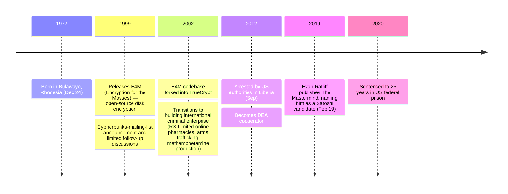

Paul Calder Le Roux (born December 24, 1972 in Bulawayo, Rhodesia — now Zimbabwe) is a programmer and convicted criminal. He is documented in the cryptographic record as the original author of *Encryption for the Masses* (E4M, 1999), the open-source disk-encryption package whose codebase was forked into *TrueCrypt* in 2002. From the early 2000s he transitioned from cryptographic engineering into building a sprawling international criminal enterprise, chronicled in journalist Evan Ratliff's 2019 book *The Mastermind*. He was arrested by US authorities in Liberia in September 2012 and has been incarcerated and cooperating with the US Drug Enforcement Administration ever since.

### E4M and the TrueCrypt Lineage

In 1999 Le Roux released *Encryption for the Masses* (E4M), a free open-source disk-encryption package, distributed under an open-source license. He announced the project on the cypherpunks mailing list and engaged in a limited number of cryptographic discussions there during 1999. In 2002 the E4M codebase was forked into *TrueCrypt*, which became one of the most widely deployed open-source disk-encryption packages of the 2000s and 2010s. The TrueCrypt project's original developers remained anonymous and the lineage from E4M was the subject of years of speculation about Le Roux's possible authorship of TrueCrypt itself — never definitively resolved in public.

### Criminal Enterprise

From the early 2000s Le Roux's operational focus shifted from open-source cryptography to building an international criminal organization. The enterprise spanned multiple verticals: RX Limited (a network of US online pharmacies dispensing controlled prescriptions of disputed legality), arms trafficking, methamphetamine production in the Philippines, gold-smuggling operations, and contract violence. The full scope is documented in Evan Ratliff's *The Mastermind* (Random House, 2019) and the accompanying *Atavist Magazine* long-form series.

### Arrest and Cooperation

In September 2012 Le Roux was arrested by US authorities in Liberia after being lured there in a sting operation. He immediately became a DEA cooperator, providing extensive evidence against members of his own organization. He was sentenced to 25 years in US federal prison in 2020 — substantially reduced for cooperation against the originally maximum possible life sentence. He has not made public statements while incarcerated, including on the Satoshi-identity question.

### Posthumous-style association with the Satoshi-identity question

Le Roux's connection to the Satoshi-identity question is entirely external — there is no documented contact with Satoshi Nakamoto, no statement by Le Roux on the question, and no Bitcoin-related material in the public record from him. He was named as a Satoshi candidate primarily through Evan Ratliff's 2019 *The Mastermind* and accompanying journalism, on a capability-plus-covertness-plus-motive argument (E4M cryptographic work, low public visibility during the 2007–2008 Bitcoin development window consistent with covert criminal operations, possible motive of separating his cryptographic past from his criminal present). The full hypothesis discussion — the argument-for, the argument-against (limited cypherpunks footprint, no monetary-design work, no Bitcoin-source-level shipping after E4M, circumstantial alignment only) — is in the [identity-hypotheses overview §3](/BitcoinArchive/entries/analysis/2008-10-31-satoshi-identity-hypotheses-overview/). He was also one of the five named candidates in the [2026-05-03 van Dorst corpus reanalysis](/BitcoinArchive/entries/analysis/2026-05-03-van-dorst-corpus-reanalysis-named-candidates/), where his stylometric distance to Satoshi did not place him near the top.

*[Editor: This archive does not hold dedicated Le Roux primary-source entries (E4M cypherpunks announcement, criminal-case court documents, Mastermind chapter excerpts). Specific dates and claims in this biography are externally sourced — primarily Ratliff (2019), Atavist Magazine (2016), and Wikipedia — rather than archive-verified. The Satoshi-identity association is included to record the public discussion; the biography does not endorse the hypothesis.]*
