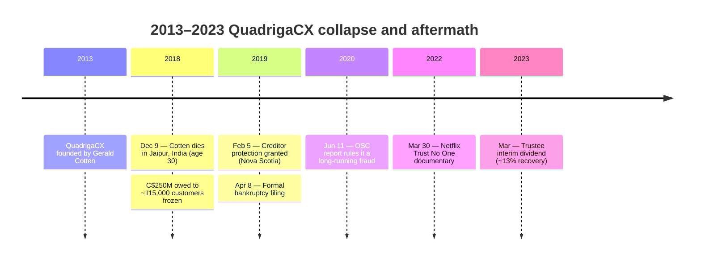

QuadrigaCX, founded in 2013, was at its peak Canada's largest cryptocurrency exchange. On **December 9, 2018**, its founder and chief executive **Gerald Cotten** died at the Fortis Hospital in **Jaipur, India**, at the age of 30. The cause of death was given as septic shock arising from peritonitis and intestinal obstruction. He had been traveling with his wife on what the company described as a charitable trip and a honeymoon-anniversary visit.

According to QuadrigaCX's public statement after his death, Cotten had been the sole custodian of the exchange's private keys. The company informed customers that without him the keys were unrecoverable, freezing approximately **C$250 million** (about **US$190 million**) owed to roughly **115,000 customers** in BTC, ETH, other cryptocurrencies, and Canadian-dollar fiat balances.

**The collapse and bankruptcy.** On **February 5, 2019**, QuadrigaCX obtained creditor protection from the Nova Scotia Supreme Court. On **April 8, 2019** the exchange entered formal bankruptcy proceedings under Canada's Bankruptcy and Insolvency Act. **Ernst & Young** was appointed as bankruptcy monitor; their investigators began the cold-storage forensic work that ultimately revealed the operation's true nature.

**The OSC investigation and the fraud conclusion.** On **June 11, 2020**, the Ontario Securities Commission released a 47-page investigative report titled *Quadriga: Inside The Crypto Exchange*. The conclusion was unambiguous:

<!-- audit:quote-skip -->
> What happened at Quadriga was an old-fashioned fraud wrapped in modern technology.

The OSC found that Cotten had operated QuadrigaCX as a long-running fraud. The exchange's internal balances were maintained by creating fictitious accounts with which Cotten then traded against customers, generating apparent profits that he withdrew from the real BTC/ETH inflows. Customer cryptocurrency was never held in the segregated cold storage the company advertised — most of it had been moved to Cotten-controlled accounts at other exchanges and either traded away or paid out as withdrawals to other customers in a structure functionally identical to a **Ponzi scheme**. By the time of Cotten's death the exchange was, the OSC determined, already insolvent and had been so for an extended period.

**Conspiracy theories and the exhumation question.** The combination of Cotten's youth, the manner of his death abroad, his recent will (executed twelve days before his death, with his wife as sole beneficiary), and the discovery of the Ponzi structure produced persistent public speculation that Cotten faked his death. The Royal Canadian Mounted Police received a 2019 petition to exhume the body, which the Crown declined to act on. No public evidence has emerged contradicting the official death certificate.

**The Netflix documentary.** On **March 30, 2022**, Netflix released *Trust No One: The Hunt for the Crypto King*, a feature-length documentary directed by Luke Sewell focused on the QuadrigaCX collapse and the community of customer-investigators who had pieced together the fraud independently of regulators. The documentary brought the case to a substantially larger general audience than the OSC report had reached on its own.

**Recovery to creditors.** The bankruptcy trustee distributed an interim dividend of **C$0.13 per CAD of proven claim** in March 2023 — approximately C$40 million, representing about 87% of the funds the trustee had recovered, against far larger total proven claims. Most affected customers will not be made whole; QuadrigaCX is, after Mt. Gox, one of the largest cryptocurrency exchange losses by dollar value with no recovery.

**Position in the lost-Bitcoin canon.** QuadrigaCX is the canonical example of **custody-collapse-mode** Bitcoin loss — distinct from forgotten-password losses like [Stefan Thomas's IronKey lockout](/BitcoinArchive/entries/aftermath/2021-01-12-stefan-thomas-7002-btc-ironkey-lockout/) and from physical-loss cases like [James Howells's Newport landfill drive](/BitcoinArchive/entries/aftermath/2024-12-03-james-howells-7500-btc-newport-landfill/). The OSC's finding that the loss was substantially fraud (rather than purely lost keys) also distinguishes it sharply from the [Mt. Gox bankruptcy](/BitcoinArchive/entries/aftermath/2014-02-28-mt-gox-bankruptcy/) (operational failure and transaction-malleability theft) and from the later [FTX collapse](/BitcoinArchive/entries/aftermath/2022-11-11-ftx-collapse/) (misappropriation at scale). The [Bitcoin lost-coins overview](/BitcoinArchive/entries/analysis/2026-06-02-bitcoin-iconic-losses-overview/) sets the case in the broader pattern.
