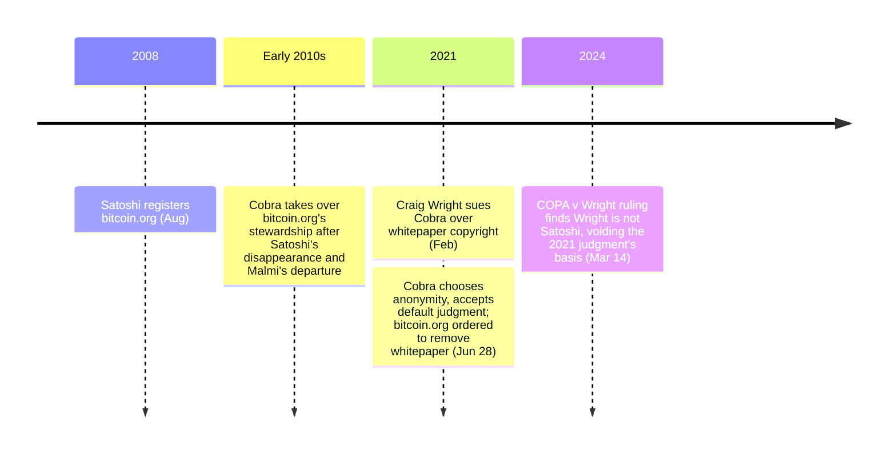

In June 2021, the pseudonymous operator of bitcoin.org chose to lose a UK High Court case rather than reveal his real identity. [Craig Wright had sued](/BitcoinArchive/entries/aftermath/2021-06-28-wright-v-cobra-whitepaper-lawsuit/) for copyright infringement over the Bitcoin whitepaper hosted on the site. The court allowed Wright to sue pseudonymously, but the procedural rules required Cobra to reveal his identity to defend himself. He accepted the default judgment instead. Two and a half years later, on March 14, 2024, the same court [ruled in COPA v. Wright](/BitcoinArchive/entries/aftermath/2024-03-14-copa-v-wright-ruling/) that Wright is not Satoshi and had fabricated evidence on a grand scale — rendering the 2021 default judgment retroactively hollow. The Bitcoin whitepaper remains freely available on bitcoin.org.

Cobra (also stylised as Cøbra) is the steward of the website [Satoshi Nakamoto](/BitcoinArchive/participants/satoshi-nakamoto/) registered in August 2008. His real identity is unknown.

## Role
After Satoshi's disappearance and [Martti Malmi](/BitcoinArchive/participants/martti-malmi/)'s departure, Cobra became the custodian of bitcoin.org — maintaining the site, hosting the Bitcoin whitepaper, and managing the domain that serves as Bitcoin's primary public gateway. The position carries no formal authority over the Bitcoin protocol but holds symbolic significance as the steward of Satoshi's original website.

## Wright v. Cobra (2021)
In February 2021, [Craig Wright](/BitcoinArchive/participants/craig-wright/) [filed a copyright infringement lawsuit](/BitcoinArchive/entries/aftermath/2021-06-28-wright-v-cobra-whitepaper-lawsuit/) against Cobra, claiming ownership of the Bitcoin whitepaper and demanding its removal from bitcoin.org. The London High Court allowed Wright to sue Cobra pseudonymously, but the procedural rules did not allow Cobra to defend himself without revealing his real identity.

Cobra faced an impossible choice: reveal his identity and lose his anonymity, or accept a default judgment. On June 28, 2021, he chose to protect his anonymity, and the court issued a default judgment in Wright's favor. Bitcoin.org was ordered to remove the whitepaper.

## Vindication (2024)
On March 14, 2024, the UK High Court [ruled in COPA v. Wright](/BitcoinArchive/entries/aftermath/2024-03-14-copa-v-wright-ruling/) that Craig Wright is not Satoshi Nakamoto and had fabricated evidence on a grand scale. The ruling rendered the 2021 default judgment against Cobra meaningless — Wright had no legitimate copyright claim to the whitepaper. The Bitcoin whitepaper remains freely available on bitcoin.org and numerous other websites worldwide.
