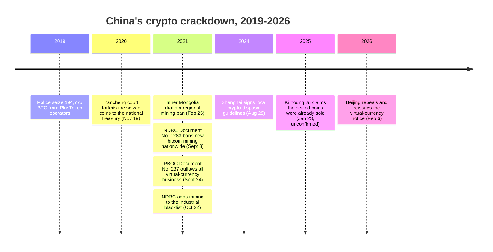

On September 3, 2021, eleven Chinese central agencies led by the National Development and Reform Commission (NDRC) issued Document No. 1283 [2021], banning any new virtual-currency mining project in the country. Two years earlier, Chinese police had already taken permanent custody of 194,775 bitcoin seized from the operators of the PlusToken Ponzi scheme — one of the largest cryptocurrency frauds in history. Outlawing private mining and holding seized coins in state custody turned out to be positions the same government could occupy at once.

## The 2021 escalation: from a regional draft to a nationwide ban

Inner Mongolia moved first. On February 25, 2021, the region's Development and Reform Commission posted a draft rule, open for public consultation until March 3, ordering that virtual-currency mining projects in the region "will all be cleaned up by the end of April 2021."

Seven months later, the ban went national. Document No. 1283 [2021] — issued jointly by eleven agencies — banned any new mining project, ordered existing operations to exit in an orderly fashion, set a punitive electricity surcharge for any that carried on regardless, and directed banks to recall loans extended to the industry:

<!-- audit:quote-skip -->
> 严禁新增虚拟货币'挖矿'项目 (Prohibit any new virtual currency mining projects)... 加快存量项目有序退出 (Accelerate orderly exit of existing projects)... 加价标准为每千瓦时0.30元 (Surcharge standard of 0.30 yuan per kilowatt-hour)

— NDRC, Document No. 1283 [2021] (发改运行〔2021〕1283 号), September 3, 2021

Three weeks after that, on September 24, 2021, the People's Bank of China and nine other bodies — the Cyberspace Administration, the Supreme People's Court, the Supreme People's Procuratorate, the Ministry of Industry and Information Technology, the Ministry of Public Security, the State Administration for Market Regulation, the China Banking and Insurance Regulatory Commission, the China Securities Regulatory Commission, and the State Administration of Foreign Exchange — jointly released Yinfa [2021] No. 237. The document itself was dated September 15; publication followed nine days later. It classified virtual-currency business activities as illegal financial activity outright, and extended that classification to overseas exchanges providing services to residents in China over the internet — a jurisdiction that Document No. 1283 alone could not reach.

A last procedural step closed the file on October 22, 2021. The NDRC announced it would add cryptocurrency mining to the Industrial Structure Adjustment Guidance Catalogue — the sole revision made in that year's review — placing mining of bitcoin and other digital tokens on a blacklist of industrial activities to be abandoned, with public comment open through November 21.

## A parallel posture: seized coins in state custody

The ban reached private mining and private trading. It did not reach coins the state already held. In 2019, Chinese police seized 194,775 BTC — along with 833,083 ETH, 1.4 million LTC, 27.6 million EOS, 74,167 DASH, 487 million XRP, 6 billion DOGE, 79,581 BCH, and 213,724 [USDT](/BitcoinArchive/entries/currency/2026-07-27-usdt-currency-overview/) — from the operators of the PlusToken Ponzi scheme.

On November 19, 2020, the Jiangsu Yancheng Intermediate People's Court handed down the PlusToken judgment: prison terms of two to eleven years, and forfeiture of the seized assets, worth almost $4 billion at the time, to the national treasury:

<!-- audit:quote-skip -->
> The seized digital currencies will be processed pursuant to laws and the proceeds and gains will be forfeited to the national treasury.

— Jiangsu Yancheng Intermediate People's Court, ruling of November 19, 2020

What China has not published is a clear account of how, or whether, those coins have since moved. What it has published, piecemeal, are local procedures for handling crypto that enters state hands through criminal cases: Suzhou in April 2022, Shandong in August 2023, Fujian in December 2023, and a joint guideline from Shanghai's Xuhui District procuratorate and police in August 2024. The machinery for disposing of judicially seized crypto grew even as all private crypto business remained illegal nationwide.

On January 23, 2025, CryptoQuant CEO Ki Young Ju said publicly that he believed the entire PlusToken holding had already been sold — roughly $19.7 billion by his estimate, disposed of gradually through exchanges such as Huobi:

<!-- audit:quote-skip -->
> China sold 194K Bitcoin already, [in my opinion]. […] The CCP said it was 'transferred to the national treasury' without clarifying if it was sold.

— Ki Young Ju, CryptoQuant CEO, January 23, 2025

Chinese authorities have neither confirmed nor denied the claim. It stands as Ki's stated opinion, not a documented transaction.

Five years after Document No. 237, Beijing returned to the same ground. On February 6, 2026, eight central bodies repealed the 2021 notice outright and reissued it — reasserting that virtual-currency business is illegal, while adding fresh restrictions on unapproved offshore RMB stablecoins and tokenized real-world assets — a repeal-and-reassert in the same motion, one of the reversals examined further in this archive's [survey of nation-state Bitcoin policy](/BitcoinArchive/entries/analysis/2026-07-28-bitcoin-nation-state-policy-history/).

## Significance to Bitcoin

Document No. 1283 could order every mining rig inside China to shut down. It had no clause that could reach the same activity outside China's borders. This archive's [2017 ICO-ban entry](/BitcoinArchive/entries/aftermath/2017-09-04-china-ico-ban/) already recorded that limit once, when the exchange-closure order pushed trading elsewhere rather than stopping it. A government can prohibit an activity inside its own jurisdiction; it cannot prohibit the protocol running beyond it.

The seized coins sit on the other side of the same ledger. A government that bans private ownership of an asset while holding 194,775 units of it in a vault of its own making is not rejecting the asset — it is choosing who is allowed to hold it. This archive's [ownership map of Bitcoin's largest holders](/BitcoinArchive/entries/analysis/2026-07-09-bitcoin-ownership-map/) lists the same holding at roughly 194,000 BTC, with custody and liquidation status marked disputed there too. Bitcoin's ledger does not care whether a given output sits in a Ponzi wallet, a police evidence account, or an ordinary holder's key; it will show, eventually and publicly, whether those coins ever move again. A law can declare a currency illegal. It cannot make the record of who holds it disappear.
