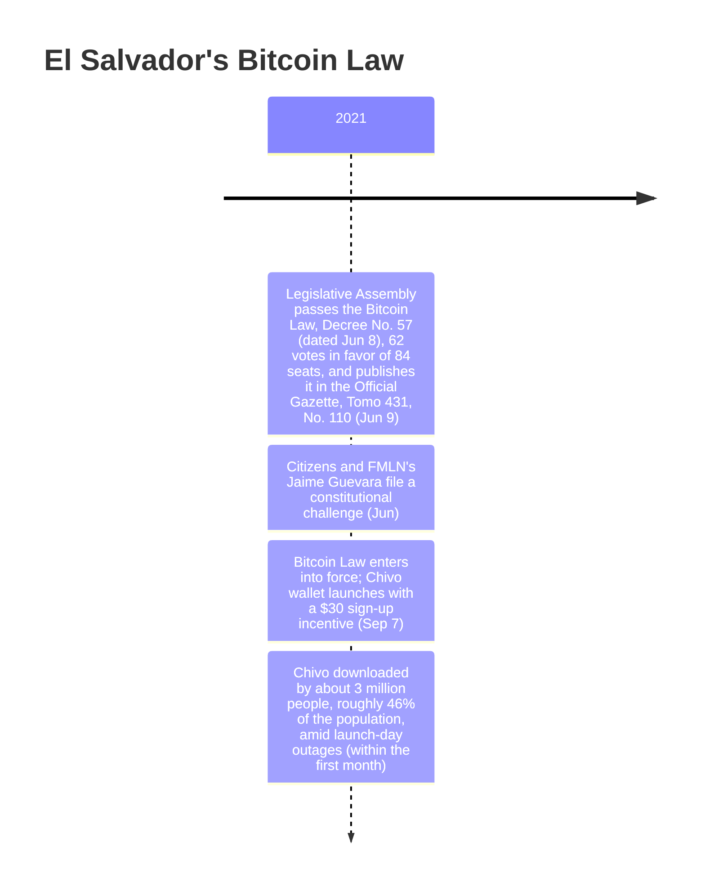

On September 7, 2021, bitcoin became legal tender in El Salvador — not by market adoption, but by law. Article 7 of the country's new Bitcoin Law made acceptance mandatory: every economic agent in the country now had to take bitcoin as payment whenever a customer offered it. No country had ever done this before — the opening entry in what would become [a much longer record of nation-state reversals, seizures, and reserve declarations](/BitcoinArchive/entries/analysis/2026-07-28-bitcoin-nation-state-policy-history/).

## A 62-vote majority

President [Nayib Bukele](/BitcoinArchive/participants/nayib-bukele/) had championed the bill; the vote itself belonged to the Legislative Assembly. In the early hours of June 9, 2021, the Assembly passed the Bitcoin Law — Legislative Decree No. 57, dated June 8 — with 62 votes in favor out of its 84 seats. The decree was published that same day, June 9, in the Official Gazette (Diario Oficial, Tomo 431, No. 110).

## An immediate legal challenge

Opposition surfaced before the law had even begun to apply. In June 2021, a group of citizens joined FMLN legislator Jaime Guevara in filing a constitutional challenge against the Bitcoin Law at El Salvador's Constitutional Chamber. Cointelegraph reported the filing:

<!-- audit:quote-skip -->
> A group of citizens joining forces with political party, Farabundo Martí National Liberation Front (FMLN), has filed a lawsuit claiming President Bukele's Bitcoin adoption program is unconstitutional.

## Ninety days later, a world first

The law had written its own countdown into its final pages: a transitory provision setting entry into force ninety days after the Official Gazette publication. That count ran out on September 7, 2021. CoinDesk reported that morning:

<!-- audit:quote-skip -->
> Bitcoin is now officially legal tender in El Salvador, three months after the Bitcoin Law passed the country's legislature.

## What the law required

| Article | Provision |
|---|---|
| 1 | States the law's purpose: bitcoin as "unrestricted legal tender with liberating power," usable without limit in any transaction |
| 4 | Allows tax contributions to be paid in bitcoin |
| 5 | Exempts bitcoin exchanges from capital-gains tax, treating bitcoin like any legal tender |
| 7 | Makes acceptance mandatory: every economic agent must take bitcoin when a customer offers it |

The two clauses doing the most legal work were Articles 1 and 7:

<!-- audit:quote-skip -->
> **Article 1.** "The purpose of this law is to regulate bitcoin as unrestricted legal tender with liberating power, unlimited in any transaction, and to any title that public or private natural or legal persons require carrying out."
>
> **Article 7.** "Every economic agent must accept bitcoin as payment when offered to him by whoever acquires a good or service."

By January 2025, that mandatory-acceptance requirement was gone: the Legislative Assembly voted 55 to 2 on January 30 to strip it from the law.

Articles 4 and 5 handled the tax side of the same equal-footing principle — bitcoin taxed, and exempted, the way any legal tender already was:

<!-- audit:quote-skip -->
> **Article 4.** "Tax contributions can be paid in bitcoin."
>
> **Article 5.** "Exchanges in bitcoin will not be subject to capital gains tax, just like any legal tender."

## Chivo: $30 to sign up, and a rocky first month

The government's own wallet, Chivo, launched the same day the law took effect. Every Salvadoran who signed up received $30 in bitcoin, seeded directly into a new account — the government's own incentive for adoption. The launch did not go smoothly. Wikipedia's account of the law describes what happened next:

<!-- audit:quote-skip -->
> the government had to take its bitcoin e-wallet, Chivo, offline due to excessive load

Even so, within the first month Chivo had been downloaded by roughly three million people, "amounting to 46 percent of the population."

## Significance to Bitcoin

Bitcoin's design needed no institution's permission to be used, and none to be refused — no central switch any government could throw to allow or forbid it. El Salvador's Bitcoin Law inverted half of that premise: use of bitcoin was no longer optional by an unpermissioned network's design, but guaranteed by statute, and the state paid $30 apiece to the people who opened the accounts that would hold it. A protocol built to need no one's help got a government's help anyway — and made non-use illegal rather than use unstoppable.
