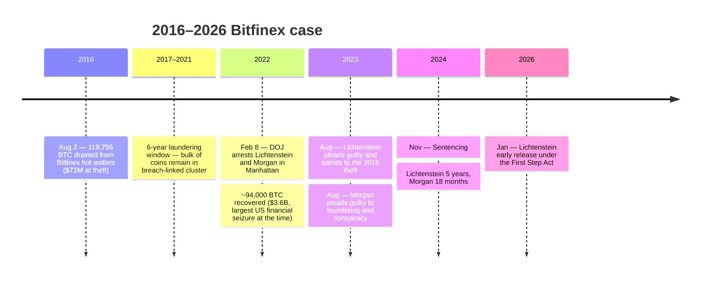

On August 2, 2016, 119,756 bitcoins were drained from hot wallets at the Hong Kong–based exchange **Bitfinex** in 2,072 unauthorized transactions. The haul was worth roughly $72 million at the time of the theft; by the time of the arrests it had appreciated to around $4.5 billion. For six years the funds sat in a single cluster of addresses tied to the breach, with only small portions tumbled through mixers and cashed out. The bulk of the stolen coins did not move.

**The arrests (February 8, 2022).** The U.S. Department of Justice arrested **Ilya Lichtenstein** (born 1989) and his wife **Heather R. Morgan** (born 1991) in Manhattan. Federal agents announced the recovery of roughly 94,000 BTC — about $3.6 billion at the time, the largest financial seizure in US history when made. The case was filed in the District of Columbia; the indictment charged the couple with conspiracy to launder stolen cryptocurrency and conspiracy to defraud the United States. They were not initially charged with the hack itself.

**Razzlekhan and the public persona.** Morgan was, before the arrest, known to a small online audience as **Razzlekhan**, an avant-garde rapper with self-released music videos shot in lower Manhattan and a column for *Forbes* magazine on entrepreneurship and persuasion. The Razzlekhan footage went viral after the arrest, with much of the coverage struggling to reconcile the persona with the alleged $4.5 billion conspiracy. Forbes removed her column; the music videos remained online and accumulated millions of views in the weeks after the indictment.

**Six years of slow laundering.** Court filings described an evolving laundering pattern across years: chain-hops through privacy-focused services, small withdrawals at exchanges using fictitious identities, gold-coin purchases, and routing through darknet markets. The volumes were modest relative to the total stolen — most of the coins remained in the cluster of addresses traceable back to the August 2016 breach. The slow drip, rather than a panicked sell-off, was central to how the funds remained recoverable.

**Guilty pleas and sentencing.** In August 2023, Lichtenstein pleaded guilty to money laundering conspiracy and **admitted he had committed the original 2016 Bitfinex theft**. Morgan also pleaded guilty to money laundering and conspiracy to defraud. Sentencing followed in November 2024: Lichtenstein received **5 years (60 months) in federal prison** plus 3 years of supervised release; Morgan received **18 months** plus 3 years of supervised release. Lichtenstein was reported to have received early release in January 2026 under the First Step Act.

**Significance.** The Bitfinex case marks the largest cryptocurrency-related law-enforcement recovery to date and one of the longest gaps between an exchange breach and the arrest of the parties responsible. It demonstrated that on-chain forensics combined with traditional financial-investigation techniques (subpoenas to exchanges, surveillance of dark-market accounts, search warrants on cloud storage holding the master key list) could undo a multi-year laundering effort that had once been treated as unrecoverable. The 2016 Bitfinex hack functions as the canonical "recovery-against-the-irreversibility-default" counterpoint in [the lost-Bitcoin canon overview](/BitcoinArchive/entries/analysis/2026-06-02-bitcoin-iconic-losses-overview/), which reads it alongside Mt. Gox, QuadrigaCX, FTX, and the forgotten-password and physical-loss cases (Stefan Thomas, James Howells).
