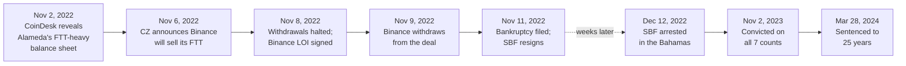

On November 11, 2022, FTX Trading Ltd. — along with Alameda Research and over 130 affiliated entities — filed for Chapter 11 bankruptcy in U.S. Bankruptcy Court. Founder Sam Bankman-Fried (SBF) resigned as CEO.

Approximately **$8 billion** in customer funds had been misappropriated. Federal prosecutors called it "one of the biggest financial frauds in American history." John J. Ray III, appointed as the new CEO to oversee bankruptcy proceedings, described it as the worst case of corporate governance failure he had ever seen — worse than Enron.

Once again, media declared cryptocurrency dead. Once again, Bitcoin's protocol was unaffected. FTX was a centralized intermediary — the exact type of trusted third party that Bitcoin was designed to eliminate. The collapse reinforced the principle embedded in Bitcoin's design: "Don't trust, verify." [The lost-Bitcoin canon overview](/BitcoinArchive/entries/analysis/2026-06-02-bitcoin-iconic-losses-overview/) reads FTX as a custody-collapse-by-misappropriation case alongside QuadrigaCX (sole-custodian fraud) and Mt. Gox (operational failure plus theft), with forgotten-password and physical-loss cases (Stefan Thomas, James Howells) on the other side of the typology.

This FTX collapse is treated as a load-bearing custody-axis example by [the Satoshi-design-vs-current-reality analysis](/BitcoinArchive/entries/analysis/2026-05-24-satoshi-design-vs-current-reality/), which uses FTX alongside the [Mt. Gox bankruptcy](/BitcoinArchive/entries/aftermath/2014-02-28-mt-gox-bankruptcy/) to exemplify the bank-failure mode the protocol was designed to prevent — affected users had no protocol-level claim on any coin, only a contractual claim against an insolvent company.
