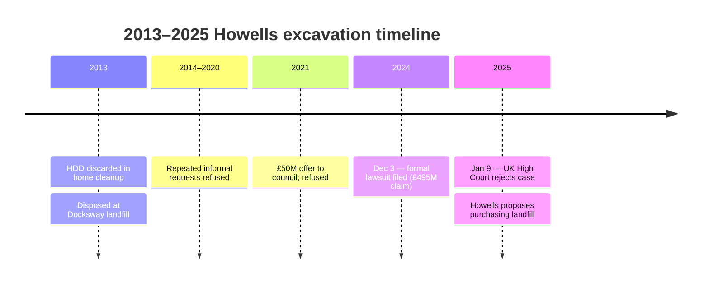

In mid-2013, **James Howells**, a Welsh IT worker living in Newport, mined approximately 7,500 BTC in Bitcoin's earliest period and stored the private keys on a single Dell laptop hard drive. During a 2013 home cleanup, he discarded the drive. It was collected with general waste and deposited at Newport City Council's **Docksway landfill** on the eastern edge of the city.

Within weeks Howells realized the drive was gone. He contacted the council. The drive — by then buried under months of further deposits — was unrecoverable without an excavation operation. Howells's request to dig was refused, and that refusal has been repeated, in various forms, every year since.

**Escalation of offers.** Over the twelve-year period that followed, Howells repeatedly raised the compensation he was offering Newport City Council in exchange for permission to excavate. Reported offers include a percentage of any recovered coins, **£50 million** to the council for granting permission (2021), bringing in a specialist excavation contractor at his own cost, and most recently a proposal in 2025 to purchase the entire landfill outright. The council has refused every iteration on the same set of grounds: the dig would breach the landfill's environmental permit, the disruption to Newport's waste-management operations would be substantial, and the council does not regard the drive as recoverable in usable condition even if found.

**The 2024–2025 lawsuit.** In December 2024, Howells filed a formal legal action against Newport City Council seeking the right to excavate or, in the alternative, **£495 million** in compensation. The BTC value at filing put the contents of the drive at roughly **£600 million** (about $760 million). On **January 9, 2025**, the UK High Court (sitting in Cardiff) refused to allow the case to proceed: District Judge Andrew Keyser found that Howells's claim had no realistic prospect of success. The court accepted the council's position that the landfill's environmental permit and operational reality made the excavation untenable.

**Wider continuation.** Howells has stated publicly that he intends to continue pursuing the matter, including by attempting to acquire the landfill itself when it closes (currently scheduled within the next several years). The case is regularly revisited in UK and international press whenever the BTC price moves significantly, since the nominal value of the drive's contents tracks the price directly.

**Why the case persists in the lost-Bitcoin canon.** The Howells case is the canonical example of **physical-loss-mode** Bitcoin destruction — distinct from forgotten-password losses like [Stefan Thomas's IronKey lockout](/BitcoinArchive/entries/aftermath/2021-01-12-stefan-thomas-7002-btc-ironkey-lockout/) and from custody collapse cases like [QuadrigaCX's loss of keys after its CEO's death](/BitcoinArchive/entries/aftermath/2019-04-08-quadrigacx-gerald-cotten-death/). The keys exist (somewhere in a half-million tonnes of compacted Welsh waste) but are operationally inaccessible. From Bitcoin's perspective the coins are not destroyed; they are simply unmoveable, indistinguishable from any other long-dormant UTXO. The [Bitcoin lost-coins overview](/BitcoinArchive/entries/analysis/2026-06-02-bitcoin-iconic-losses-overview/) sets the Howells case alongside the other documented losses and the underlying irreversibility principle.
