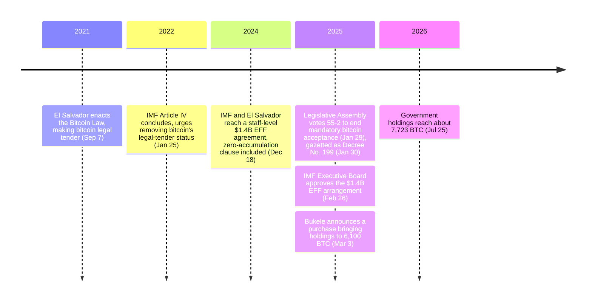

Fifty-five votes to two. That was the margin by which El Salvador's Legislative Assembly voted on January 29, 2025 to strike the words in its own [Bitcoin Law](/BitcoinArchive/entries/aftermath/2021-09-07-el-salvador-bitcoin-law/) that had made bitcoin's acceptance mandatory — a change the IMF had been asking for since 2022, and a precondition of the $1.4 billion loan its board would approve four weeks later. The same government that gave up the mandate kept buying bitcoin anyway, adding to a reserve the loan's own terms were supposed to freeze at zero — one reversal among [roughly thirty governments' worth of Bitcoin policy turns this archive tracks](/BitcoinArchive/entries/analysis/2026-07-28-bitcoin-nation-state-policy-history/).

## Three years of being told to narrow the law

The IMF's Executive Board concluded its 2021 Article IV consultation with El Salvador on January 24, 2022. The press release announcing it, issued the following day, put the ask plainly:

<!-- audit:quote-skip -->
> They urged the authorities to narrow the scope of the Bitcoin law by removing Bitcoin's legal tender status.

The board's stated reasons were risks to financial stability, consumer protection, financial integrity, and the fiscal contingent liabilities the law created. El Salvador did not act on the recommendation for three years — until a loan was on the table.

## The price of $1.4 billion

On December 18, 2024, the IMF announced a staff-level agreement with El Salvador on a $1.4 billion, 40-month Extended Fund Facility. The agreement's own language named what would have to give:

<!-- audit:quote-skip -->
> Acceptance of Bitcoin by the private sector will be voluntary and public sector's participation in Bitcoin-related activities will be confined... the government's participation in the crypto e-wallet (Chivo) will be gradually unwound... Taxes will only be paid in U.S. dollars.

The full set of conditions went further than the wallet itself, including a "ceiling of 0 on new Bitcoin acquisitions by public sector entities throughout the program period" and a bar on "any type of debt or tokenized instrument that is indexed to or denominated in Bitcoin":

| EFF condition (Dec 2024) | Requirement |
|---|---|
| Private-sector acceptance | Made voluntary, not mandatory |
| Chivo wallet | Government participation wound down; public funds barred by July 2025 |
| Fidebitcoin trust | Liquidated by July 2025 |
| Transparency | All government bitcoin wallet addresses published; Chivo user funds segregated |
| Audits | Audited financial statements for bitcoin-linked public entities |
| New accumulation | Continuous performance criterion: zero ceiling on public-sector bitcoin purchases |
| Debt | No debt or tokenized instrument indexed to or denominated in bitcoin |

## What the reform actually changed

By a vote of 55 to 2, the Legislative Assembly passed the reform on January 29, 2025; the gazetted text was published the following day, January 30, as Legislative Decree No. 199. The gazetted text, as reported by Bloomberg Tax:

<!-- audit:quote-skip -->
> allowing any price to be expressed in Bitcoin... allowing only natural persons and legal entities with full private participation to accept Bitcoin... directing the Central Reserve Bank and Superintendency of the Financial System to issue related regulations... requiring payment of the government's domestic or foreign monetary obligations in the currency in which they were contracted.

A separate legal-analysis account of the same decree adds that three articles of the original law were struck outright:

<!-- audit:quote-skip -->
> Articles 4, 8, and 9 have been repealed, removing the State's obligation to provide mechanisms for Bitcoin transactions, such as automatic and instant convertibility to U.S. dollars. Similarly, the State is no longer allowed to accept tax payments in Bitcoin.

Whether the reform touched bitcoin's legal-tender status itself, and not just the obligation to accept it, depends on which account addresses the question at all. Decrypt's coverage of the loan conditions describes the change only as "eliminating the obligation for the public and private sector to accept Bitcoin in transactions," making acceptance "voluntary" — it says nothing about the legal-tender label itself. A Central American legal-commentary outlet does address the label directly, and reports it gone: "References to Bitcoin as a legal tender have been deleted, rendering its use optional." Read together, the two accounts are not actually in tension — mandatory acceptance ended, and on the one source that speaks to it, so did the formal designation that made bitcoin legal tender in the first place.

## The IMF board signs off

On February 26, 2025, the IMF's Executive Board approved the new Extended Fund Facility:

<!-- audit:quote-skip -->
> access equivalent to US$1.4 billion... immediate disbursement of SDR 86.16 million, equivalent to around US$113 million... combined overall financing package of over US$3.5 billion over the program period.

The $113 million landed immediately. The IMF said the arrangement was expected to catalyze more than $3.5 billion in combined financing from other multilateral and bilateral sources over the program's life — a sum far larger than the loan itself, contingent on El Salvador holding to the terms it had just signed, including the zero ceiling on new public-sector bitcoin purchases.

## Buying anyway

President Nayib Bukele tested that ceiling within days of the ink drying:

<!-- audit:quote-skip -->
> On March 3, Bukele announced a new purchase, bringing the country's total holdings to 6,100 BTC.

It kept being tested. Through early-to-mid 2026, El Salvador's government continued adding roughly one bitcoin per day to its Strategic Bitcoin Reserve, all while the program's continuous performance criterion on public-sector accumulation remained formally in force:

<!-- audit:quote-skip -->
> The complication is that El Salvador's reported holdings have risen since the program began... The IMF's explanation... is that increases... reflect consolidation of BTC across various government-owned wallets... rather than net new market purchases by the public sector.

Rising holdings and a zero-purchase ceiling are reconciled, on the IMF's own account, by a distinction between buying and gathering — coins already owned by the state, moved from one government wallet to another, are not new acquisitions under the program's definition. By late July 2026, El Salvador's reserve, tracked alongside every other government, corporate, and ETF bitcoin balance in [the archive's ownership map](/BitcoinArchive/entries/analysis/2026-07-09-bitcoin-ownership-map/), had grown regardless. BitcoinTreasuries.net put the number directly:

<!-- audit:quote-skip -->
> El Salvador holds ₿7,723... valued at approximately $493.2 million USD... ranks #5 among government entities with Bitcoin holdings.

Fifth among the world's government bitcoin holders, on a balance the loan that unlocked $1.4 billion for El Salvador was written to keep at zero.

## Significance to Bitcoin

A legislature wrote the words "legal tender" into a law in 2021, and — on the one account that addresses the label directly rather than just the obligation — took them back out in 2025. What no account disputes is the balance itself. The wallet addresses the IMF's own condition forced into the open are checkable by anyone, on a ledger that does not consult loan agreements before recording a transfer — the same [design tension between a spendable currency and a held asset](/BitcoinArchive/entries/analysis/2008-10-31-bitcoin-electronic-cash-vs-digital-gold/) that El Salvador's 2021 law tried to resolve by decree is still being fought, three years and a legislative reversal later, over a reserve nobody disputes the size of.
