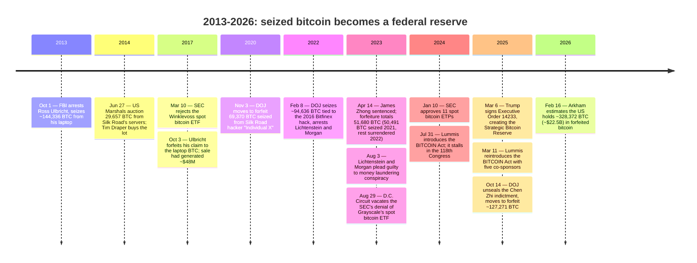

On March 6, 2025, Donald Trump signed Executive Order 14233, creating the Strategic Bitcoin Reserve — the first bitcoin holding the United States has ever declared it will not sell. Every coin inside it arrived by seizure, not purchase: a decade of criminal and civil forfeiture cases that the government, for most of that decade, treated as inventory to auction off rather than as a reserve to keep.

## Executive Order 14233

The order's operative clause reverses what had been, until that day, the government's default practice:

<!-- audit:quote-skip -->
> Government BTC deposited into the Strategic Bitcoin Reserve shall not be sold and shall be maintained as reserve assets of the United States ... capitalized with all BTC held by the Department of the Treasury that was finally forfeited as part of criminal or civil asset forfeiture proceedings ... budget neutral and do not impose incremental costs on United States taxpayers

Agency heads had 30 days to report every digital asset the government held. The order also drew a hard boundary around what the reserve could become next:

<!-- audit:quote-skip -->
> Within 30 days of the date of this order, the head of each agency shall provide the Secretary of the Treasury and the President's Working Group on Digital Asset Markets with a full accounting of all Government Digital Assets ... the United States Government shall not acquire additional Stockpile Assets other than in connection with criminal or civil asset forfeiture proceedings or in satisfaction of any civil money penalty imposed by any agency without further executive or legislative action.

Treasury cannot buy bitcoin with taxpayer money under this order, and it cannot acquire any digital asset other than bitcoin at all — except as the byproduct of a forfeiture, a penalty, or a future act of Congress. The reserve grows only the way it was built: through law enforcement, not through a market order.

## A decade of seizures, sold rather than kept

The practice the order reversed began with Ross Ulbricht. FBI agents arrested him in San Francisco on October 1, 2013, and seized roughly 144,336 BTC from his laptop — the Silk Road operator, caught with the marketplace's own reserve on his machine. The government did not hold what it had taken. On June 27, 2014, the U.S. Marshals Service auctioned 29,657 BTC recovered from Silk Road's servers in ten blocks; venture capitalist Tim Draper bought the lot for roughly $17-18 million. Ulbricht spent years contesting the government's claim to the separate stash of bitcoins found on his own laptop; he signed away that claim on October 3, 2017.

<!-- audit:quote-skip -->
> Ross Ulbricht's signature ... rest[s] below the heading 'AGREED AND CONSENTED TO,' effectively ceding nearly 50 million USD to the federal government

A decade before Executive Order 14233 banned the sale, selling was the only outcome forfeited Silk Road bitcoin ever had.

More Silk Road-linked bitcoin surfaced later, seized from people other than Ulbricht, and this time the government did not sell it. On November 3, 2020, the Justice Department moved to forfeit 69,370 BTC — then worth more than $1 billion — recovered from a Silk Road hacker prosecutors identified only as "Individual X," calling it the largest cryptocurrency seizure to date. James Zhong, who had drained roughly 50,000 BTC from Silk Road through a 2012 wire-fraud bug, was sentenced on April 14, 2023 to a year and a day in prison; law enforcement recovered approximately 50,491 BTC from his Gainesville, Georgia house in a November 9, 2021 search, and the government's final forfeiture orders — covering that recovery plus additional bitcoin Zhong voluntarily surrendered in 2022 — totaled 51,680.32473733 BTC. Individual X and Zhong are two separate people convicted in two separate cases; Arkham Intelligence's 2026 tally groups both of their recoveries into a single "Silk Road recoveries" line of roughly 94,679 BTC — a figure smaller than the two cases' own reported totals combined, which Arkham's tracing does not itself reconcile. Either way, this is bitcoin that, unlike Ulbricht's own stash, the government kept rather than converted back into dollars.

## The Bitfinex hack and the Prince Group forfeiture

[The 2016 Bitfinex hack](/BitcoinArchive/entries/aftermath/2022-02-08-bitfinex-hack-morgan-lichtenstein-arrest/) supplied the reserve's next major addition. On February 8, 2022, the Justice Department arrested Ilya Lichtenstein and Heather Morgan and recovered roughly 94,636 BTC connected to the theft.

<!-- audit:quote-skip -->
> lawfully seize and recover more than 94,000 bitcoin that had been stolen from Bitfinex ... the department's largest financial seizure ever

Lichtenstein and Morgan pleaded guilty to money laundering conspiracy in August 2023, clearing the coins' legal status well before the March 2025 order gave them a permanent home rather than an eventual auction date.

The largest single addition came seven months after the reserve existed. On October 14, 2025, the Justice Department unsealed an indictment against Chen Zhi, the Cambodian founder and chairman of Prince Holding Group, and filed a civil forfeiture action against approximately 127,271 BTC.

<!-- audit:quote-skip -->
> The US Department of Justice (DOJ) unsealed an indictment charging Cambodian national Chen Zhi, founder and chairman of Prince Holding Group, with wire fraud conspiracy and money laundering conspiracy ... the US Attorney's Office for the Eastern District of New York and the DOJ filed a civil forfeiture complaint for about 127,271 Bitcoin or ~$15 billion — the largest forfeiture action in DOJ history.

A single 2025 case had produced more forfeited bitcoin than either the Bitfinex hack or the Silk Road recoveries had alone — proof that Executive Order 14233's no-sale rule kept applying to whatever the courts handed it next, not only to the coins the reserve started with.

## An SEC reversal and a stalled bill

None of this happened in a regulatory vacuum. The Securities and Exchange Commission rejected the Winklevoss twins' bitcoin ETF on March 10, 2017, ruling that bitcoin markets were too vulnerable to fraud and manipulation to support an exchange-traded product. The agency kept rejecting similar filings for six more years, until the D.C. Circuit vacated its denial of Grayscale's application on August 29, 2023, finding the SEC's different treatment of futures-based and spot bitcoin funds arbitrary and capricious. On January 10, 2024, the SEC approved 11 spot bitcoin exchange-traded products at once.

<!-- audit:quote-skip -->
> Today, the Commission approved the listing and trading of a number of spot bitcoin exchange-traded product (ETP) shares ... we did not approve or endorse bitcoin ... The Commission is merit neutral ... Beginning under Chair Jay Clayton in 2018 and through March 2023, the Commission disapproved more than 20 exchange rule filings for spot bitcoin ETPs.

An agency that had turned down more than 20 filings over six years approved 11 in a single day — the same reversal, in miniature, that Executive Order 14233 would apply to the government's own bitcoin a little over a year later.

Congress tried the more direct route first, and it stalled. Senator Cynthia Lummis introduced the BITCOIN Act on July 31, 2024, directing the Treasury to buy up to 1,000,000 BTC over five years; the bill did not advance past Senator Sherrod Brown's opposition in the 118th Congress. Lummis reintroduced it on March 11, 2025 — five days after Trump's order — this time with five co-sponsors; it remains unenacted. The contrast sits side by side: the bill Congress could not pass would have directed Treasury to buy a million bitcoin on the open market. The order Trump signed directs no purchases at all — only a promise not to sell what forfeiture had already produced.

## The reserve in February 2026

Arkham Intelligence tallied the US government's bitcoin holdings by source as of mid-February 2026:

| Source of the bitcoin | BTC (Feb 2026) |
|---|---|
| Prince Group (Chen Zhi case) | ~127,271 |
| Bitfinex hack (Lichtenstein/Morgan case) | ~94,643 |
| Silk Road recoveries | ~94,679 |
| Other DOJ and IRS cases | ~11,779 |
| **Total** | **~328,372** |

<!-- audit:quote-skip -->
> The US government is holding $22.5 billion BTC ... approximately 328,372 BTC ... approximately 127,271 BTC tied to the Prince Holding Group ... roughly 94,643 BTC were forfeited from the Bitfinex hack case ... 94,679 BTC are linked to Silk Road recoveries ... 11,779 BTC stems from miscellaneous DOJ and IRS cases.

Every line in that table is a law-enforcement outcome, not a Treasury purchase order. The largest one, Prince Group, did not exist as a government holding on the day Trump signed the order that now promises to keep it forever.

## Significance to Bitcoin

A UTXO carries no record of whether the hand that last held it was a market-maker's or a prosecutor's. Bitcoin's ledger settles a seized coin exactly the way it settles a bought one.

What changed on March 6, 2025 was not the protocol but a government's policy toward the coins its own courts had already taken — one entry in a wider survey of [reversals, seizures, and reserve declarations running through roughly thirty governments](/BitcoinArchive/entries/analysis/2026-07-28-bitcoin-nation-state-policy-history/): for a decade, forfeited bitcoin was inventory to be converted back into dollars — 29,657 BTC auctioned in 2014, Ulbricht's laptop stash sold for about $48 million by 2017. Executive Order 14233 stopped that conversion. The reserve it created holds no bitcoin the United States ever chose to buy; every coin in it, from Silk Road to Bitfinex to Prince Group, is a coin someone else lost first.
