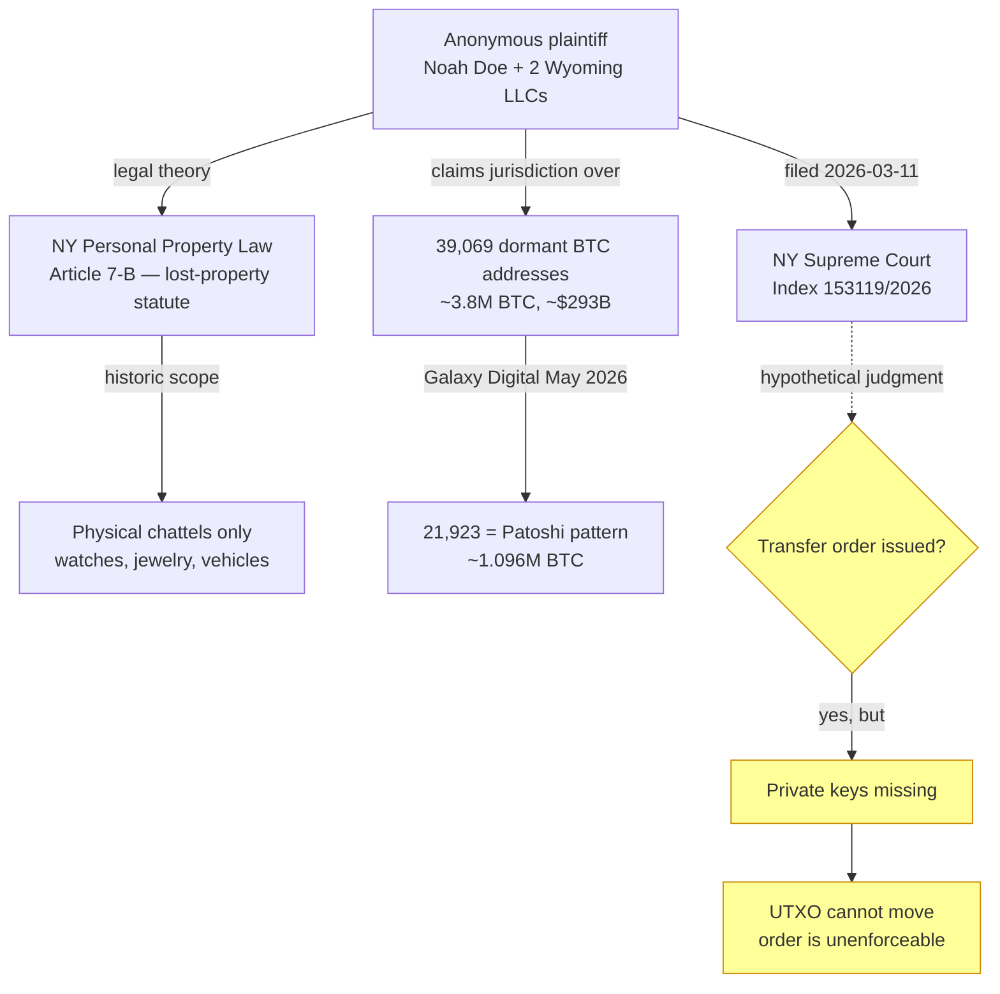

On March 11, 2026, an anonymous plaintiff using the pseudonym "Noah Doe," joined by two Wyoming LLCs (ABC Company and XYZ Company), filed suit in the Supreme Court of the State of New York under Index No. 153119/2026. The suit names 39,069 dormant Bitcoin addresses as defendants and claims ownership of the approximately 3.8 million BTC they hold — valued at roughly $293 billion at filing.

Counsel of record is Lewis & Lin LLC. The novel legal theory rests on **Article 7-B of New York's Personal Property Law**, the state's lost-property statute traditionally applied to physical objects. Plaintiff's argument: dormant Bitcoin meets the statutory definition of mislaid or abandoned personal property, and a finder who has "publicly maintained" possession through some yet-to-be-disclosed mechanism is entitled to ownership transfer through court order.

The legal innovation is significant. New York courts have applied Article 7-B to physical chattels — wallets, jewelry, motor vehicles — but never to digital assets recorded on a public blockchain. The pleading therefore frames a question of first impression: whether the statutory category of "personal property" extends to UTXO-controlled coins whose controlling private key has been lost, forgotten, or destroyed.

In May 2026, Galaxy Digital's research head Alex Thorn published an analysis classifying the 39,069 defendant addresses against [Sergio Demian Lerner's Patoshi nonce signature](/BitcoinArchive/entries/aftermath/2013-04-17-sergio-lerner-patoshi-analysis/). After excluding addresses linked to the [Bitfinex 2016 hack](/BitcoinArchive/entries/aftermath/2022-02-08-bitfinex-hack-morgan-lichtenstein-arrest/) and known exchange wallets, Thorn identified **21,923 addresses (56% of the defendants) as carrying the Patoshi pattern** — approximately 1.096 million BTC, in alignment with Lerner's earlier estimate of ~1.1M BTC mined by the single early miner widely understood to be Satoshi Nakamoto himself.

The remaining 17,146 addresses likely belong to other early miners or are unclassified. None of the defendant addresses have moved coins since the dormancy thresholds applied in the complaint.

The case is ongoing. The defendants — wallet addresses — cannot answer, and the procedural mechanics of how the plaintiff would establish standing, serve unknown holders, and enforce any judgment are themselves novel questions. Bitcoin-community reception has been overwhelmingly skeptical: critics argue that the suit amounts to asking a state court to declare a finder's right over coins whose original owner has not relinquished cryptographic control, and that any judgment ordering transfer would be unenforceable absent the private keys.

The case nevertheless tests, for the first time in a US court, whether lost-property doctrine can reach into the UTXO set. A finding for the plaintiff — even a partial one — would create precedent affecting all long-dormant Bitcoin, including the Satoshi-era reserves.
