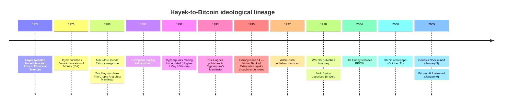
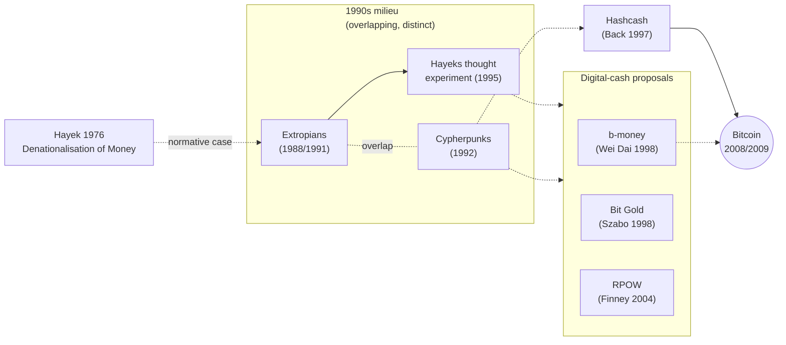

<!-- audit:quote-skip -->
> "There is no justification in history for the existing position of a government monopoly of issuing money. It has never been proposed on the ground that government will give us better money than anybody else could. It has always, since the privilege of issuing money was first explicitly represented as a Royal prerogative, been advocated because the power to issue money was essential for the finance of the government."
>
> — F. A. Hayek, *Denationalisation of Money* (1976), §III

Bitcoin's 2009 launch is sometimes read against a single immediate cause — the September 2008 financial crisis and the *Times* "Chancellor on brink of second bailout" headline embedded in the [genesis block](/BitcoinArchive/entries/aftermath/2009-01-03-genesis-block/). That reading captures the proximate symbolism but not the longer ideological span the system was built into. A separate intellectual lineage — Friedrich Hayek's 1976 *Denationalisation of Money*, the 1990s Extropian and cypherpunk circles that kept Hayek's competing-currency framing alive, and Bitcoin's 2009 realisation — predates the crisis by more than three decades and is documented in independent secondary sources.

The companion entry [Satoshi was not a cypherpunk](/BitcoinArchive/entries/analysis/2008-10-31-cypherpunk-independent-arrival/) addresses Satoshi's intellectual position relative to the cypherpunk channel of that transmission. The Hayek-to-Extropian leg, examined below, sits earlier in the same chain.

## 1. Hayek 1976: the competing-currency thesis

Friedrich August von Hayek published *Denationalisation of Money: An Analysis of the Theory and Practice of Concurrent Currencies* on October 25, 1976, through the Institute of Economic Affairs in London. He had been awarded the Nobel Memorial Prize in Economic Sciences two years earlier (1974). The monograph went through three editions (1976, 1978, 1990) and remains in print; the Satoshi Nakamoto Institute hosts the full text as a standing library reference.

### 1.1 The central proposal

Hayek's argument can be condensed into five linked claims that span the monograph:

| # | Hayek's claim | Mechanism proposed |
|---|---|---|
| 1 | Government monopoly of money issuance has no historical justification on monetary-quality grounds | Open the issuance of currency to competing private issuers |
| 2 | Private issuers competing for users would be disciplined by user choice into preserving purchasing power | Users hold the currency whose issuer best preserves value; bad issuers lose users |
| 3 | Inflation is an artefact of monopoly issuance, not of monetary economies as such | Competitive issuance removes the political incentive to inflate |
| 4 | Currency stability does not require a single national unit; multiple parallel currencies can circulate | Concurrent currencies coexist within and across borders |
| 5 | The unit of account need not be the unit of issuance | Users may keep accounts in a stable basket independent of which currency they spend |

The five claims together form what the 2024 *Modern American History* peer-reviewed study calls Hayek's "denationalisation" thesis: the position that money is a product like any other, and that the state monopoly on its production is contingent rather than necessary.

### 1.2 What Hayek's monograph does not contain

The monograph predates digital cash by more than a decade. It does not address:

- Cryptographic settlement.
- Network-based propagation of monetary state.
- Algorithmic supply schedules (Hayek's competing issuers would set their own supply policies through ordinary banking judgement).
- Pseudonymous holding.

What it *does* contain is the underlying normative case for non-state monetary issuance, framed in a way that later digital-cash designers would draw on directly when the technical means caught up with the political argument.

## 2. The 1990s intermediate: Extropians and the "Hayeks" thought-experiment

### 2.1 The Extropian milieu

The Extropian movement coalesced around Max More's *Extropy* magazine (founded 1988) and the Extropians mailing list (launched 1991). It overlapped substantially with — but was institutionally distinct from — the cypherpunk movement that emerged in 1992 (treated in detail in [Satoshi was not a cypherpunk](/BitcoinArchive/entries/analysis/2008-10-31-cypherpunk-independent-arrival/) §1.1). Where the cypherpunks centred on cryptographic privacy and "writing code," the Extropians centred on a broader transhumanist and libertarian programme that explicitly cited Hayek as a foundational economic reference.

[Hal Finney](/BitcoinArchive/participants/hal-finney/) — later the first non-Satoshi node operator on the Bitcoin network and the recipient of the [first Bitcoin transaction](/BitcoinArchive/entries/aftermath/2009-01-12-first-bitcoin-transaction/) — was an active participant on the Extropians list during this period. This is one of the few primary-source-documented individual-level connections between the Extropian milieu and the subsequent Bitcoin network (see §4 for the bounds on what this connection supports).

### 2.2 The "Hayeks" thought-experiment (Extropy magazine, 1995)

In *Extropy* magazine issue 14 (1995), Max More and the Extropian community circulated a thought-experiment about a "Virtual Bank of Extropolis" issuing a private digital currency named after Hayek — denominated in "Hayeks" and decorated with his portrait. The piece was not a working system; it was an exercise that explicitly joined two ideas that had not previously been combined in publication:

1. Hayek's 1976 competing-currency thesis (the normative case for private issuance).
2. The cypherpunk-adjacent digital-cash discussion that would shortly produce [Hashcash (1997)](/BitcoinArchive/entries/aftermath/1997-03-28-adam-back-hashcash-announcement/), [b-money (1998)](/BitcoinArchive/entries/aftermath/1998-11-26-wei-dai-pipenet-b-money-announcement/), Bit Gold, and RPOW.

The 2024 *Modern American History* study, the 2024 Reason retrospective, and the Bitcoin Magazine cultural history independently confirm that this Extropian discussion of "Hayeks" is the earliest published locus where Hayek's competing-currency framing was explicitly joined to the digital-cash design space. Earlier digital-cash work (Chaum's DigiCash; the original e-cash schemes of the late 1980s) did not foreground the Hayekian framing; earlier Hayekian work did not engage the digital-cash design space.

## 3. The ideological lineage to Bitcoin

### 3.1 Timeline

The intellectual chain from Hayek's monograph to Bitcoin's launch spans 33 years and three milieux. The events documented in primary sources or peer-reviewed secondary sources:

### 3.2 The structure of the lineage

The same chain seen as a flow of influence rather than a sequence of dates: the branch from Hayek into the 1990s milieu, and how Bitcoin rose out of that milieu's digital-cash design space.

The line styles track the evidence tiers of §4. A solid edge marks something concretely made or used: Hashcash, used during development, and the Hayeks thought experiment, produced by the Extropians. A dashed edge marks a real but indirect link: upstream ideological influence, community overlap, or a post-hoc citation. b-money is the post-hoc citation — Satoshi was unaware of it until Adam Back pointed him to it and did not use it in development, yet he cited it in the white paper. Hashcash, note, is not a currency but an anti-spam proof-of-work; Bitcoin reused only that mechanism (see [the Hashcash announcement](/BitcoinArchive/entries/aftermath/1997-03-28-adam-back-hashcash-announcement/)), which is why it sits apart from the digital-cash proposals (b-money, Bit Gold, RPOW). Bit Gold and RPOW are not cited in the white paper at all; conceptually close as Bit Gold is, neither is a development-time input or a citation, so they stay among the proposals with no edge to Bitcoin. The implementation-level lineage is the subject of the sibling entry, [Bitcoin's design lineage](/BitcoinArchive/entries/analysis/2008-10-31-bitcoin-design-lineage/).

### 3.3 What Bitcoin realises from the Hayek thesis

Bitcoin's design choices map onto Hayek's five claims (§1.1) with mixed fit — some are realised directly, others are reframed, others are absent. The mapping is not engineered after the fact; the correspondences are visible in Bitcoin's own design documents.

| Hayek 1976 claim | Bitcoin 2009 realisation | Fit |
|---|---|---|
| ❶ State issuance monopoly is contingent, not necessary | Issuance is performed by the network through proof-of-work mining; no state issuer | **Direct** |
| ❷ Competition among issuers preserves value | Bitcoin is *not* one of many competing private issuers — it is a single algorithmic issuer. The competition is across cryptocurrencies, not within Bitcoin | **Reframed** — Hayek's mechanism (issuer-level competition) is replaced by algorithmic commitment |
| ❸ Inflation is an artefact of monopoly issuance | Bitcoin's monetary policy is a fixed halving schedule with a 21M cap, removing the political incentive to inflate; see [the fixed-supply analysis](/BitcoinArchive/entries/analysis/2008-10-31-fixed-supply-vs-adjustable-money/) | **Direct** in policy effect, **different** in mechanism |
| ❹ Concurrent currencies can coexist within and across borders | Bitcoin operates as a peer-to-peer network across borders without state cooperation | **Direct** |
| ❺ Unit of account need not be unit of issuance | Bitcoin holders frequently denominate accounts in fiat or in a stable basket while transacting in BTC | **Direct** in practice, not enforced by protocol |

The closest direct realisation is the rejection of state issuance monopoly (❶) and the cross-border concurrent operation (❹). The reframing of competition (❷) is the most distinctive divergence: Hayek envisioned competing *private banks*; Bitcoin substitutes algorithmic commitment for banking judgement. The companion entry [Fixed supply vs adjustable money](/BitcoinArchive/entries/analysis/2008-10-31-fixed-supply-vs-adjustable-money/) treats this divergence at length, noting that [Wei Dai's b-money](/BitcoinArchive/entries/aftermath/1998-11-26-wei-dai-pipenet-b-money-announcement/) and [Adam Back's 1998 b-money critique](/BitcoinArchive/entries/aftermath/1998-12-06-adam-back-b-money-monetary-critique/) had already explored more Hayekian (adjustable-supply) alternatives — which Bitcoin chose not to take.

### 3.4 The genesis-block headline in this longer frame

The famous coinbase message in [Bitcoin's genesis block](/BitcoinArchive/entries/aftermath/2009-01-03-genesis-block/) — *"The Times 03/Jan/2009 Chancellor on brink of second bailout for banks"* — has often been read as a 2008-crisis-specific protest. Read against the Hayekian lineage, it is also a continuation of a much older argument: state monetary intermediation produces the bailouts that Hayek's 1976 monograph already named as the inevitable consequence of issuance monopoly. The 2008 headline made the case proximate and concrete; it did not invent the case.

## 4. Direct influence vs. ideological lineage: what the evidence supports

The temptation in tracing intellectual lineages is to collapse "ideological transmission" into "individual influence." The primary-source record narrows this lineage to two distinct claims, only one of which the evidence supports strongly.

| Claim | Evidence status | Notes |
|---|---|---|
| The **ideological lineage** from Hayek (1976) through Extropian / cypherpunk libertarianism to Bitcoin's design exists and is documented in multiple independent secondary sources | **Well supported** | Peer-reviewed *Modern American History* (2024); Reason 2024; Bitcoin Magazine cultural history; Satoshi Nakamoto Institute curatorial choice to host Hayek's full text |
| **Specific individual Bitcoin contributors were Extropian-mailing-list participants** | **Partially supported** | [Hal Finney](/BitcoinArchive/participants/hal-finney/) — confirmed Extropians-list participant during the relevant period |
| **Most or all early Bitcoin contributors were Extropians** | **Not supported** | A claim of this strength has been advanced in some secondary commentary; the primary-source record does not establish it. [Satoshi's own statements](/BitcoinArchive/entries/aftermath/2008-08-21-satoshi-to-adam-back-b-money/) place him outside the visible cypherpunk community ([cypherpunk-independent-arrival analysis](/BitcoinArchive/entries/analysis/2008-10-31-cypherpunk-independent-arrival/)); analogous Extropian-membership claims about [Wei Dai](/BitcoinArchive/participants/wei-dai/), [Adam Back](/BitcoinArchive/participants/adam-back/), and [Nick Szabo](/BitcoinArchive/participants/nick-szabo/) are not supported by the primary record in this Archive |
| **Satoshi personally read Hayek's monograph during Bitcoin's development** | **Open** | The public record contains no Satoshi statement on Hayek either way. Satoshi's design realises elements of Hayek's thesis but does not cite the monograph |

The distinction matters because the strong individual-membership claim is the form in which the Hayek-Extropians-Bitcoin lineage most often circulates in popular accounts. The peer-reviewed and primary-source evidence supports the weaker ideological-lineage claim; it does not license the strong individual-membership claim.

On the narrower open question of Satoshi's personal views, [Mike Hearn's 2025 retrospective](/BitcoinArchive/entries/aftermath/2025-02-21-mike-hearn-coingeek-retrospective/) offers a rare first-hand data point: Hearn recalls Satoshi as interested in payments and novel uses of the technology rather than as a 'gold bug or Hayek fan.'

## 5. Limits and counter-readings

- **The lineage is one of several plausible ideological framings of Bitcoin.** Adjacent framings include Austrian-school monetary economics more broadly (Mises, Rothbard), Mont Pelerin Society networks, Friedman's *Program for Monetary Stability*, and the cypherpunk technical-political tradition. The Hayek-specific channel is one strand within a larger libertarian-monetary milieu, not the sole or dominant one.
- **The Extropian "Hayeks" piece is a thought-experiment, not a working system.** It documents that Hayek's framing had entered the digital-cash discussion by 1995; it does not establish that the Extropian community itself produced a running implementation. The implementation work that followed (Hashcash, b-money, Bit Gold, RPOW, Bitcoin) was undertaken in adjacent rather than identical communities.
- **The "2008 crisis caused Bitcoin" reading is not refuted, only contextualised.** Satoshi's own [contemporaneous statements](/BitcoinArchive/entries/aftermath/2008-08-20-satoshi-to-adam-back/) place the start of Bitcoin's coding around mid-2007 — before the September 2008 Lehman event but during the unfolding 2007 subprime crisis. The crisis influence is real; the Hayekian lineage adds depth to it rather than replacing it.
- **No identity claim follows from this entry.** As with the [cypherpunk-independent-arrival analysis](/BitcoinArchive/entries/analysis/2008-10-31-cypherpunk-independent-arrival/), structural mapping between ideological positions and Bitcoin's design does not narrow Satoshi's identity to any country, profession, or named individual.

## 6. Summary

- Hayek's 1976 *Denationalisation of Money* makes a sustained case against the state monopoly on currency issuance and for competing private currencies, on grounds that long predate the digital-cash design space.
- The 1990s Extropian milieu — particularly the 1995 *Extropy* magazine "Virtual Bank of Extropolis" / "Hayeks" thought-experiment — is the earliest published locus where Hayek's framing was explicitly joined to the digital-cash discussion.
- Bitcoin's 2009 design realises the rejection of state issuance monopoly (Hayek ❶) and cross-border concurrent operation (Hayek ❹) directly; it reframes Hayek's issuer-level competition (❷) as algorithmic commitment.
- The ideological lineage from Hayek through the Extropian / cypherpunk channels to Bitcoin is documented in peer-reviewed and independent secondary sources. The stronger claim that early Bitcoin contributors were Extropian-network members is supported only for [Hal Finney](/BitcoinArchive/participants/hal-finney/); broader individual-membership claims are not supported by the primary record.
- The genesis-block "Chancellor on brink of second bailout for banks" headline is consistent with both the proximate 2008-crisis reading and the longer Hayekian lineage; the two readings reinforce rather than exclude each other.
