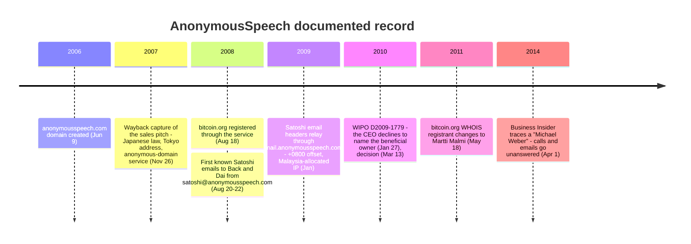

Satoshi Nakamoto's first documented steps toward the world passed through one commercial counterparty. `bitcoin.org` was registered on August 18, 2008 through AnonymousSpeech.com, an anonymous-registration and anonymous-email service; the first known outbound emails — to Adam Back on August 20 and Wei Dai on August 22 — were sent from `satoshi@anonymousspeech.com`. A paid service sits in a different position from every mailing list and forum Satoshi later used: it had a billing relationship with its customer. So what does the public record actually establish about that service and its operator — and where does the trail stop? The short answer to the second question: everywhere, on purpose, and the shape of that stopping is itself worth reading.

## 1. The documented record

| Date | Record | Where it survives |
|---|---|---|
| June 9, 2006 | `anonymousspeech.com` domain created | live WHOIS record |
| November 26, 2007 | The service's sales page: anonymous email and anonymous domain registration, Japanese-law protection pitch, Tokyo address, "since 1996" self-description | Wayback Machine capture (this entry's primary reference) |
| August 18, 2008 | `bitcoin.org` registered; historical WHOIS shows registrant "ANONYMOUSSPEECH ANONYMOUSSPEECH", organization Anonymousspeech LLC, at the same Tokyo address the sales page advertised | DomainTools historical WHOIS, reproduced on the whoissatoshi OSINT blog |
| August 20–22, 2008 | First known Satoshi emails, to [Adam Back](/BitcoinArchive/entries/correspondence/adam-back/2008-08-20-satoshi-to-adam-back-hashcash-citation/) and [Wei Dai](/BitcoinArchive/entries/correspondence/wei-dai/2008-08-22-satoshi-to-wei-dai/), sent from `satoshi@anonymousspeech.com` | released correspondence in this archive |
| January 2009 | Headers of [Satoshi's emails to Hal Finney](/BitcoinArchive/entries/aftermath/2020-11-26-coindesk-unpublished-satoshi-finney-emails/) relay through `mail.anonymousspeech.com` (IP `124.217.253.42`), Date header at +0800 | CoinDesk's 2020 header release; Chain Bulletin's analysis |
| March 13, 2010 | WIPO panel decision D2009-1779 (AnonymousSpeech LLC as registrant-of-record for a shielded domain); during the proceeding, on January 27, 2010, the company's CEO had told the Center it was not the beneficial owner, without disclosing who was | WIPO decision text |
| May 18, 2011 | `bitcoin.org` WHOIS registrant changes to Martti Malmi, via the Finnish provider Louhi Net Oy | DomainTools historical WHOIS, reproduced on the whoissatoshi OSINT blog |
| April 1, 2014 | Business Insider traces a "Michael Weber" as the person behind the site; repeated contact attempts through Japanese and Mexican phone numbers and email addresses go unanswered | Business Insider article (Wayback snapshot) |

Two things about this table are worth stating explicitly. First, every Tokyo location in it — the sales page, the bitcoin.org WHOIS record, the WIPO address of record — traces back to the company's own self-declaration; no independent record verifies a physical operation there. Second, nothing in it identifies the operator: the strongest identity lead (the 2014 Business Insider investigation) ends in unanswered phone calls.

## 2. The jurisdiction pitch

The service's product was not software; it was a legal position. The November 2007 capture of the sales page reads:

<!-- audit:quote-skip -->
> AnonymousSpeech.com will not respond to inquiries made by foreign governments or private parties regarding the emails sent by its subscribers. Any inquiries regarding the identity of our subscribers are ignored. We do not respond to any of them. Located in Japan, AnonymousSpeech is governed by Japanese law and allowed to delete customer data legally from its servers. By law AnonymousSpeech.com only reports to official Japanese government agencies.

The same page gives the company's self-description — "Based in Tokyo, Japan since 1996", with the address "AnonymousSpeech LLC, 1-3-3 Nakanosakaue Sakura House #206, 164-0011, Tokyo, Japan" — and a comparison chart whose headline row is "Offshore Jurisdiction (Server and registered company): Japan", set against the USA and UK jurisdictions of mainstream webmail. An "Anonymous Domain" product ("Purchase domain names completely anonymous") appears on the page dated August 2007, one year before `bitcoin.org` was registered through it.

The pitch is jurisdictional arbitrage sold as a subscription: the customer buys distance between his identity and any party who might ask for it. Whatever else is uncertain about AnonymousSpeech, the WIPO record shows the pitch was operational practice, not just marketing — in a formal UDRP proceeding (D2009-1779, decided March 2010), the company's CEO wrote to the Center in January 2010 that AnonymousSpeech was not the beneficial owner of the disputed domain and declined to say who was; the panel had to infer the real party in interest (a Dominica-registered company, Global House, Inc.) from the case record. A privacy shield that holds its silence even inside a WIPO arbitration is a strong shield.

*[Editor: The "since 1996" claim is quoted here as the company's self-description, not as verified history. The domain dates from 2006, and no independent record of the company before that year surfaced in the research for this entry. The same caution applies to the sales page's "over 600,000 subscribers" claim.]*

## 3. A Tokyo signboard and a Malaysian relay

The UTC+8 offset in the headers of Satoshi's January 2009 emails to Hal Finney briefly looked like a location signal — CoinDesk read it as evidence that Satoshi lived in the UTC+8 band. Chain Bulletin's Doncho Karaivanov argued the more economical reading: the offset belongs to AnonymousSpeech's webmail relay (`mail.anonymousspeech.com`), whose Date header reflects the server's clock, not the customer's. On that point the archive's [reading of the Finney headers](/BitcoinArchive/entries/aftermath/2020-11-26-coindesk-unpublished-satoshi-finney-emails/) follows Karaivanov: the +0800 is server-side noise, and it subtracts one apparent identity signal rather than adding one.

The infrastructure beneath the signboard is less tidy than the marketing. The relay IP preserved in those headers, `124.217.253.42`, sits in an address block allocated to the Malaysian hosting provider Piradius Net — not to a Tokyo data center. The pieces do not contradict each other as cleanly as they first appear (Malaysia's clock is also UTC+8, and neither a time-zone setting nor an IP allocation proves where a company's people sit), but they do mean the one technical trace of the service's actual infrastructure points somewhere the sales page never mentions. The Tokyo address is what the company said; the Malaysian allocation is what the packet headers show; no primary source reconciles the two. The signboard itself did not stay put, either: Business Insider's 2014 investigation reported that by 2009 the same site was describing itself as based in Switzerland and governed by Swiss law.

| Layer | What it says | What it is evidence of |
|---|---|---|
| Sales page (2007 capture) | "Located in Japan", "Based in Tokyo, Japan since 1996" | The company's self-presentation |
| bitcoin.org WHOIS (2008) | Registrant Anonymousspeech LLC, Nakano-ku, Tokyo | The same self-presentation, entered into a registration database |
| WIPO address of record (2010) | Nakano-ku, Tokyo | The same self-presentation, carried into a legal proceeding |
| Mail-relay IP (January 2009 headers) | `124.217.253.42`, allocated to Piradius Net, Malaysia | The only infrastructure-level trace, and it is not in Japan |
| Date header offset (same headers) | +0800 | The relay's clock setting — Malaysia-consistent, Tokyo-inconsistent (Japan is +0900), but a configuration value either way |

## 4. The operator trail

The one named lead on the operator comes from reporting, not from records. In April 2014, Business Insider (Hunter Walker and Rob Wile) published an investigation into the man behind AnonymousSpeech, naming a Michael Weber and running photographs sourced from his online presence. The reporters tried Japanese and Mexican phone numbers and multiple email addresses; none produced a response. The single substantive on-record statement in the piece about Bitcoin comes from Martti Malmi — by then the registrant of `bitcoin.org` — who told Business Insider that Weber had been the contact for the domain-registration service and had no other connection to Bitcoin.

That is the extent of the record that reaches a person: a privacy service that declined to identify even its own beneficial owners in arbitration, an investigation that ends at unanswered phones, and a minimizing character reference from the one Bitcoin figure who dealt with the service directly. The recurring details around the name also come from the Business Insider investigation, which reported them from online traces: a profile page on which Weber described himself as a Swiss software developer living in Japan; payment instructions on the service's own site directing Western Union transfers to a "Michael Niklaus Weber" in Mexico City; and WHOIS records tying vistomail.com — the service behind Satoshi's second email address — to the same name, the same contact email, and the same Sakura House address. These are reported traces, not identity verification; § 6 states their standing.

## 5. What the operator's side of the ledger could hold

A registration intermediary is not a mailing list. Whatever Satoshi paid for — the domain, the email account — was paid in 2008, before Bitcoin existed, which means through conventional rails. A Reddit comment (the account since deleted) quoted by news.bitcoin.com in 2021 spelled out the implication: the payment had to be a wire transfer, PayPal, a bank transfer, or a check, "so they may know who he is". That is hearsay from an anonymous, deleted account, and this entry treats it as nothing stronger. But the structural point underneath it does not depend on the comment: a paid anonymity service holds a class of records — payment channel, account metadata, whatever logs it kept despite advertising that it kept none — that no public archive holds, and those records sat with an operator who has never said a word about them, or about anything else, on any record that survives.

Set against the [six-layer anonymity architecture](/BitcoinArchive/entries/analysis/2008-10-31-satoshi-anonymity-architecture/), this is the channel layer's outer wall, and it extends the [identification asymmetry](/BitcoinArchive/entries/analysis/2008-10-31-satoshi-identification-asymmetry/) one step past Satoshi himself: the single counterparty best positioned to hold identity-relevant records was itself pseudonymous, jurisdiction-shielded by design, and is now unreachable. Whether that was Satoshi's luck or Satoshi's screening criterion is exactly the kind of intent question the record cannot answer.

There is also a quieter symbolic footnote. The one commercial service Satoshi chose wrapped itself in a Japanese flag — Japanese law, a Tokyo address — just as the pseudonym did. The [techno-orientalism reading of the name](/BitcoinArchive/entries/analysis/2008-10-31-satoshi-name-techno-orientalism/) applies unchanged here: the alignment is observable, its intent is not, and treating it as evidence of a Japanese Satoshi would be the same category error in a second location.

## 6. Limits and counter-readings

- **Every Tokyo datum is self-declared.** WHOIS registrant fields and WIPO addresses of record repeat what the registrant supplies; they corroborate the company's consistency, not its geography. No business registration, lease, or independent record of a Tokyo operation surfaced in the research for this entry — and the self-presentation itself later moved, per the Switzerland description Business Insider reported from the 2009 site.
- **The operator identification is reported, not verified.** "Michael Weber" rests on one 2014 news investigation that received no reply from its subject. The Swiss / Japan / Mexico details trace to Weber's own online self-description and the service's payment instructions as reported in that investigation; the vistomail.com linkage traces to WHOIS records reported in the same piece. None of it has been confirmed against a business registry, a court record, or any on-the-record first-person statement.
- **No cypherpunk connection is documented.** Nothing ties the operator to the cypherpunk mailing lists, the remailer-operator community, or any adjacent circle — in either direction. The absence is an absence of records, not evidence of distance.
- **The payment-trail argument is hearsay at its only concrete point.** That the operator "may know who Satoshi is" is an inference from a deleted, anonymous forum comment. The underlying premise — a 2008 payment could only have moved through conventional rails — is hard to escape; every specific about what records exist, or existed, is unknown.
- **No identity claim follows.** Using a Japan-branded anonymity service is not evidence that Satoshi was Japanese, was in Japan, or chose the service for its flag rather than for its function — the service was, on its own advertising, one of the more visible anonymous-email providers of its period.

## 7. Summary

The documented record supports a narrow but solid account: Satoshi's first public infrastructure ran through a paid anonymity intermediary that sold Japanese jurisdiction as its product, self-described from Tokyo, demonstrably relayed mail through Malaysian-allocated infrastructure, refused to identify a beneficial owner even in front of a WIPO panel, and whose operator has never spoken on any surviving record — not to arbitrators, not to journalists, not after Bitcoin made its most famous customer the subject of a fifteen-year search. For identity research the entry's yield is deflationary in one direction and cautionary in the other: the UTC+8 header is service noise, not a Satoshi signal; and the one ledger that might hold a real signal belongs to a party whose silence has outlasted everyone else's.
