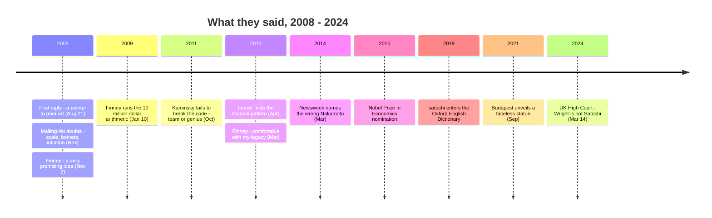

In 2011, the security researcher Dan Kaminsky — famous for finding a flaw in the internet's DNS infrastructure severe enough that the world's vendors patched it in coordinated secrecy — sat down to break Bitcoin. He arrived with nine attack vectors. Every one failed. "I came up with beautiful bugs," he told *The New Yorker*. "But every time I went after the code there was a line that addressed the problem." His verdict on the author he never met:

<!-- audit:quote-skip -->
> "Either there's a team of people who worked on this, or this guy is a genius."

[The archive's entry on Kaminsky's audit](/BitcoinArchive/entries/aftermath/2011-10-10-dan-kaminsky-bitcoin-security/) records the technical detail. This entry collects the wider record that verdict belongs to: what other people said about Satoshi Nakamoto — to his face in 2008, behind his back after 2011, under oath in 2024. The archive already inventories [what Satoshi said about himself](/BitcoinArchive/entries/analysis/2008-08-20-satoshi-self-statements/) (almost nothing) and [what he declined to answer](/BitcoinArchive/entries/analysis/2010-12-27-satoshi-non-technical-silence/) (everything personal). This is the third axis: everyone else's words.

Read in one place, those words follow an arc none of the speakers could see at the time — doubt, a wager, verification, retraction, a courtroom, a dictionary, and two statues with no face.

## 1. The first replies (2008–2009)

The first documented words anyone addressed to Satoshi are a homework pointer. On August 21, 2008, Adam Back — whose Hashcash the whitepaper cited — answered an unknown correspondent's citation-check request in two sentences and pointed him at prior art:

<!-- quote: q1 -->
> You maybe aware of the "B-money" proposal, I guess google can find it for you, by Wei Dai which sounds to be somewhat related to your paper.

When the paper went public that October, the reception on the cryptography mailing list opened with need and closed with doubt. [James A. Donald](/BitcoinArchive/participants/james-donald/), first to reply:

<!-- quote: q2 -->
> "We very, very much need such a system, but the way I understand your proposal, it does not seem to scale to the required size."

[John Levine](/BitcoinArchive/participants/john-levine/) answered from the anti-spam trenches, where the honest-majority assumption looked already refuted:

<!-- quote: q3 -->
> "Bad guys routinely control zombie farms of 100,000 machines or more... I also have my doubts about other issues, but this one is the killer."

[Ray Dillinger](/BitcoinArchive/participants/ray-dillinger/) ran the economics and pronounced the currency unholdable:

<!-- quote: q4 -->
> "Computing proofs-of-work have no intrinsic value... People will not hold assets in this highly-inflationary currency if they can help it."

One voice broke the pattern. [Hal Finney](/BitcoinArchive/participants/hal-finney/) — the only reader who had himself built and shipped a proof-of-work token system — replied on November 7:

<!-- quote: q5 -->
> "Bitcoin seems to be a very promising idea. I like the idea of basing security on the assumption that the CPU power of honest participants outweighs that of the attacker."

Two months later, three days after the software went live, Finney extended the thought into the most famous arithmetic in Bitcoin's early record. If Bitcoin became the world's dominant payment system, he wrote, dividing the world's household wealth by twenty million coins:

<!-- quote: q6 -->
> "That gives each coin a value of about $10 million. So the possibility of generating coins today with a few cents of compute time may be quite a good bet, with a payoff of something like 100 million to 1!"

The private correspondents who followed sounded the same two notes — skepticism about the economics, and something else about the design. [Mike Hearn](/BitcoinArchive/participants/mike-hearn/)'s first email, April 2009:

<!-- quote: q7 -->
> "So many questions :) But it's rare that I encounter truly revolutionary ideas."

[Martti Malmi](/BitcoinArchive/participants/martti-malmi/)'s [first message](/BitcoinArchive/entries/correspondence/martti-malmi/2009-05-02-malmi-initial-contact/), the following month, was simpler still: an offer to help. He would go on to exchange more correspondence with Satoshi than anyone else in the record.

## 2. Those who tested him

Satoshi disappeared in April 2011. The people who studied him afterward could not ask him anything, so they interrogated what he left — the code, the coins, the prose. Their findings are the closest thing the record has to an independent audit of the man.

| Examiner | What they tested | Year | What they found |
|---|---|---|---|
| Dan Kaminsky | The codebase, nine attack vectors | 2011 | Every attack pre-empted in the source; "team or genius" ([entry](/BitcoinArchive/entries/aftermath/2011-10-10-dan-kaminsky-bitcoin-security/)) |
| Sergio Demian Lerner | Early-block mining patterns | 2013 | The [Patoshi pattern](/BitcoinArchive/entries/aftermath/2013-04-17-sergio-lerner-patoshi-analysis/): ~1.1M BTC mined under one coordinated pattern, never spent |
| Aston University (Jack Grieve) | Stylometry, 11 candidates | 2014 | Szabo's writing closest; ["uncanny" similarity](/BitcoinArchive/entries/aftermath/2014-04-16-aston-university-szabo-stylometric-study/) |
| Whale Alert | The full mining record | 2020 | [Deliberately throttled mining](/BitcoinArchive/entries/aftermath/2020-07-20-whale-alert-satoshi-fortune/), consistent with protecting the network, not enrichment |
| Jameson Lopp | The "greedy Satoshi" claim | 2022 | Full capacity would have yielded ~2× the coins; ["anyone who claims that Satoshi was greedy simply hasn't done the math"](/BitcoinArchive/entries/aftermath/2022-09-16-lopp-was-satoshi-greedy-miner/) |

Lerner, who spent a decade on the forensic trail, summarized the experience of studying Satoshi in [a line from 2013](/BitcoinArchive/entries/aftermath/2013-09-03-sergio-lerner-nonce-lsb-discovery/):

<!-- audit:quote-skip -->
> "We're living in a LOST movie: each time it looks a mystery is solved, another one appears."

Two of the tests deserve their own sentence. Kaminsky's failed hack is an assessment of capability: the code defended itself. Lerner's Patoshi finding, extended by Whale Alert and Lopp, is an assessment of character: the man who could have mined twice as much throttled himself, and the roughly 1.1 million BTC he did mine have never moved. Even Bitcoin's cited predecessor conceded the design point — Nick Szabo, whose bit gold the stylometrists kept tracing back to, [wrote on his own blog in 2011](/BitcoinArchive/entries/aftermath/2011-05-28-nick-szabo-bitcoin-what-took-ye-so-long/) that "Nakamoto improved a significant security shortcoming that my design had." Vitalik Buterin, surveying the cryptographic near-misses Bitcoin sailed through, put it more bluntly: "Satoshi was much luckier, or wiser, than most people realize."

## 3. Those who knew him, looking back

The people who actually worked with Satoshi spent the following decade being asked what he was like. Their answers agree on two things: the caliber, and the wall.

[Adam Back](/BitcoinArchive/participants/adam-back/), who received the first email and skimmed the paper, [told the COPA trial's orbit of interviewers](/BitcoinArchive/entries/aftermath/2024-02-21-adam-back-retrospective-testimony/):

<!-- audit:quote-skip -->
> "I initially failed to read the Bitcoin whitepaper carefully. That was probably my biggest mistake."

Ray Dillinger, the reviewer who had called the currency unholdable, spent his retrospectives in open admiration and open exasperation at once — [he recalled the moment he found floating-point arithmetic in the monetary code](/BitcoinArchive/entries/aftermath/2018-10-01-ray-dillinger-interview/): "I freaked out when I discovered the code used a floating-point type rather than an integer type for accounting." He verified it; the rounding error was zero. [His later summary](/BitcoinArchive/entries/aftermath/2017-09-20-ray-dillinger-if-id-known/) of what Satoshi had built: "Satoshi built a highway with no toll bridge. He wasn't selling coins, he was giving them away for solving hashes."

[Wei Dai](/BitcoinArchive/participants/wei-dai/), cited in the whitepaper's first reference, [answered the motive question in 2014](/BitcoinArchive/entries/aftermath/2014-01-12-wei-dai-retrospective-on-satoshi/):

<!-- audit:quote-skip -->
> "I think he is not motivated mainly to personally make money, but to change the world and to solve an interesting technical problem."

[Jeff Garzik](/BitcoinArchive/participants/jeff-garzik/), who worked beside him in the code for a year, [called him](/BitcoinArchive/entries/aftermath/2024-10-28-jeff-garzik-satoshi-lone-genius/) "more the 'A Beautiful Mind' type lone genius" — and, in [an earlier retrospective](/BitcoinArchive/entries/aftermath/2018-10-29-jeff-garzik-retrospective/), "practical and sane, which made interactions very easy and comfortable." Note what is missing from every one of these accounts: a biographical fact. The people closest to Satoshi describe a temperament, never a person — the collaborator-side view of the [communication discipline](/BitcoinArchive/entries/analysis/2010-12-27-satoshi-non-technical-silence/) this archive documents from the correspondence side.

The last word in this category belongs to Hal Finney, writing in 2013 [under an ALS diagnosis](/BitcoinArchive/entries/aftermath/2013-03-19-bitcoin-and-me-hal-finney/), about the correspondent he had backed when everyone else doubted:

<!-- audit:quote-skip -->
> "I've had the good fortune to know many brilliant people over the course of my life, so I recognize the signs."

## 4. What the institutions said

By the 2010s the question of Satoshi had outgrown the mailing list. Prominent voices weighed in first, then institutions began answering in their own right.

A UCLA finance professor, Bhagwan Chowdhry, formally nominated Satoshi for the Nobel Prize in Economics in 2015, writing that he could "barely think of another innovation in Economic and Finance in the last several decades" whose influence surpassed it. Bill Gates [called Bitcoin "a technical tour de force"](/BitcoinArchive/entries/aftermath/2013-05-06-bill-gates-bitcoin-technical-tour-de-force/). Even the design's fiercest critics conceded the same clause: Paul Krugman, the Nobel-winning economist who spent years dismissing Bitcoin's economics, allowed that it was "a technically sweet solution to a problem" — the same phrase Oppenheimer used about the bomb.

The strangest institutional testimony is negative space. When journalists filed Freedom of Information Act requests for records about Satoshi Nakamoto, the CIA responded that it could "neither confirm nor deny the existence of the requested documents" — the Glomar response, the formula an agency uses when even confirming or denying would reveal something — and the FBI answered a 2024 request the same way. The Oxford English Dictionary, meanwhile, admitted "satoshi" as an English word in 2019: one hundred millionth of a bitcoin, a currency unit named for a person nobody can name.

And in 2024, an institution said the one thing about Satoshi's identity that carries legal force. After a trial in which the archive's own correspondents [testified](/BitcoinArchive/entries/aftermath/2024-02-21-copa-trial-malmi-testimony/) — Malmi: "I communicated with Satoshi, who I believe to be a different person to Dr. Wright"; [Hearn](/BitcoinArchive/entries/aftermath/2024-02-22-mike-hearn-copa-trial-testimony/): "I didn't get the impression I was talking to Satoshi to be honest" — Justice Mellor of the UK High Court ruled, in [the COPA v Wright judgment](/BitcoinArchive/entries/aftermath/2024-03-14-copa-v-wright-ruling/):

<!-- quote: q8 -->
> "Dr. Wright is not the person who adopted or operated under the pseudonym Satoshi Nakamoto in the period 2008 to 2011."

Ten years of "I am Satoshi" met the one institution whose opinion is binding, and lost. The courtroom could establish who Satoshi is not; it made no finding on who he is.

## 5. The monuments

The testimony that requires no words is the two statues. Budapest unveiled the first in 2021: a bronze bust whose face is a blank, mirror-polished plane. Its co-sculptor, Tamás Gilly, explained the choice — "I hope that through the language of sculpture I have managed to convey the basic idea of Bitcoin, that it belongs to everyone and no one at the same time." A viewer leaning in sees their own face where Satoshi's should be. Lugano followed in 2024 with a figure that reads clearly in profile and nearly vanishes head-on; its sculptor, Valentina Picozzi, wanted "the sense that the inventor stays between the lines."

Michael Saylor compressed the same reading into a single line: "Satoshi created a way, gave it away, and walked away." And Benjamin Wallace, who spent fifteen years reporting on the mystery, located the historical anomaly the statues are groping at:

<!-- audit:quote-skip -->
> "The modern history of science supplied no precedent for someone who conceived a revolutionary technology and brought it into the world without taking credit."

That is where the record of other people's words about Satoshi currently rests. The man [said almost nothing about himself](/BitcoinArchive/entries/analysis/2008-08-20-satoshi-self-statements/) and [answered nothing personal](/BitcoinArchive/entries/analysis/2010-12-27-satoshi-non-technical-silence/); the doubters put their objections in writing and later put their retractions beside them; the verifiers found code that defended itself and a fortune that never moved; a court settled who he is not; and the durable public monuments to him are a mirror and an outline — a face supplied by whoever happens to be looking.

*[Context: The October 31, 2008 announcement these first replies answered is the inciting moment of the novel [*Genesis: The Disappearance of the Founder and the Promise*](/BitcoinArchive/novel/), which follows a present-day office worker in Tokyo reading this same record of other people's words to find the person behind them.]*
