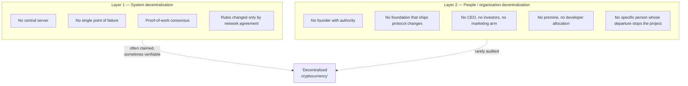

Seventeen years after Bitcoin's release, later chains have surpassed it on speed, programmability, and many other individual technical axes. Yet Bitcoin is still the asset most often called "digital gold." Is that simply first-mover advantage? Seventeen years of continuous operation is an extraordinary record. It still leaves the central question open: why did the label stick?

The whitepaper presents electronic cash; Satoshi later used a communications channel and gold-like scarcity as a thought experiment. So what is doing the work here: the gold analogy, the fixed supply, or the institutional shape around the design — who can change it, and who cannot? The answer is buried in the fair launch, the cap, the founder's departure, and the question of who can still change the rules.

## Where monetary value comes from

Before getting into Bitcoin specifically, start with a broader question: why does anything have monetary value at all? A dollar bill is paper; a gold coin is stamped metal. But the two sit on opposite sides of a key line: a central bank or government can decide to expand the money supply. Gold has no equivalent — no single authority holds a monopoly over the world's gold supply, and none can simply decree more of it into existence.

That absence of a controlling party is one of the reasons an asset becomes worth holding as a long-term store of value: [scarcity](/BitcoinArchive/entries/analysis/2008-10-31-fixed-supply-vs-adjustable-money/) nobody commands, resistance to counterfeiting, and a supply nobody can unilaterally expand. Gold has held this role for thousands of years in part for exactly this reason — pulling more of it out of the ground is slow, expensive, and bounded by geology, a natural constraint rather than a policy one.

Bitcoin's founding claim was that software could reproduce those same properties without the metal — a [fixed, verifiable supply](/BitcoinArchive/entries/design/2009-01-03-bitcoin-monetary-design/), no central issuer, and [rules no single party can rewrite](/BitcoinArchive/entries/design/2009-01-03-bitcoin-consensus-design/). This page tests whether that claim actually holds up, and whether Bitcoin delivers on it more convincingly than the newer projects making similar claims.

Satoshi made the metal comparison explicitly, in a [2010 forum reply](/BitcoinArchive/entries/forum/bitcointalk/topic-583/2010-08-27-re-bitcoin-does-not-violate-mises-regression-theorem/):

<!-- quote: q1 -->
> "As a thought experiment, imagine there was a base metal as scarce as gold but ... not useful for any practical or ornamental purpose ... and one special, magical property: can be transported over a communications channel."

Satoshi left the origin of that value open — foreseen usefulness for exchange, collectors, "any random reason" — but scarcity is what would make the value durable once it existed. How that same scarcity later reshaped Bitcoin's use as a payment system is traced in [the cash-versus-digital-gold reading](/BitcoinArchive/entries/analysis/2008-10-31-bitcoin-electronic-cash-vs-digital-gold/).

[Later cryptocurrencies](/BitcoinArchive/entries/analysis/2026-07-26-altcoin-count-and-design-comparison/) ([Ethereum](/BitcoinArchive/entries/currency/2026-07-27-ethereum-currency-overview/), [Ripple](/BitcoinArchive/entries/currency/2026-07-27-xrp-currency-overview/), [Cardano](/BitcoinArchive/entries/currency/2026-07-27-cardano-currency-overview/), [Solana](/BitcoinArchive/entries/currency/2026-07-27-solana-currency-overview/)) ship more capable virtual machines, faster confirmation, lower fees, richer programmability. On any single technical axis other than uptime since 2009, Bitcoin is no longer the frontier. And yet the market consistently prices Bitcoin as the asset most resembling gold — the long-horizon store of value, the reserve position, the holding that doesn't depend on a counterparty's roadmap.

<!-- chart: assets-race -->

The standard explanation is "first-mover advantage." On this reading, Bitcoin's value is a path-dependent accident: it arrived first, accumulated the network effect, and is now defended by inertia rather than by anything intrinsic to the design.

But the substance is structural, not accidental: Bitcoin's claim to "digital gold" status is not a single property but the **simultaneous combination** of two distinct layers of decentralization, supported by six concrete structural features. Each individual feature exists in some other project. None of those projects has assembled the full set, and the absence is not accidental — several of the features are mutually difficult to satisfy together.

## The two layers, distinguished

The discussion of "decentralization" in cryptocurrency frequently conflates two layers that operate on different planes and have different evidence:

Layer 1 is technical. It can be inspected: read the consensus code, count the independent full nodes, check that no entity controls the canonical client release. Most major cryptocurrencies satisfy Layer 1 in some form, and most of the public discussion of decentralization is about Layer 1.

Layer 2 is sociological. The question is whether a specific named individual or organization sets the protocol's direction, controls its development, holds its keys, or speaks for it institutionally. Layer 2 cannot be inspected through the consensus code — it has to be checked against the project's governance record, premine accounting, foundation structure, and the visible activity of the original architects.

The two layers are not redundant. A project can be highly decentralized at Layer 1 (many nodes, open-source client, no single server) while being highly centralized at Layer 2 (a named founder whose announcements move the protocol roadmap, a foundation whose treasury bankrolls development, an investor cohort holding 30% of the initial supply). Most post-2014 cryptocurrencies are in exactly that position — and that position is what makes Bitcoin distinctive.

## The six structural features

The features below are the concrete pillars that, taken together, supply Bitcoin's Layer 2 decentralization and complete its Layer 1 story. None is unique to Bitcoin in isolation; the combination is.

| # | Feature | Bitcoin's form | Where it is found elsewhere |
|---|---|---|---|
| 1 | System decentralization | PoW + open-source client + thousands of independent full nodes | Most major chains, in varying degrees |
| 2 | People / org decentralization | No founder authority, no foundation with protocol power, no CEO | Rare; partial in a few smaller projects |
| 3 | Fair launch (no premine) | Genesis block followed by ordinary mining open to all from block 1 | Some smaller chains ([Litecoin](/BitcoinArchive/entries/currency/2026-07-27-litecoin-currency-overview/), [Monero](/BitcoinArchive/entries/currency/2026-07-27-monero-currency-overview/)); rare among top-ten |
| 4 | Founder departure | Satoshi gone since 2011; no public re-emergence | None among comparably-valued chains |
| 5 | Fixed supply | 21 million cap, immutable in practice | Some chains have caps; most can be amended by governance |
| 6 | Network effect / first-mover | 17-year history, deepest liquidity, longest brand recognition | Tautologically Bitcoin-only |

Each feature is developed in its own section below. The order is roughly the order in which each became evident: system-level decentralization at launch (2009), fair launch at the same moment, fixed supply written into the code, founder departure in 2011, the absence of a controlling foundation as a pattern visible by 2014, network effect as the cumulative result.

### 1. System decentralization

Bitcoin's [consensus design](/BitcoinArchive/entries/design/2009-01-03-bitcoin-consensus-design/) is the textbook example of permissionless, proof-of-work-based agreement: independent nodes validate every block against the same deterministic rule set, the canonical chain is the most-work chain, and no entity has authority to override that selection. There is no central server, no operator, no kill switch. A node operator anywhere on Earth can reject a block the rest of the network accepts, and if their rule set is the one the majority of hashpower also enforces, their view wins.

This layer is well covered, and most successor cryptocurrencies have a defensible analog (proof-of-stake variants, BFT-based finality, etc.). The point is not that Bitcoin invented Layer 1 decentralization; it is that Layer 1 alone is insufficient to explain the digital-gold claim, because so many projects can credibly say "Layer 1: yes." The distinguishing layer is below.

### 2. People and organization decentralization

This is where Bitcoin separates from every other major chain. Compared on Layer 2, the picture for top cryptocurrencies looks like this:

| Project | Active founder | Foundation with protocol authority | Visible CEO | Premine / dev allocation |
|---|---|---|---|---|
| **Bitcoin** | Departed 2011, no contact | Bitcoin Foundation existed; never held protocol authority | None | None |
| **[Ethereum](/BitcoinArchive/entries/currency/2026-07-27-ethereum-currency-overview/)** | [Vitalik Buterin](/BitcoinArchive/participants/vitalik-buterin/) (highly active, public roadmap influence) | Ethereum Foundation (treasury, grants, EIP guidance) | Foundation executive director | ICO 2014; founder + early-contributor allocation |
| **[Ripple](/BitcoinArchive/entries/currency/2026-07-27-xrp-currency-overview/)** | [Chris Larsen](/BitcoinArchive/participants/chris-larsen/) / [Brad Garlinghouse](/BitcoinArchive/participants/brad-garlinghouse/) | Ripple Labs (private company controlling protocol) | Brad Garlinghouse (CEO) | ~80% held by Ripple Labs at launch |
| **[Cardano](/BitcoinArchive/entries/currency/2026-07-27-cardano-currency-overview/)** | [Charles Hoskinson](/BitcoinArchive/participants/charles-hoskinson/) (publicly active) | Cardano Foundation + IOG + Emurgo (three coordinating bodies) | Charles Hoskinson (IOG CEO) | ICO 2017; foundation allocation |
| **[Solana](/BitcoinArchive/entries/currency/2026-07-27-solana-currency-overview/)** | [Anatoly Yakovenko](/BitcoinArchive/participants/anatoly-yakovenko/) (active) | Solana Foundation | Anatoly Yakovenko (Labs CEO) | Premine; foundation + investor allocation |

The contrast is not subtle. For every project in the comparison except Bitcoin, an interested reader can name the person whose announcements move price, the organization whose treasury funds protocol development, and the company whose corporate decisions shape the chain's roadmap. For Bitcoin the corresponding fields are empty, and the emptiness is durable — it has held for over a decade across multiple contentious upgrade cycles.

Note that "Bitcoin Foundation" existed (founded 2012, effectively dormant by 2015). It was a 501(c)(6) advocacy and education body, not a protocol-governance organ. The Bitcoin Core development project is a loose coalition of contributors with no single corporate sponsor and no formal governance hierarchy; this is the [authority pattern](/BitcoinArchive/entries/analysis/2014-03-19-bitcoin-core-rebrand-authority-effects/) the 2014 rebrand exposed and that has held since.

The same institutional absence is the precondition [the fork-wars-as-not-OSS analysis](/BitcoinArchive/entries/analysis/2015-08-15-bitcoin-fork-wars-as-not-oss/) traces through the 2015–2017 block-size war, reading the Foundation's 2015 collapse as one leg of the vacuum that turned a rule dispute into an identity contest.

### 3. Fair launch — no premine

Bitcoin's launch followed the [genesis block](/BitcoinArchive/entries/aftermath/2009-01-03-genesis-block/) (January 3, 2009) with a roughly five-day gap before block 1 was mined on January 9, 2009. The first non-Satoshi transaction the chain records is the [10 BTC sent from Satoshi to Hal Finney at block 170 (January 12, 2009)](/BitcoinArchive/entries/aftermath/2009-01-12-first-bitcoin-transaction/) — the earliest publicly archived exchange of bitcoins between two parties. The five-day pre-block-1 gap, the absence of any chain history before block 0, and the [PoW headroom analysis](/BitcoinArchive/entries/analysis/2009-01-03-genesis-block-hardcode-analysis/) all point in the same direction: there was no period during which Satoshi accumulated coins privately before the network opened to others on the same terms.

Empirical confirmation comes from the supply curve. Sergio Lerner's Patoshi pattern analysis (2013, extended in subsequent papers; see the [Patoshi analysis entry](/BitcoinArchive/entries/aftermath/2013-04-17-sergio-lerner-patoshi-analysis/)) identified an early-mining fingerprint consistent with a single dominant miner during the first ~14 months. The point relevant here is not the exact coin count attributable to that pattern (estimates vary by paper) but that those coins were mined under the same difficulty and reward rules every other miner faced, with no advance allocation and no preferential schedule.

The fair-launch picture for later major projects is different. Ethereum's 2014 pre-launch crowdsale distributed a meaningful share of the initial supply to early contributors and the foundation before the genesis block. Ripple launched with a large fraction of XRP held by Ripple Labs at the protocol bootstrap. Solana's launch included a premine allocated to founders, the foundation, and early investors.

The exact percentages differ by source and are not the load-bearing point — what matters is the categorical distinction: each of these chains began with an internal allocation that placed a counterparty between the protocol and its holders. That counterparty's interests are not identical to long-horizon holders'. Bitcoin's fair-launch property is the absence of any such counterparty at genesis.

### 4. Founder departure

Satoshi's public activity stopped in mid-2010, with the [handover to Gavin Andresen on December 12, 2010](/BitcoinArchive/entries/aftermath/2010-12-12-satoshi-handover-to-andresen/), the [lead-maintainer announcement on December 19, 2010](/BitcoinArchive/entries/aftermath/2010-12-19-andresen-lead-maintainer-announcement/), and the [final known email of April 26, 2011](/BitcoinArchive/entries/aftermath/2011-04-26-satoshi-final-known-email/). Since then there has been no verified communication, no protocol opinion offered, no resurfacing at a conference, no signed message from a Satoshi key. The departure has held for fifteen years across moments that would have plausibly drawn a re-emergence: the 2013 Mt. Gox collapse, the 2017 block-size war, the 2024 ETF approvals.

The departure has structural consequences that go beyond symbolism:

- **No "what would Satoshi say" appeal.** Protocol arguments cannot be settled by quoting an original-designer reading; the document is what it is, and contemporary contributors must make the case on its merits.
- **No founder key with custodial weight.** No private wallet whose movement implies an endorsement; no signing power that markets would treat as authoritative.
- **No personal continuation of authority.** A founder who stays accumulates authority by default — reputation, network relationships, the institutional respect that comes with having shipped the original system. A founder who departs forfeits that accumulation and the project must develop substitute mechanisms.

The pattern is anomalous. Among comparably-valued cryptocurrencies, the original architect remains visibly active. This is the natural choice — creators tend to stay with their creations. Bitcoin's case is the exception, and the [anonymity architecture](/BitcoinArchive/entries/analysis/2008-10-31-satoshi-anonymity-architecture/) (six-layer model whose final layer is the departure itself) suggests the departure was prepared, not accidental.

### 5. Fixed supply

The 21-million cap is the most-cited feature of Bitcoin's monetary design and the one most often replicated by competitors. The substance is in the immutability, not in the number.

Several chains have caps written into their issuance schedule; the question is how easily the cap can be amended. The Bitcoin cap has been treated as untouchable across multiple upgrade cycles, including ones where contributors would have benefited from relaxing it (mining-fee security debates, scaling debates). The pattern is documented in the [fixed-supply-vs-adjustable-money analysis](/BitcoinArchive/entries/analysis/2008-10-31-fixed-supply-vs-adjustable-money/), which compares 15 chains' monetary designs and shows that "cap exists in code" and "cap cannot be politically amended" are distinct properties.

The mechanical design that produces the cap — the [monetary design](/BitcoinArchive/entries/design/2009-01-03-bitcoin-monetary-design/) geometric halving series, 210,000 blocks per epoch, integer-satoshi truncation after the 33rd halving — is reproducible; the per-halving cards and the supply curve are on the Archive's [Bitcoin chart page](/BitcoinArchive/chart/). The political property that the cap survives is harder to copy, and that political property depends on the Layer 2 features above. A chain with an active foundation and a visible CEO has named entities who could be persuaded to ease the cap when expedient; Bitcoin has no such entities.

### 6. Network effect / first-mover

Bitcoin launched January 3, 2009. Seventeen years of continuous operation accumulate four things that successor chains cannot duplicate by design choice alone:

- **Deepest spot liquidity** across centralized and decentralized venues, including the post-2024 spot ETF inflows that re-anchored institutional pricing.
- **Strongest brand recognition** at the level where "cryptocurrency" and "bitcoin" are near-synonyms in non-specialist coverage.
- **Largest accumulated proof-of-work**, which is what the most-work chain rule actually selects on — a property no fork can short-circuit without out-mining 17 years of difficulty.
- **Longest uninterrupted operational record**, including survival of the [August 2010 value-overflow incident](/BitcoinArchive/entries/analysis/2010-08-15-overflow-incident-structure-and-paradox/) and every subsequent stress event.

The network effect is real and is correctly counted as one of the six features, but it is not the whole story. The first-mover argument is often inflated into "Bitcoin's value is just network effect" — meaning, if the order had been different, some other chain would now occupy the digital-gold slot. The other five features above push against that reading: even with first-mover stripped, Bitcoin would still be the project with no founder authority, no foundation, no premine, and a credibly immutable cap. First-mover compounds the effect; it is not the substrate.

## Why the combination matters

Each of the six features individually exists, in some form, somewhere in the cryptocurrency landscape. But **all six simultaneously, to the degree Bitcoin satisfies them, do not coexist in any other project** — and several pairs of features are mutually difficult to satisfy:

- **Fair launch + ongoing development funding.** A project with no premine, no ICO, and no foundation has no internal source of development funding. Bitcoin's solution is to have a contributor coalition with no central paymaster — possible only because (a) the protocol was deliberately minimal at launch and (b) volunteer-and-grant funding has been sufficient to sustain a thin development surface. A project that aims at richer functionality (smart contracts, layer-1 DeFi, application platforms) cannot make the same trade-off without re-introducing a funding entity.
- **Founder departure + roadmap leadership.** A protocol with an active founder has clear roadmap leadership; a protocol without one has to develop dispersed decision-making. Bitcoin's experience suggests this is workable but slow, and the slowness itself is part of what makes the cap and other rules credibly immutable. A project that prioritizes rapid iteration cannot also have no founder.
- **No CEO + institutional perception.** A protocol with no CEO has no spokesperson, no quarterly call, no figure for institutional counterparties to negotiate with. This is friction for adoption pathways that depend on corporate negotiation, and it is the price Bitcoin's Layer 2 decentralization extracts.

The six features cohere because they share an underlying design choice: **the protocol exists to be a monetary base, not a platform**. A monetary base does not need rapid feature iteration, does not need a CEO, does not need a foundation treasury, and benefits from being incapable of fast change.

Every later cryptocurrency that aims at more — programmability, throughput, application support — accepts trade-offs against the six features. Those trade-offs are reasonable for their stated goals. They also explain why the digital-gold slot, structurally, remains Bitcoin's.

## What "digital gold" actually means in this framing

"Digital gold" is not a slogan. It is shorthand for the bundle: a monetary asset whose scarcity is enforced by mathematics rather than by a central bank, whose ownership is portable without a custodial intermediary, whose protocol cannot be amended at the discretion of a named entity, and whose original architect has visibly removed themselves from a position of continuing authority. Each of those properties is a structural feature. The bundle is what gives the phrase its content.

The bundle is also what makes the phrase difficult to apply to other cryptocurrencies, regardless of their technical merits. A chain with a richer instruction set, faster confirmation, and lower fees can be many things; if it also has an active founder, a foundation treasury, a CEO, and a premine, it is not (under this framing) digital gold. It is something else — possibly something more useful for many purposes — but the digital-gold slot is structurally not vacant for it to occupy.

## What this structure does not guarantee

This entry is an editorial reading of structural features, not a price prediction or an investment thesis. Several caveats:

- The six features are necessary but not jointly sufficient for the digital-gold framing to remain valid in the long term. A successful 51% attack, a discovered cryptographic break, a Layer 2 governance capture, or a coordinated political action against the cap would each falsify the framing.
- The Layer 2 decentralization is empirically demonstrated over the 2011–2026 window; future contributor consolidation could erode it.
- The network-effect component is the most fragile in conceptual terms: it is the one feature an external shock could most plausibly displace.

The framing is an explanation of why the digital-gold label has stuck for Bitcoin and has not for the others. It is not a guarantee that it will continue to stick.

Where the ownership side of this story stands as of 2026 — how far corporate treasuries, spot ETFs, and sovereign reserves have climbed toward Satoshi's untouched ~1.1 million BTC, and why holding coins confers none of the protocol authority the second layer is about — is mapped in [Bitcoin's ownership map](/BitcoinArchive/entries/analysis/2026-07-09-bitcoin-ownership-map/).

The six features above are applied to twelve chains at once in [the altcoin count and design comparison](/BitcoinArchive/entries/analysis/2026-07-26-altcoin-count-and-design-comparison/).

Five AI systems, asked separately to pick exactly one cryptocurrency, converged on Bitcoin. The claims that survived fact-checking were structural claims like these six features, not superlatives. The AI investment survey records the full experiment.

<!-- entry-closing -->

Scarcity was never alone. The fixed cap sits inside a network whose rules no single operator can rewrite; its launch had no premine, its founder stepped away, no controlling foundation took his place, and seventeen years of uninterrupted history accumulated behind it. That combination made "digital gold" structural rather than decorative. Later chains can copy one feature or beat Bitcoin on one axis; they cannot inherit the years already written into this network. Whether that accumulated promise can survive the people now carrying it is the question the records still to come will answer.
